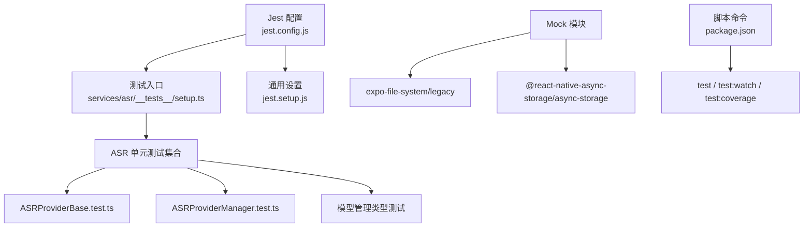
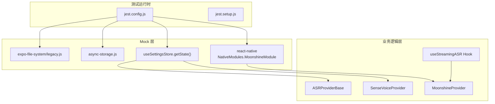
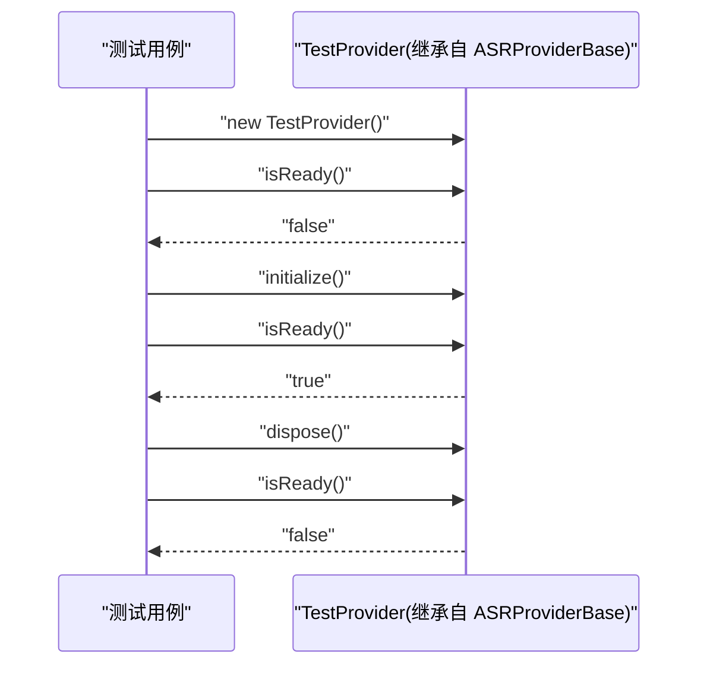
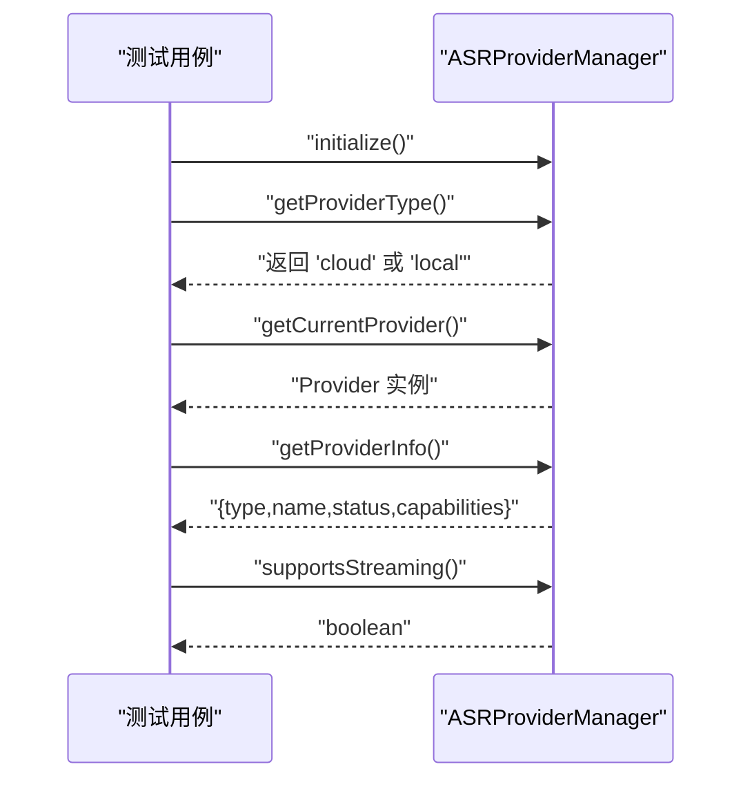
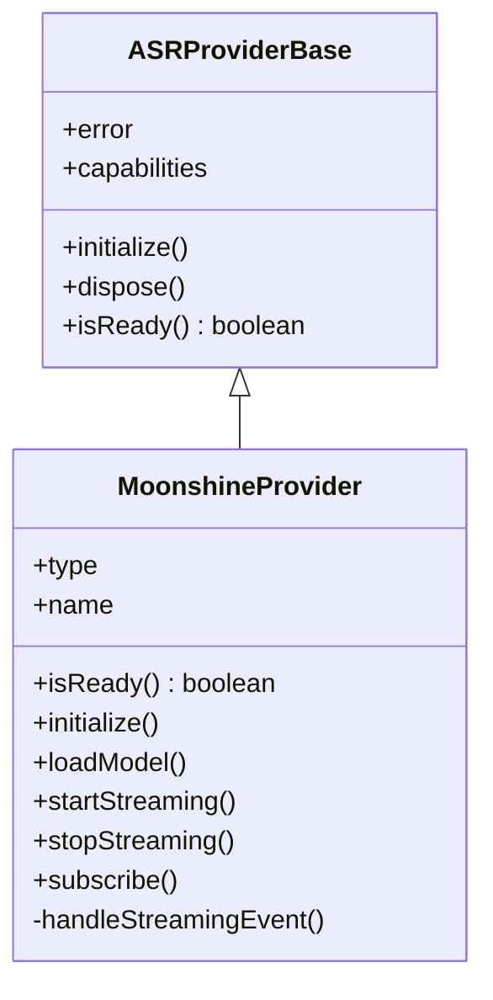
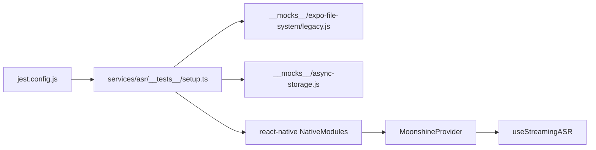

# 测试策略

<cite>
**本文引用的文件**
- [jest.config.js](file://jest.config.js)
- [jest.setup.js](file://jest.setup.js)
- [package.json](file://package.json)
- [services/asr/__tests__/setup.ts](file://services/asr/__tests__/setup.ts)
- [services/asr/__tests__/ASRProviderBase.test.ts](file://services/asr/__tests__/ASRProviderBase.test.ts)
- [services/asr/__tests__/ASRProviderManager.test.ts](file://services/asr/__tests__/ASRProviderManager.test.ts)
- [services/asr/asrService.ts](file://services/asr/asrService.ts)
- [hooks/useStreamingASR.ts](file://hooks/useStreamingASR.ts)
- [services/asr/providers/local/MoonshineProvider.ts](file://services/asr/providers/local/MoonshineProvider.ts)
- [services/asr/providers/cloud/SenseVoiceProvider.ts](file://services/asr/providers/cloud/SenseVoiceProvider.ts)
- [store/index.ts](file://store/index.ts)
- [__mocks__/expo-file-system/legacy.js](file://__mocks__/expo-file-system/legacy.js)
- [__mocks__/async-storage.js](file://__mocks__/async-storage.js)
</cite>

## 目录
1. [引言](#引言)
2. [项目结构](#项目结构)
3. [核心组件](#核心组件)
4. [架构总览](#架构总览)
5. [详细组件分析](#详细组件分析)
6. [依赖关系分析](#依赖关系分析)
7. [性能考虑](#性能考虑)
8. [故障排查指南](#故障排查指南)
9. [结论](#结论)
10. [附录](#附录)

## 引言
本文件系统性梳理 VoiceNote 的测试策略与实现，围绕基于 Jest 的测试架构与环境配置展开，覆盖单元测试、集成测试与 UI 测试的组织方式与实施策略；阐述测试模拟（Mock）的使用方法与最佳实践；文档化关键业务逻辑的测试覆盖范围与测试用例设计；解释异步操作测试、API 调用测试与状态管理测试的方法；提供测试数据准备与测试环境隔离策略；包含性能测试与压力测试的实施方案；解释持续集成中的测试自动化流程，并为开发者提供编写高质量测试用例的指导与规范。

## 项目结构
VoiceNote 的测试体系以 Jest 为核心，结合 TypeScript、Jest 预设扩展与自定义模块映射，形成统一的测试运行时与断言风格。测试文件采用按功能域分层的组织方式：ASR 子系统的测试集中在 services/asr/__tests__ 下，配合 __mocks__ 提供对原生模块与外部依赖的隔离模拟。

图表来源
- [jest.config.js:1-47](file://jest.config.js#L1-L47)
- [jest.setup.js:1-11](file://jest.setup.js#L1-L11)
- [services/asr/__tests__/setup.ts:1-99](file://services/asr/__tests__/setup.ts#L1-L99)
- [package.json:5-18](file://package.json#L5-L18)

章节来源
- [jest.config.js:1-47](file://jest.config.js#L1-L47)
- [jest.setup.js:1-11](file://jest.setup.js#L1-L11)
- [package.json:5-18](file://package.json#L5-L18)

## 核心组件
- 测试运行时与环境
  - 使用 Node 环境运行测试，避免与 Expo 运行时冲突；通过 @testing-library/jest-native 扩展断言能力；启用 ts-jest 并针对测试场景调整模块互操作与默认导入行为。
  - 通过 moduleNameMapper 将 @/、@components/、@hooks/、@store/、@services/、@db/、@theme/、@types/、@utils/ 等路径别名解析到源码目录；同时为 expo、expo-file-system、expo-asset、async-storage、react-native、i18next 等模块提供专用 Mock。
  - 收集覆盖率时聚焦于 ASR 服务与 useStreamingASR Hook，排除声明文件与测试目录，确保覆盖率指标聚焦关键业务逻辑。
- 测试初始化与隔离
  - 在根级 jest.setup.js 中统一抑制特定控制台警告，减少噪音干扰。
  - 在 ASR 子系统测试中，通过独立的 setup.ts 对 AsyncStorage、expo-file-system/legacy、expo-asset、react-native（含 Moonshine 原生模块）、zustand store 等进行集中 Mock，确保测试隔离与可重复性。
- Mock 实现
  - 文件系统与资产访问：通过 __mocks__/expo-file-system/legacy.js 提供目录信息、文件操作与下载等方法的异步返回值，便于在不依赖真实文件系统的情况下验证路径与读写逻辑。
  - 异步存储：__mocks__/async-storage.js 提供键值存取、批量操作与清空等方法的异步返回值，满足本地持久化逻辑的测试需求。
  - 原生模块：setup.ts 中对 react-native 的 NativeModules.MoonshineModule 进行完整 Mock，包括可用性检查、模型加载/卸载、流式识别事件监听与停止等，确保本地 ASR Provider 的单元测试无需真实设备或原生二进制。
  - 设置 Store：setup.ts 中对 useSettingsStore 的 getState 返回值进行 Mock，使 Provider 初始化与配置校验逻辑可被稳定测试。

章节来源
- [jest.config.js:1-47](file://jest.config.js#L1-L47)
- [jest.setup.js:1-11](file://jest.setup.js#L1-L11)
- [services/asr/__tests__/setup.ts:1-99](file://services/asr/__tests__/setup.ts#L1-L99)
- [__mocks__/expo-file-system/legacy.js:1-12](file://__mocks__/expo-file-system/legacy.js#L1-L12)
- [__mocks__/async-storage.js:1-12](file://__mocks__/async-storage.js#L1-L12)

## 架构总览
下图展示测试架构的关键交互：Jest 配置驱动测试执行，模块映射与 Mock 解决原生依赖问题，ASR Provider 的具体实现与 Hook 在测试中被隔离调用，最终验证业务逻辑与错误处理。

图表来源
- [jest.config.js:18-38](file://jest.config.js#L18-L38)
- [services/asr/__tests__/setup.ts:6-83](file://services/asr/__tests__/setup.ts#L6-L83)
- [services/asr/providers/base/ASRProviderBase.ts](file://services/asr/providers/base/ASRProviderBase.ts)
- [services/asr/providers/cloud/SenseVoiceProvider.ts](file://services/asr/providers/cloud/SenseVoiceProvider.ts)
- [services/asr/providers/local/MoonshineProvider.ts](file://services/asr/providers/local/MoonshineProvider.ts)
- [hooks/useStreamingASR.ts](file://hooks/useStreamingASR.ts)

## 详细组件分析

### ASR Provider 基类测试（ASRProviderBase）
- 测试目标
  - 验证 Provider 初始化状态、幂等初始化、就绪状态查询、错误暴露与清理释放。
  - 验证能力描述（capabilities）字段的正确性与只读性。
- 关键断言点
  - 初始 isReady 为 false；initialize 后变为 true；多次 initialize 不抛错。
  - 错误初始为空，dispose 后重置。
  - capabilities 字段存在且包含语言支持列表。
- 测试模式
  - 使用继承基类创建最小可测实现，仅实现必要接口，避免真实依赖。
  - 在每个用例前后分别调用 initialize 与 dispose，确保资源回收。

图表来源
- [services/asr/__tests__/ASRProviderBase.test.ts:25-53](file://services/asr/__tests__/ASRProviderBase.test.ts#L25-L53)
- [services/asr/providers/base/ASRProviderBase.ts](file://services/asr/providers/base/ASRProviderBase.ts)

章节来源
- [services/asr/__tests__/ASRProviderBase.test.ts:1-90](file://services/asr/__tests__/ASRProviderBase.test.ts#L1-L90)

### ASR Provider 管理器测试（ASRProviderManager）
- 测试目标
  - 验证管理器初始化、双次初始化幂等、提供者类型获取、当前提供者实例获取、提供者信息聚合、流式支持判断。
  - 验证类型守卫函数对流式与非流式提供者的判定。
- 关键断言点
  - initialize 成功且可重复调用不报错。
  - getProviderType 返回合法值集合。
  - getCurrentProvider 返回对象且包含名称等字段。
  - getProviderInfo 返回包含 type、name、status、capabilities 的完整信息。
  - supportsStreaming 返回布尔值。
  - 类型守卫对不同 provider 类型返回预期布尔值。
- 测试模式
  - 使用管理器单例进行测试，前置与后置钩子中分别调用 initialize 与 dispose，保证状态一致性。

图表来源
- [services/asr/__tests__/ASRProviderManager.test.ts:9-58](file://services/asr/__tests__/ASRProviderManager.test.ts#L9-L58)

章节来源
- [services/asr/__tests__/ASRProviderManager.test.ts:1-133](file://services/asr/__tests__/ASRProviderManager.test.ts#L1-L133)

### 本地 Moonshine Provider 测试要点
- 测试目标
  - 验证 MoonshineProvider 的就绪检查、初始化流程、模型加载/卸载、事件订阅与取消、流式开始/结束、错误传播。
- 关键断言点
  - isReady 在未可用原生模块、未下载模型、未内置模型时返回 false；在已加载模型时返回 true。
  - initialize 抛出错误时能正确设置错误并向上抛出；成功时清除错误。
  - startStreaming 在已开始时抛错；在未加载模型时尝试初始化；Android 平台需触发麦克风权限回调。
  - stopStreaming 返回结果包含文本、提供者类型与处理时间；清理事件订阅。
  - subscribe 订阅回调并返回取消函数；事件错误时更新内部错误。
- 测试模式
  - 通过 setup.ts 对 react-native 的 NativeModules.MoonshineModule 进行完整 Mock，覆盖所有异步方法与事件回调。
  - 通过 Mock 的 useSettingsStore.getState 返回默认配置，确保语言与模型架构可控。

图表来源
- [services/asr/providers/local/MoonshineProvider.ts:42-291](file://services/asr/providers/local/MoonshineProvider.ts#L42-L291)
- [services/asr/providers/base/ASRProviderBase.ts](file://services/asr/providers/base/ASRProviderBase.ts)

章节来源
- [services/asr/providers/local/MoonshineProvider.ts:1-307](file://services/asr/providers/local/MoonshineProvider.ts#L1-L307)
- [services/asr/__tests__/setup.ts:39-59](file://services/asr/__tests__/setup.ts#L39-L59)

### 云端 SenseVoice Provider 测试要点
- 测试目标
  - 验证 SenseVoiceProvider 的配置检查、就绪状态、初始化、音频转录、超时控制与错误处理。
- 关键断言点
  - isConfigured 依据设置与环境变量判断；initialize 在未配置时抛错。
  - transcribe 在文件不存在、网络异常、超时、非 2xx 响应时抛出对应错误。
  - 处理时间从开始到响应返回的时间差计算。
- 测试模式
  - 通过 Mock 的 useSettingsStore.getState 返回 API 地址与密钥，确保请求参数可控。
  - 通过 AbortController 控制超时，验证超时错误消息与类型。

章节来源
- [services/asr/providers/cloud/SenseVoiceProvider.ts:1-167](file://services/asr/providers/cloud/SenseVoiceProvider.ts#L1-L167)

### Hook useStreamingASR 测试要点
- 测试目标
  - 验证 Hook 的状态管理（lines、text、isStreaming、isReady、error）、事件订阅与取消、启动/停止流式识别、重置逻辑。
- 关键断言点
  - 初始化时检查 Provider 就绪状态；订阅事件后根据事件类型更新行状态与最终标记；停止时合并文本并返回结果。
  - startStreaming 在未就绪时尝试初始化；失败时设置错误并保持非就绪状态。
  - stopStreaming 返回最终文本与处理时间；失败时回退为空文本并返回默认结果。
  - reset 清空状态并重置行 ID。
- 测试模式
  - 通过 getStableMoonshineProvider 获取稳定的 Provider 实例，避免重复创建导致状态丢失。
  - 通过 Mock 的 Provider 事件回调模拟增量文本与完成事件，验证 UI 状态同步。

章节来源
- [hooks/useStreamingASR.ts:1-269](file://hooks/useStreamingASR.ts#L1-L269)

### ASR 服务函数测试要点
- 测试目标
  - 验证 asrService 的配置检查、文件存在性校验、超时控制、错误消息国际化与异常分支。
- 关键断言点
  - isASRConfigured 基于设置与环境变量判断；未配置时抛错。
  - transcribe 在文件不存在时抛错；fetch 非 2xx 时读取响应体并抛错；超时抛出特定错误。
  - 正常情况下返回文本内容。
- 测试模式
  - 通过 Mock 的 useSettingsStore.getState 返回 API 地址与密钥，确保请求参数可控。
  - 通过 AbortController 控制超时，验证超时错误消息与类型。

章节来源
- [services/asr/asrService.ts:1-74](file://services/asr/asrService.ts#L1-L74)

## 依赖关系分析
- 组件耦合与内聚
  - ASR Provider 基类与具体 Provider（SenseVoice、Moonshine）通过统一接口解耦，便于替换与测试。
  - Hook useStreamingASR 仅依赖 Provider 接口与设置 Store，降低与具体实现的耦合。
  - Mock 层集中管理原生模块与外部依赖，提升测试稳定性与可维护性。
- 直接与间接依赖
  - 测试直接依赖 jest.config.js、jest.setup.js、各 Mock 模块与业务实现。
  - 间接依赖包括 TypeScript 编译配置、包管理脚本与第三方库（如 @testing-library/jest-native）。
- 循环依赖
  - 当前结构未发现循环依赖迹象；Provider 与 Hook 之间为单向依赖。
- 外部依赖与集成点
  - 原生模块（Moonshine）与文件系统、异步存储、国际化库通过 Mock 隔离，避免真实设备与网络依赖。
- 接口契约与实现细节
  - Provider 接口定义了 initialize、dispose、isReady、事件订阅与停止等契约，测试重点验证这些契约的一致性与健壮性。

图表来源
- [jest.config.js:18-38](file://jest.config.js#L18-L38)
- [services/asr/__tests__/setup.ts:6-59](file://services/asr/__tests__/setup.ts#L6-L59)
- [services/asr/providers/local/MoonshineProvider.ts:42-291](file://services/asr/providers/local/MoonshineProvider.ts#L42-L291)
- [hooks/useStreamingASR.ts:67-268](file://hooks/useStreamingASR.ts#L67-L268)

章节来源
- [jest.config.js:1-47](file://jest.config.js#L1-L47)
- [services/asr/__tests__/setup.ts:1-99](file://services/asr/__tests__/setup.ts#L1-L99)

## 性能考虑
- 单元测试性能
  - 通过 Mock 替代真实网络与原生模块，显著降低测试执行时间；建议在测试中避免真实文件系统与网络请求。
  - 对 Provider 的初始化与模型加载进行短路处理，优先使用 Mock 数据。
- 集成测试性能
  - 对于需要真实设备或网络的场景，建议拆分为独立的集成测试套件，并在 CI 中按需运行。
- 覆盖率与性能平衡
  - 当前覆盖率收集聚焦于 ASR 服务与 useStreamingASR Hook，有助于在保证关键路径覆盖的同时控制测试总量。
- 建议
  - 引入测试分层：快速单元测试（Mock）、慢速集成测试（真实设备/网络），并在本地开发中优先运行单元测试，在 CI 中增加集成测试。

## 故障排查指南
- 常见问题与定位
  - 控制台警告噪声：已在 jest.setup.js 中抑制特定“Bundled”警告，若仍有问题，检查 setup.ts 中的警告过滤逻辑。
  - Provider 初始化失败：检查 Mock 的 isMoonshineAvailable、isModelLoaded、loadModel 等方法是否返回期望值。
  - 文件系统相关错误：确认 expo-file-system/legacy 的 getInfoAsync、readDirectoryAsync 等方法返回值与测试断言一致。
  - 设置 Store 未生效：确认 setup.ts 中对 useSettingsStore.getState 的 Mock 是否包含 asrConfig。
- 调试技巧
  - 使用 --verbose 或在测试中添加 console.log 辅助定位。
  - 对异步流程使用 jest.useFakeTimers 与 advanceTimersByTime 控制时间推进。
  - 对事件订阅与取消进行单元测试，确保订阅生命周期正确。

章节来源
- [jest.setup.js:1-11](file://jest.setup.js#L1-L11)
- [services/asr/__tests__/setup.ts:85-98](file://services/asr/__tests__/setup.ts#L85-L98)

## 结论
VoiceNote 的测试策略以 Jest 为核心，通过模块映射与集中 Mock 实现对原生模块与外部依赖的隔离，形成稳定可重复的测试环境。ASR Provider 的基类与具体实现均具备良好的可测性，结合 Hook 的状态管理与事件订阅机制，能够覆盖关键业务逻辑。建议在现有基础上进一步完善 UI 测试与端到端测试套件，并在 CI 中引入分层测试策略，以提升整体质量与交付效率。

## 附录
- 测试命令与脚本
  - test：运行全部测试。
  - test:watch：监听文件变化并运行相关测试。
  - test:coverage：运行测试并生成覆盖率报告。
- 最佳实践清单
  - 优先使用 Mock 替代真实依赖，确保测试稳定。
  - 对异步流程与事件订阅进行充分断言，覆盖正常与异常分支。
  - 保持测试隔离：每个测试用例独立初始化与清理。
  - 明确测试职责：单元测试专注逻辑，集成测试关注交互。
  - 覆盖关键路径：聚焦 ASR 服务与核心 Hook 的业务逻辑。
  - 在 CI 中分层运行测试，缩短反馈周期。

章节来源
- [package.json:5-18](file://package.json#L5-L18)