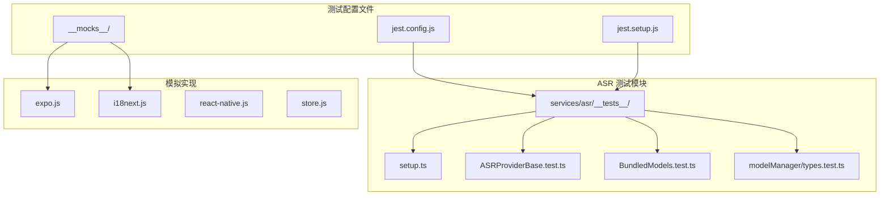
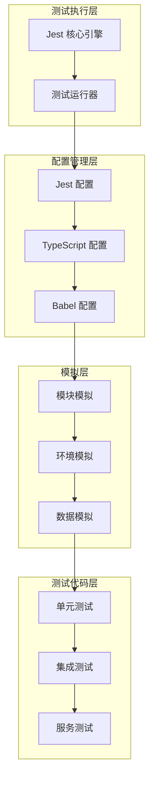
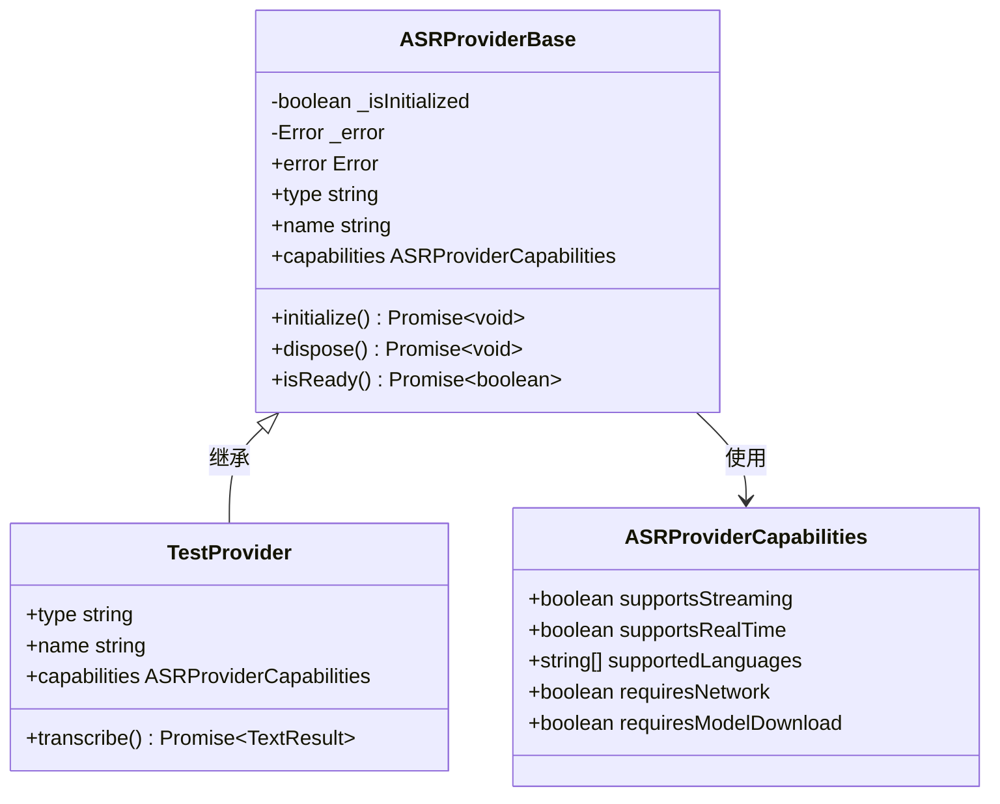
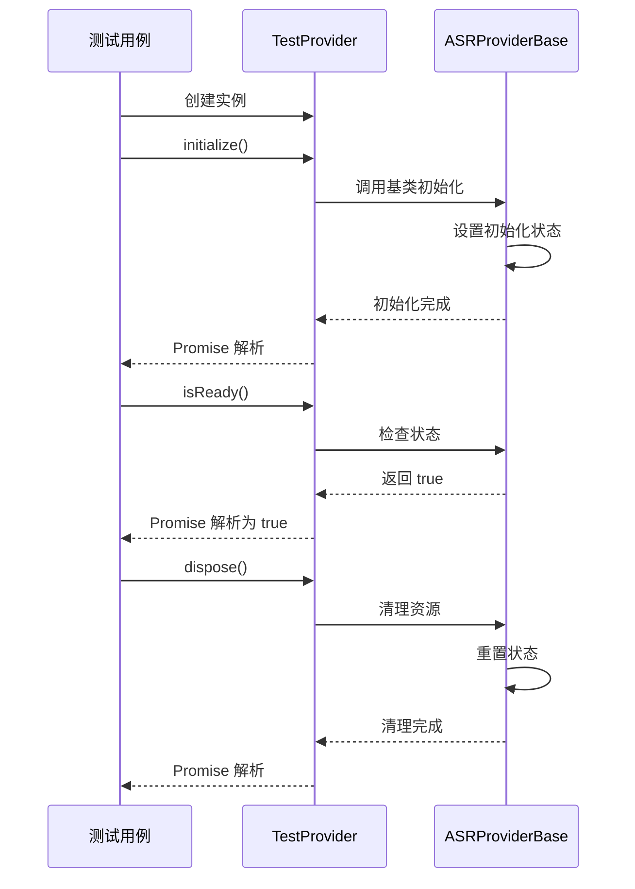
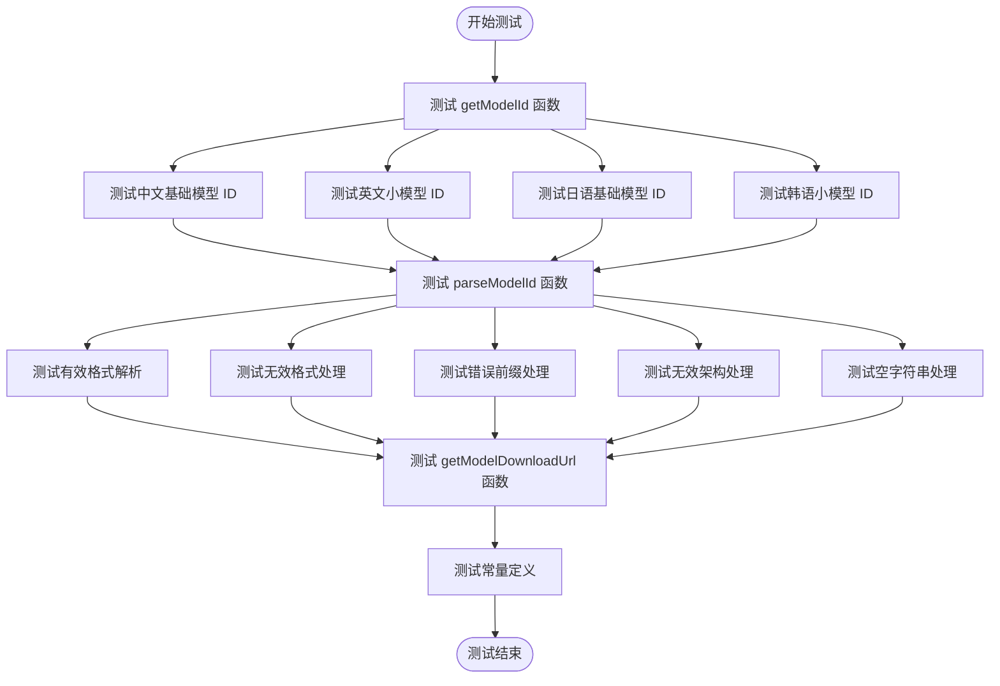
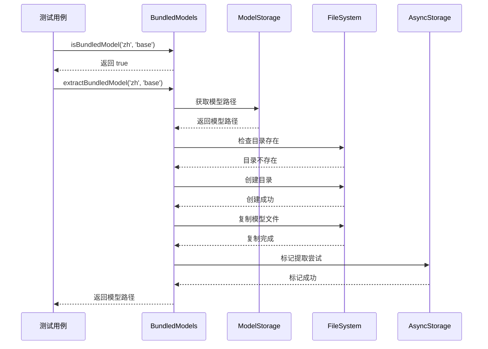
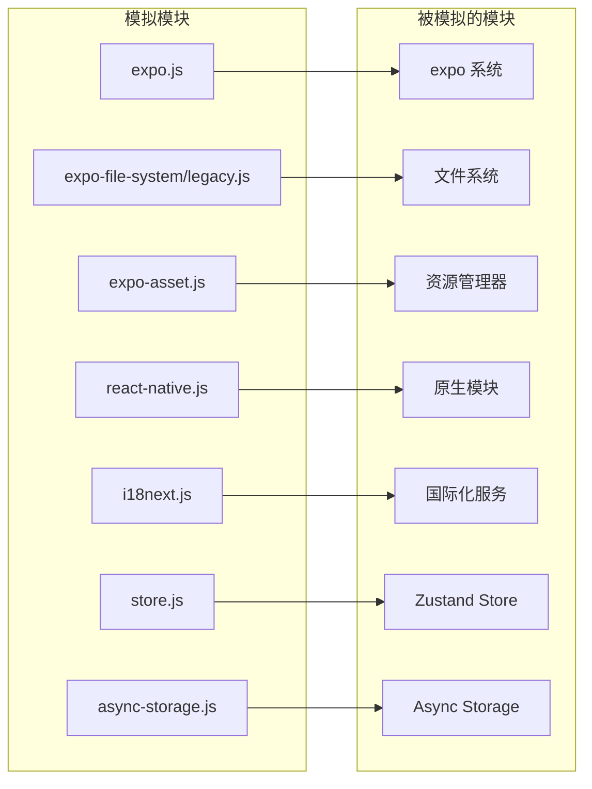

# 测试配置与环境

<cite>
**本文档引用的文件**
- [jest.config.js](file://jest.config.js)
- [jest.setup.js](file://jest.setup.js)
- [package.json](file://package.json)
- [tsconfig.json](file://tsconfig.json)
- [babel.config.js](file://babel.config.js)
- [eslint.config.js](file://eslint.config.js)
- [metro.config.js](file://metro.config.js)
- [__mocks__/expo.js](file://__mocks__/expo.js)
- [__mocks__/i18next.js](file://__mocks__/i18next.js)
- [services/asr/__tests__/setup.ts](file://services/asr/__tests__/setup.ts)
- [services/asr/__tests__/ASRProviderBase.test.ts](file://services/asr/__tests__/ASRProviderBase.test.ts)
- [services/asr/__tests__/BundledModels.test.ts](file://services/asr/__tests__/BundledModels.test.ts)
- [services/asr/__tests__/modelManager/types.test.ts](file://services/asr/__tests__/modelManager/types.test.ts)
- [services/asr/modelManager/BundledModels.ts](file://services/asr/modelManager/BundledModels.ts)
</cite>

## 目录
1. [简介](#简介)
2. [项目结构](#项目结构)
3. [核心组件](#核心组件)
4. [架构概览](#架构概览)
5. [详细组件分析](#详细组件分析)
6. [依赖关系分析](#依赖关系分析)
7. [性能考虑](#性能考虑)
8. [故障排除指南](#故障排除指南)
9. [结论](#结论)
10. [附录](#附录)

## 简介

VoiceNote 项目采用 Jest 测试框架配合 TypeScript 进行全面的单元测试和集成测试。本项目专注于语音转录服务（ASR）的测试配置，通过精心设计的测试环境和模拟机制，确保核心功能的稳定性和可靠性。

项目使用 Expo 生态系统构建，测试配置特别针对 React Native 环境进行了优化，包括模块解析、文件转换和环境模拟等方面。测试覆盖了 ASR 提供商管理、模型下载器、存储管理等核心模块。

## 项目结构

VoiceNote 项目的测试相关文件组织结构如下：



**图表来源**
- [jest.config.js:1-47](file://jest.config.js#L1-L47)
- [services/asr/__tests__/](file://services/asr/__tests__/)

**章节来源**
- [jest.config.js:1-47](file://jest.config.js#L1-L47)
- [jest.setup.js:1-11](file://jest.setup.js#L1-L11)

## 核心组件

### Jest 测试配置

Jest 配置文件是整个测试系统的中枢，定义了测试环境、模块映射、转换规则和覆盖率收集策略。

**测试环境设置**
- 使用 Node.js 环境而非默认的 jsdom
- 集成 Testing Library 扩展
- 自定义测试设置文件加载

**模块名称映射**
项目实现了完整的路径别名映射系统：
- `@/*` → 根目录 `./*`
- `@components/*` → `components/*`
- `@hooks/*` → `hooks/*`
- `@services/*` → `services/*`
- `@store/*` → `store/*`
- `@db/*` → `db/*`
- `@theme/*` → `theme/*`
- `@types/*` → `types/*`
- `@utils/*` → `utils/*`

**转换规则**
- TypeScript 文件使用 ts-jest 处理
- 特殊的 tsconfig 配置用于测试环境
- 启用 ES 模块互操作性

**覆盖率收集**
- 专门针对 ASR 服务模块
- 包含特定的工具函数
- 排除类型定义和测试文件

**章节来源**
- [jest.config.js:2-46](file://jest.config.js#L2-L46)

### TypeScript 配置

TypeScript 配置文件扩展了 Expo 的基础配置，提供了完整的路径映射支持：

**编译选项**
- 严格模式启用
- 基础目录设置为项目根目录
- 完整的路径别名映射系统

**模块解析**
- 支持目录索引文件
- 路径映射到具体文件或目录
- 与 Jest 模块映射保持一致

**章节来源**
- [tsconfig.json:1-63](file://tsconfig.json#L1-L63)

### 测试环境初始化

测试环境通过多个层面进行初始化和配置：

**全局设置**
- 控制台警告抑制机制
- 特定字符串过滤（如 "Bundled" 相关警告）
- 测试前后的环境清理

**模块模拟**
- Expo 相关模块的完整模拟
- 国际化服务模拟
- Async Storage 模拟
- Zustand 状态管理模拟

**章节来源**
- [jest.setup.js:1-11](file://jest.setup.js#L1-L11)
- [services/asr/__tests__/setup.ts:1-99](file://services/asr/__tests__/setup.ts#L1-L99)

## 架构概览

VoiceNote 的测试架构采用了分层的设计模式，确保测试的可维护性和可扩展性：



**图表来源**
- [jest.config.js:1-47](file://jest.config.js#L1-L47)
- [tsconfig.json:1-63](file://tsconfig.json#L1-L63)
- [babel.config.js:1-27](file://babel.config.js#L1-L27)

## 详细组件分析

### ASR Provider 基础类测试

ASR Provider 基础类是语音转录服务的核心抽象，测试覆盖了其生命周期管理和错误处理机制：



**图表来源**
- [services/asr/__tests__/ASRProviderBase.test.ts:5-23](file://services/asr/__tests__/ASRProviderBase.test.ts#L5-L23)

**测试流程序列图**



**图表来源**
- [services/asr/__tests__/ASRProviderBase.test.ts:25-89](file://services/asr/__tests__/ASRProviderBase.test.ts#L25-L89)

**章节来源**
- [services/asr/__tests__/ASRProviderBase.test.ts:1-90](file://services/asr/__tests__/ASRProviderBase.test.ts#L1-L90)

### 模型类型工具测试

模型类型工具测试验证了纯函数的正确性，这些函数不依赖外部状态：



**图表来源**
- [services/asr/__tests__/modelManager/types.test.ts:15-94](file://services/asr/__tests__/modelManager/types.test.ts#L15-L94)

**章节来源**
- [services/asr/__tests__/modelManager/types.test.ts:1-95](file://services/asr/__tests__/modelManager/types.test.ts#L1-L95)

### 打包模型管理测试

打包模型管理器测试涵盖了模型提取、存储和可用性检查的完整流程：



**图表来源**
- [services/asr/__tests__/BundledModels.test.ts:11-34](file://services/asr/__tests__/BundledModels.test.ts#L11-L34)
- [services/asr/modelManager/BundledModels.ts:96-201](file://services/asr/modelManager/BundledModels.ts#L96-L201)

**章节来源**
- [services/asr/__tests__/BundledModels.test.ts:1-35](file://services/asr/__tests__/BundledModels.test.ts#L1-L35)
- [services/asr/modelManager/BundledModels.ts:1-258](file://services/asr/modelManager/BundledModels.ts#L1-L258)

### 模块模拟系统

项目实现了全面的模块模拟系统，确保测试环境的隔离性和可控性：



**图表来源**
- [__mocks__/expo.js:1-9](file://__mocks__/expo.js#L1-L9)
- [__mocks__/i18next.js:1-11](file://__mocks__/i18next.js#L1-L11)
- [services/asr/__tests__/setup.ts:6-83](file://services/asr/__tests__/setup.ts#L6-L83)

**章节来源**
- [__mocks__/expo.js:1-9](file://__mocks__/expo.js#L1-L9)
- [__mocks__/i18next.js:1-11](file://__mocks__/i18next.js#L1-L11)
- [services/asr/__tests__/setup.ts:1-99](file://services/asr/__tests__/setup.ts#L1-L99)

## 依赖关系分析

测试系统的依赖关系展现了清晰的层次结构：

```mermaid
graph TB
subgraph "开发依赖"
JEST[jest ^30.2.0]
TS_JEST[ts-jest ^29.4.6]
TESTING_LIBRARY[@testing-library/jest-native ^5.4.3]
TYPES_JEST[@types/jest ^30.0.0]
TYPESCRIPT[typescript ~5.9.2]
end
subgraph "运行时依赖"
EXPO[expo ~54.0.33]
RN[react-native 0.81.5]
ASYNC_STORAGE[@react-native-async-storage/async-storage ^2.2.0]
I18NEXT[i18next ^25.8.11]
end
subgraph "构建工具"
BABEL[babel-preset-expo ^54.0.10]
ESLINT[eslint ^10.0.0]
PRETTIER[prettier ^3.8.1]
end
JEST --> TS_JEST
JEST --> TESTING_LIBRARY
TS_JEST --> TYPESCRIPT
EXPO --> RN
EXPO --> ASYNC_STORAGE
EXPO --> I18NEXT
BABEL --> EXPO
ESLINT --> TYPESCRIPT
```

**图表来源**
- [package.json:20-82](file://package.json#L20-L82)

**章节来源**
- [package.json:1-83](file://package.json#L1-L83)

## 性能考虑

### 测试执行性能优化

项目在测试配置中考虑了多项性能优化措施：

**并行执行**
- Jest 默认支持多进程并行执行测试
- 模块级别的模拟减少了外部依赖的开销
- 类型检查在测试中通过 ts-jest 处理，避免了额外的编译步骤

**内存管理**
- 测试后自动清理模拟状态
- 资源释放通过 `dispose()` 方法确保
- AsyncStorage 状态在每次测试后重置

**缓存策略**
- Babel 预设使用 API 缓存机制
- Metro 配置优化了资源解析性能
- TypeScript 编译器缓存提高增量编译速度

## 故障排除指南

### 常见问题及解决方案

**模块解析错误**
- 症状：`Cannot resolve module` 错误
- 解决方案：检查 `moduleNameMapper` 配置是否与实际文件结构匹配
- 验证：确认路径别名在 `tsconfig.json` 中正确配置

**模拟模块失效**
- 症状：测试中仍然调用真实模块而非模拟实现
- 解决方案：确保模拟文件位于 `__mocks__` 目录且命名规范正确
- 验证：检查模拟模块的导出接口是否与真实模块一致

**类型检查失败**
- 症状：TypeScript 编译错误阻止测试执行
- 解决方案：检查 `tsconfig.json` 中的路径映射配置
- 验证：确认所有路径别名都有对应的映射规则

**测试超时**
- 症状：测试执行时间过长或无限等待
- 解决方案：检查异步操作的超时设置和 Promise 处理
- 验证：添加适当的 `jest.setTimeout()` 配置

**章节来源**
- [jest.config.js:18-38](file://jest.config.js#L18-L38)
- [tsconfig.json:6-55](file://tsconfig.json#L6-L55)

## 结论

VoiceNote 项目的测试配置展现了现代 React Native 应用测试的最佳实践。通过精心设计的配置文件、全面的模块模拟系统和严格的测试覆盖策略，项目确保了核心功能的稳定性和可靠性。

主要优势包括：
- 完整的模块路径别名支持
- 全面的环境模拟机制  
- 针对核心业务逻辑的测试覆盖
- 友好的开发体验和调试支持

建议的后续改进方向：
- 扩展测试覆盖率到更多业务模块
- 集成端到端测试框架
- 实现更细粒度的测试隔离策略

## 附录

### 测试命令参考

| 命令 | 描述 | 用途 |
|------|------|------|
| `npm test` | 运行所有测试 | 开发环境快速验证 |
| `npm run test:watch` | 监听模式运行测试 | 开发过程持续反馈 |
| `npm run test:coverage` | 生成覆盖率报告 | 代码质量评估 |
| `npm run typecheck` | TypeScript 类型检查 | 静态类型验证 |

### 测试环境配置

**开发环境**
- 使用 `jest --watch` 进行实时测试
- 启用详细日志输出
- 配置断点调试支持

**CI/CD 环境**
- 使用无头模式运行测试
- 配置覆盖率阈值检查
- 集成测试报告生成

**生产环境**
- 主要用于单元测试验证
- 不直接用于生产代码执行

### 质量门禁配置

项目可通过以下方式配置质量门禁：
- 在 CI/CD 中设置最小覆盖率阈值
- 配置 ESLint 规则强制代码质量
- 实施自动化测试失败阻断机制