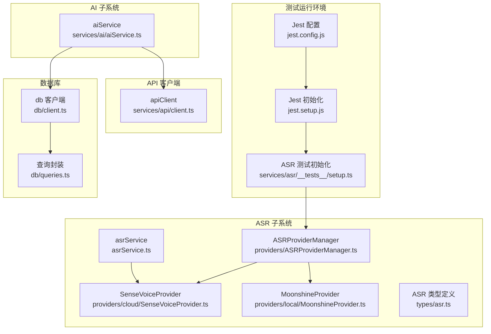
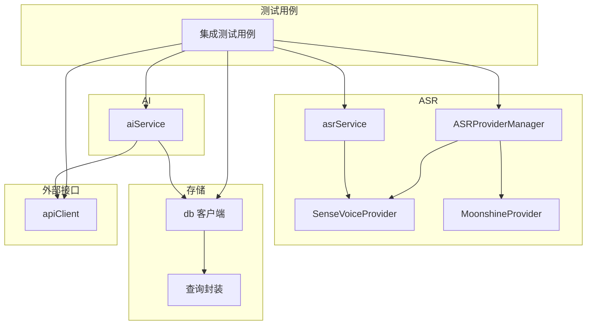
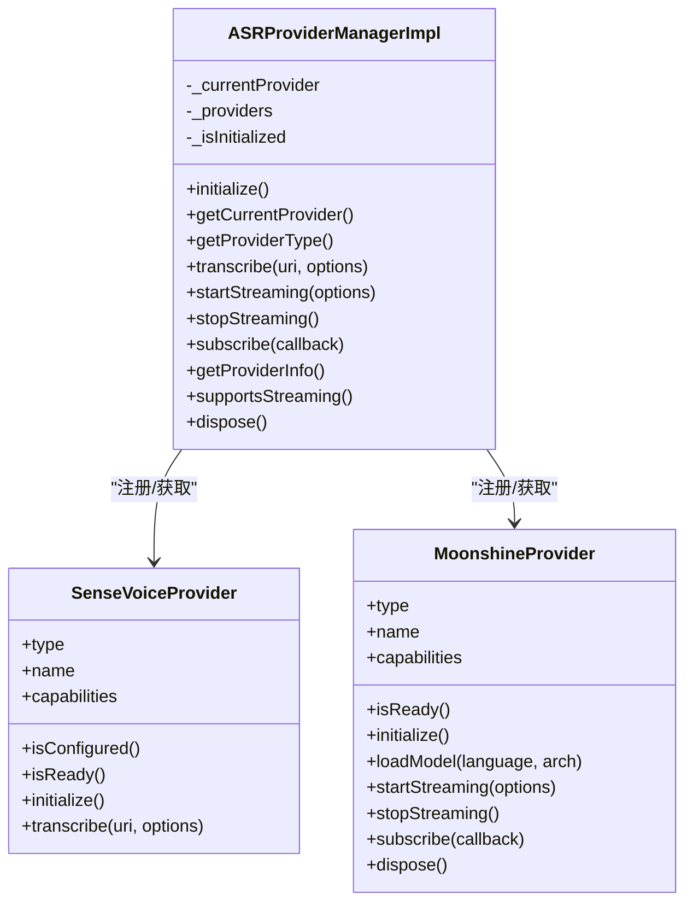
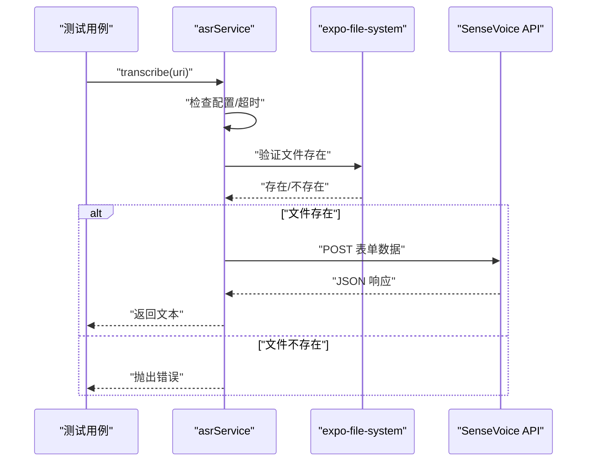
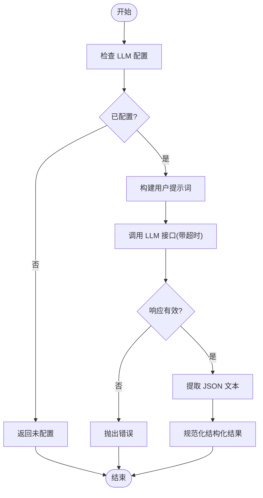
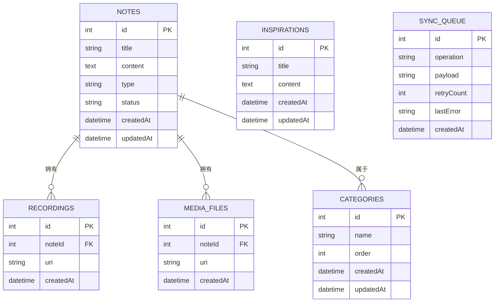
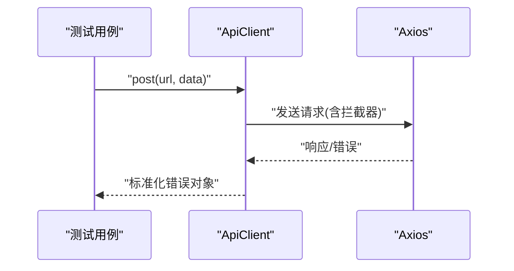
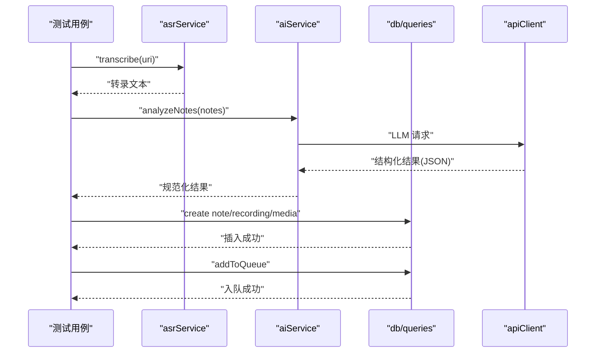
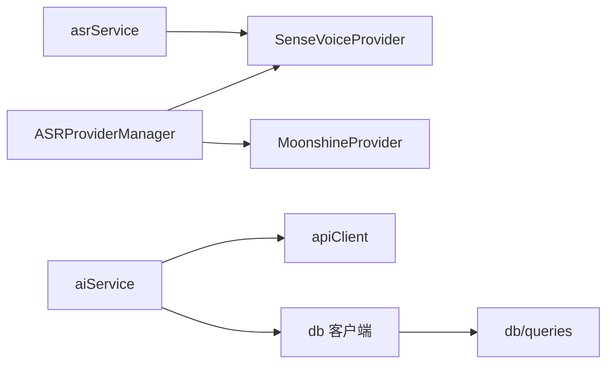

# 集成测试

<cite>
**本文引用的文件**
- [jest.config.js](file://jest.config.js)
- [jest.setup.js](file://jest.setup.js)
- [services/asr/__tests__/setup.ts](file://services/asr/__tests__/setup.ts)
- [services/asr/asrService.ts](file://services/asr/asrService.ts)
- [services/asr/providers/ASRProviderManager.ts](file://services/asr/providers/ASRProviderManager.ts)
- [services/asr/providers/cloud/SenseVoiceProvider.ts](file://services/asr/providers/cloud/SenseVoiceProvider.ts)
- [services/asr/providers/local/MoonshineProvider.ts](file://services/asr/providers/local/MoonshineProvider.ts)
- [services/ai/aiService.ts](file://services/ai/aiService.ts)
- [services/api/client.ts](file://services/api/client.ts)
- [db/client.ts](file://db/client.ts)
- [db/queries.ts](file://db/queries.ts)
- [types/asr.ts](file://types/asr.ts)
- [store/index.ts](file://store/index.ts)
</cite>

## 目录
1. [简介](#简介)
2. [项目结构](#项目结构)
3. [核心组件](#核心组件)
4. [架构总览](#架构总览)
5. [详细组件分析](#详细组件分析)
6. [依赖关系分析](#依赖关系分析)
7. [性能考量](#性能考量)
8. [故障排查指南](#故障排查指南)
9. [结论](#结论)
10. [附录](#附录)

## 简介
本文件面向 VoiceNote 的集成测试，聚焦多模块协同工作场景，包括 ASR 提供商管理器、AI 服务集成、数据库查询与 API 客户端。文档提供服务间通信的测试策略与 mock 使用方法，阐述数据库集成测试（事务与一致性）、API 集成测试（网络请求模拟与响应验证），并给出从录音转录到笔记创建的端到端流程测试方案。同时包含集成测试环境搭建、配置与测试数据准备/清理策略。

## 项目结构
- 测试运行环境采用 Node.js，使用 Jest + ts-jest，覆盖路径与模块名映射已配置。
- ASR 模块测试通过独立的 setup 文件集中 mock AsyncStorage、expo-* 模块与 zustand store。
- 数据库层基于 Expo SQLite + Drizzle ORM，迁移在连接时自动执行。
- 服务层包含 ASR、AI、API 客户端与模型管理器，类型定义统一于 types 目录。

图表来源
- [jest.config.js:1-47](file://jest.config.js#L1-L47)
- [jest.setup.js:1-11](file://jest.setup.js#L1-L11)
- [services/asr/__tests__/setup.ts:1-99](file://services/asr/__tests__/setup.ts#L1-L99)
- [services/asr/providers/ASRProviderManager.ts:1-263](file://services/asr/providers/ASRProviderManager.ts#L1-L263)
- [services/asr/providers/cloud/SenseVoiceProvider.ts:1-167](file://services/asr/providers/cloud/SenseVoiceProvider.ts#L1-L167)
- [services/asr/providers/local/MoonshineProvider.ts:1-307](file://services/asr/providers/local/MoonshineProvider.ts#L1-L307)
- [services/asr/asrService.ts:1-74](file://services/asr/asrService.ts#L1-L74)
- [services/ai/aiService.ts:1-163](file://services/ai/aiService.ts#L1-L163)
- [services/api/client.ts:1-104](file://services/api/client.ts#L1-L104)
- [db/client.ts:1-15](file://db/client.ts#L1-L15)
- [db/queries.ts:1-286](file://db/queries.ts#L1-L286)
- [types/asr.ts:1-164](file://types/asr.ts#L1-L164)

章节来源
- [jest.config.js:1-47](file://jest.config.js#L1-L47)
- [jest.setup.js:1-11](file://jest.setup.js#L1-L11)
- [services/asr/__tests__/setup.ts:1-99](file://services/asr/__tests__/setup.ts#L1-L99)

## 核心组件
- ASR 提供商管理器：负责云/本地提供商选择、生命周期管理、状态查询与流式订阅。
- SenseVoiceProvider：非流式云端 ASR 提供商，支持文件转录。
- MoonshineProvider：流式本地 ASR 提供商，支持实时增量结果。
- asrService：高层封装，直接调用云端 SenseVoice API。
- aiService：AI 分析服务，依赖 LLM 提供商与提示词构建。
- apiClient：通用 Axios 封装，带拦截器与错误处理。
- 数据库：Drizzle + Expo SQLite，提供笔记、录音、媒体、灵感、分类与同步队列查询。

章节来源
- [services/asr/providers/ASRProviderManager.ts:1-263](file://services/asr/providers/ASRProviderManager.ts#L1-L263)
- [services/asr/providers/cloud/SenseVoiceProvider.ts:1-167](file://services/asr/providers/cloud/SenseVoiceProvider.ts#L1-L167)
- [services/asr/providers/local/MoonshineProvider.ts:1-307](file://services/asr/providers/local/MoonshineProvider.ts#L1-L307)
- [services/asr/asrService.ts:1-74](file://services/asr/asrService.ts#L1-L74)
- [services/ai/aiService.ts:1-163](file://services/ai/aiService.ts#L1-L163)
- [services/api/client.ts:1-104](file://services/api/client.ts#L1-L104)
- [db/client.ts:1-15](file://db/client.ts#L1-L15)
- [db/queries.ts:1-286](file://db/queries.ts#L1-L286)

## 架构总览
下图展示 ASR、AI、数据库与 API 在集成测试中的交互关系与数据流向。

图表来源
- [services/asr/providers/ASRProviderManager.ts:1-263](file://services/asr/providers/ASRProviderManager.ts#L1-L263)
- [services/asr/asrService.ts:1-74](file://services/asr/asrService.ts#L1-L74)
- [services/ai/aiService.ts:1-163](file://services/ai/aiService.ts#L1-L163)
- [services/api/client.ts:1-104](file://services/api/client.ts#L1-L104)
- [db/client.ts:1-15](file://db/client.ts#L1-L15)
- [db/queries.ts:1-286](file://db/queries.ts#L1-L286)

## 详细组件分析

### ASR 提供商管理器集成测试
- 测试目标
  - 确认提供商注册、切换与初始化流程正确。
  - 验证当前提供商信息、能力与状态查询。
  - 验证流式/非流式提供商的区分与调用约束。
- 关键测试点
  - 初始化与重复初始化不抛错。
  - 当前提供商类型来自设置，名称与状态可用。
  - 支持流式能力检测。
  - 类型守卫对流式/非流式提供商判定正确。
- Mock 策略
  - 使用 ASR 测试专用 setup 文件集中 mock AsyncStorage、expo-file-system、expo-asset、react-native 与 zustand store。
  - 通过设置 store 默认 ASR 配置，确保提供商初始化与 API 调用可预期。
- 依赖链
  - ASRProviderManager 依赖设置存储与具体提供商工厂函数。
  - 具体提供商依赖类型定义与平台能力。

图表来源
- [services/asr/providers/ASRProviderManager.ts:1-263](file://services/asr/providers/ASRProviderManager.ts#L1-L263)
- [services/asr/providers/cloud/SenseVoiceProvider.ts:1-167](file://services/asr/providers/cloud/SenseVoiceProvider.ts#L1-L167)
- [services/asr/providers/local/MoonshineProvider.ts:1-307](file://services/asr/providers/local/MoonshineProvider.ts#L1-L307)

章节来源
- [services/asr/__tests__/ASRProviderManager.test.ts:1-133](file://services/asr/__tests__/ASRProviderManager.test.ts#L1-L133)
- [services/asr/providers/ASRProviderManager.ts:1-263](file://services/asr/providers/ASRProviderManager.ts#L1-L263)
- [services/asr/providers/cloud/SenseVoiceProvider.ts:1-167](file://services/asr/providers/cloud/SenseVoiceProvider.ts#L1-L167)
- [services/asr/providers/local/MoonshineProvider.ts:1-307](file://services/asr/providers/local/MoonshineProvider.ts#L1-L307)
- [services/asr/__tests__/setup.ts:1-99](file://services/asr/__tests__/setup.ts#L1-L99)

### 云端 ASR 服务集成测试
- 测试目标
  - 验证 asrService 的配置检查、文件存在性校验与超时控制。
  - 验证向 SenseVoice API 发送表单数据与解析响应。
- 关键测试点
  - 未配置时抛出明确错误。
  - 文件不存在时抛出明确错误。
  - 请求超时与网络异常处理。
  - 正常响应提取文本字段。
- Mock 策略
  - 通过 setup 文件 mock expo-file-system 的文件操作与 react-native 的 Platform。
  - 通过环境变量或设置注入 API 地址与密钥。
- 依赖链
  - asrService 依赖设置存储、expo-file-system 与 fetch。

图表来源
- [services/asr/asrService.ts:1-74](file://services/asr/asrService.ts#L1-L74)
- [services/asr/providers/cloud/SenseVoiceProvider.ts:1-167](file://services/asr/providers/cloud/SenseVoiceProvider.ts#L1-L167)
- [services/asr/__tests__/setup.ts:1-99](file://services/asr/__tests__/setup.ts#L1-L99)

章节来源
- [services/asr/asrService.ts:1-74](file://services/asr/asrService.ts#L1-L74)
- [services/asr/__tests__/setup.ts:1-99](file://services/asr/__tests__/setup.ts#L1-L99)

### AI 服务集成测试
- 测试目标
  - 验证 aiService 的配置检查、提示词构建与 LLM 调用。
  - 验证响应解析与结构规范化。
- 关键测试点
  - LLM 未配置时返回未配置状态。
  - 超时控制与取消信号。
  - JSON 提取与结构化规范化（标签、洞察、行动项、元数据）。
- Mock 策略
  - 通过设置 store 注入 AI 配置；必要时 mock LLM 提供商的 createChatCompletion。
- 依赖链
  - aiService 依赖设置存储、提示词工具与 LLM 服务。

图表来源
- [services/ai/aiService.ts:1-163](file://services/ai/aiService.ts#L1-L163)

章节来源
- [services/ai/aiService.ts:1-163](file://services/ai/aiService.ts#L1-L163)

### 数据库集成测试
- 测试目标
  - 验证笔记、录音、媒体、灵感、分类与同步队列的增删改查。
  - 验证跨表关联与一致性（如分类变更对笔记的影响）。
- 关键测试点
  - 插入后读取一致性与时间戳更新。
  - 删除级联与去重逻辑。
  - 统计查询（如按笔记统计媒体数量）。
  - 同步队列的入队、成功标记与失败重试计数。
- Mock 策略
  - 使用真实数据库连接与迁移，确保 SQL 语义正确。
  - 通过事务包裹测试用例，保证隔离与回滚。
- 依赖链
  - 查询封装依赖 Drizzle ORM 与 schema 定义。

图表来源
- [db/queries.ts:1-286](file://db/queries.ts#L1-L286)
- [db/client.ts:1-15](file://db/client.ts#L1-L15)

章节来源
- [db/client.ts:1-15](file://db/client.ts#L1-L15)
- [db/queries.ts:1-286](file://db/queries.ts#L1-L286)

### API 集成测试
- 测试目标
  - 验证 apiClient 的请求/响应拦截、错误映射与基本 CRUD 方法。
- 关键测试点
  - 请求头、超时与基础 URL。
  - 401 等错误状态的处理与消息映射。
  - GET/POST/PUT/PATCH/DELETE 方法可用性。
- Mock 策略
  - 使用 Axios 的拦截器行为进行断言，无需真实网络。
- 依赖链
  - apiClient 依赖 axios 与 i18n 错误消息。

图表来源
- [services/api/client.ts:1-104](file://services/api/client.ts#L1-L104)

章节来源
- [services/api/client.ts:1-104](file://services/api/client.ts#L1-L104)

### 端到端流程测试：录音转录到笔记创建
- 测试目标
  - 验证从录音文件到云端转录、AI 分析、数据库写入与同步队列入队的完整链路。
- 关键步骤
  - 准备录音文件与设置（ASR/AI 配置）。
  - 调用 asrService 或通过 ASRProviderManager 获取提供商并转录。
  - 调用 aiService 进行内容分析与结构化输出。
  - 使用 db 查询封装创建笔记、录音与媒体记录，并入队同步。
  - 验证最终状态与一致性。
- Mock 策略
  - Mock 外部 API 响应与文件系统访问。
  - 使用事务包裹测试，确保回滚。
- 依赖链
  - asrService → SenseVoiceProvider → apiClient
  - aiService → apiClient → db
  - db → queries

图表来源
- [services/asr/asrService.ts:1-74](file://services/asr/asrService.ts#L1-L74)
- [services/ai/aiService.ts:1-163](file://services/ai/aiService.ts#L1-L163)
- [services/api/client.ts:1-104](file://services/api/client.ts#L1-L104)
- [db/queries.ts:1-286](file://db/queries.ts#L1-L286)

章节来源
- [services/asr/asrService.ts:1-74](file://services/asr/asrService.ts#L1-L74)
- [services/ai/aiService.ts:1-163](file://services/ai/aiService.ts#L1-L163)
- [services/api/client.ts:1-104](file://services/api/client.ts#L1-L104)
- [db/queries.ts:1-286](file://db/queries.ts#L1-L286)

## 依赖关系分析
- 组件耦合
  - ASRProviderManager 与具体提供商之间通过工厂函数解耦。
  - asrService 与提供商之间通过抽象接口解耦。
  - aiService 与 LLM 提供商通过统一接口解耦。
- 外部依赖
  - ASR 依赖云端 API 与文件系统。
  - AI 依赖 LLM 与 API 客户端。
  - 数据库依赖 Expo SQLite 与 Drizzle ORM。
- 循环依赖
  - 未发现直接循环依赖；类型定义被各模块引用但无循环导入。

图表来源
- [services/asr/providers/ASRProviderManager.ts:1-263](file://services/asr/providers/ASRProviderManager.ts#L1-L263)
- [services/asr/asrService.ts:1-74](file://services/asr/asrService.ts#L1-L74)
- [services/ai/aiService.ts:1-163](file://services/ai/aiService.ts#L1-L163)
- [services/api/client.ts:1-104](file://services/api/client.ts#L1-L104)
- [db/client.ts:1-15](file://db/client.ts#L1-L15)
- [db/queries.ts:1-286](file://db/queries.ts#L1-L286)

章节来源
- [services/asr/providers/ASRProviderManager.ts:1-263](file://services/asr/providers/ASRProviderManager.ts#L1-L263)
- [services/asr/asrService.ts:1-74](file://services/asr/asrService.ts#L1-L74)
- [services/ai/aiService.ts:1-163](file://services/ai/aiService.ts#L1-L163)
- [services/api/client.ts:1-104](file://services/api/client.ts#L1-L104)
- [db/client.ts:1-15](file://db/client.ts#L1-L15)
- [db/queries.ts:1-286](file://db/queries.ts#L1-L286)

## 性能考量
- 超时控制
  - ASR 与 AI 均设置超时，避免长时间阻塞测试。
- 并发与资源释放
  - ASRProviderManager 在切换提供商时正确 dispose 旧实例。
  - MoonshineProvider 在停止流式时清理事件监听与模型加载状态。
- 数据库事务
  - 使用事务包裹集成测试，减少锁竞争与数据干扰。

## 故障排查指南
- ASR 未配置
  - 现象：调用转录时抛出“未配置”错误。
  - 排查：确认设置存储中 ASR API 地址与密钥已注入。
- 文件不存在
  - 现象：转录前文件校验失败。
  - 排查：确认测试中使用的文件 URI 与 mock 文件系统一致。
- 网络超时
  - 现象：ASR/AI 请求超时。
  - 排查：检查超时阈值与网络拦截器；必要时放宽超时或使用更快的 mock。
- 数据库一致性问题
  - 现象：查询结果与预期不符。
  - 排查：确认迁移是否执行、事务是否正确提交/回滚、外键约束是否满足。
- API 错误映射
  - 现象：错误码与消息不符合预期。
  - 排查：检查 apiClient 的拦截器与错误映射逻辑。

章节来源
- [services/asr/asrService.ts:1-74](file://services/asr/asrService.ts#L1-L74)
- [services/ai/aiService.ts:1-163](file://services/ai/aiService.ts#L1-L163)
- [services/api/client.ts:1-104](file://services/api/client.ts#L1-L104)
- [db/queries.ts:1-286](file://db/queries.ts#L1-L286)

## 结论
本集成测试文档提供了从 ASR 提供商管理、云端转录、AI 分析到数据库与 API 的全链路测试策略。通过集中 mock 与事务隔离，能够稳定地验证多模块协同工作场景。建议在持续集成中引入真实数据库与受限的外部 API 模拟，以进一步提升测试覆盖率与可靠性。

## 附录

### 集成测试环境搭建与配置
- 测试运行环境
  - 使用 Node.js + Jest + ts-jest。
  - 模块名映射与 mock 配置见 [jest.config.js:1-47](file://jest.config.js#L1-L47)。
  - 初始化脚本见 [jest.setup.js:1-11](file://jest.setup.js#L1-L11)。
- ASR 测试初始化
  - 集中 mock AsyncStorage、expo-* 与 zustand store，见 [services/asr/__tests__/setup.ts:1-99](file://services/asr/__tests__/setup.ts#L1-L99)。
- 数据库
  - 使用 Expo SQLite + Drizzle ORM，迁移在连接时执行，见 [db/client.ts:1-15](file://db/client.ts#L1-L15)。
- 设置存储
  - 通过 store 导出统一访问，见 [store/index.ts:1-8](file://store/index.ts#L1-L8)。

章节来源
- [jest.config.js:1-47](file://jest.config.js#L1-L47)
- [jest.setup.js:1-11](file://jest.setup.js#L1-L11)
- [services/asr/__tests__/setup.ts:1-99](file://services/asr/__tests__/setup.ts#L1-L99)
- [db/client.ts:1-15](file://db/client.ts#L1-L15)
- [store/index.ts:1-8](file://store/index.ts#L1-L8)

### 测试数据准备与清理策略
- 准备
  - 使用 mock 文件系统提供音频文件 URI。
  - 通过设置 store 注入 ASR/AI 配置，确保外部 API 可调用。
  - 在测试前执行数据库迁移，确保 schema 最新。
- 清理
  - 使用事务包裹每个测试用例，在结束后回滚。
  - 对于持久化数据，提供删除/清空查询以恢复初始状态。
- 并发与隔离
  - 不同测试用例间避免共享状态；必要时使用独立数据库实例或命名空间。

章节来源
- [services/asr/__tests__/setup.ts:1-99](file://services/asr/__tests__/setup.ts#L1-L99)
- [db/client.ts:1-15](file://db/client.ts#L1-L15)
- [db/queries.ts:1-286](file://db/queries.ts#L1-L286)