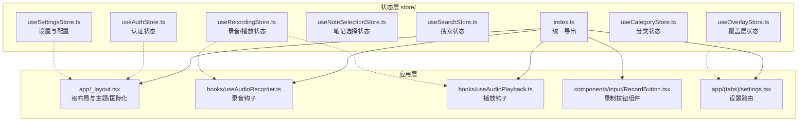
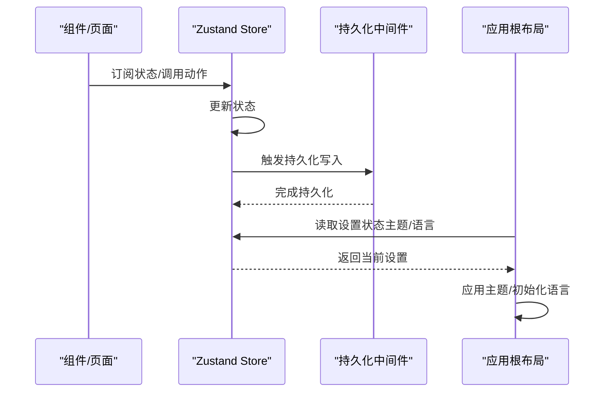
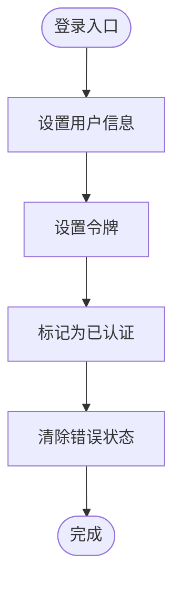
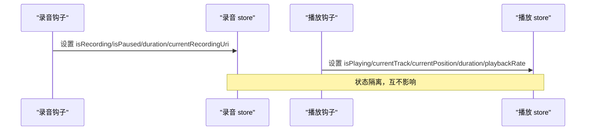
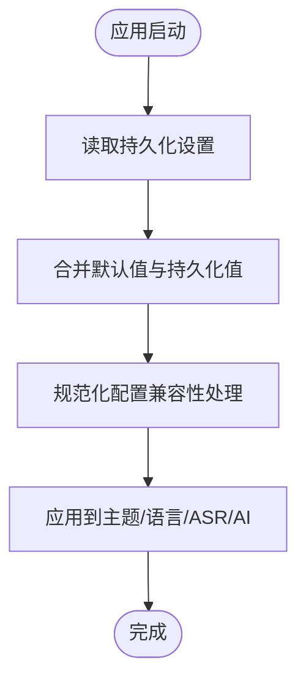
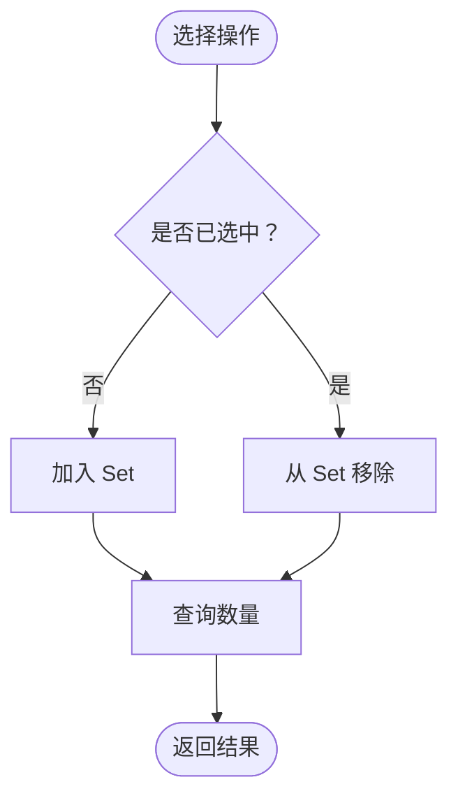
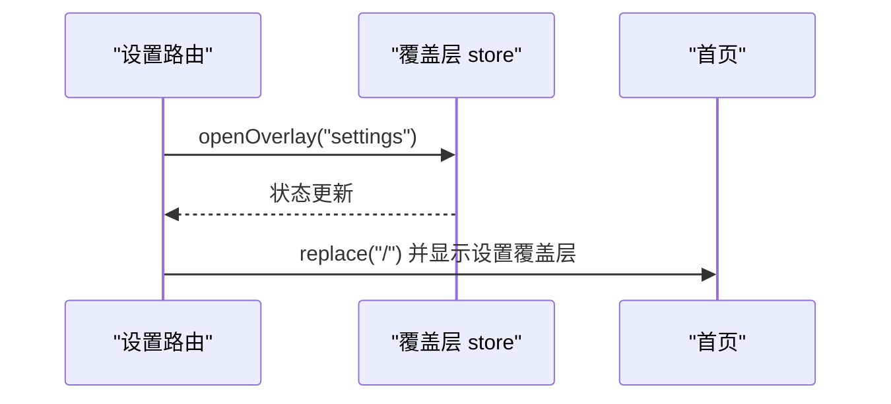
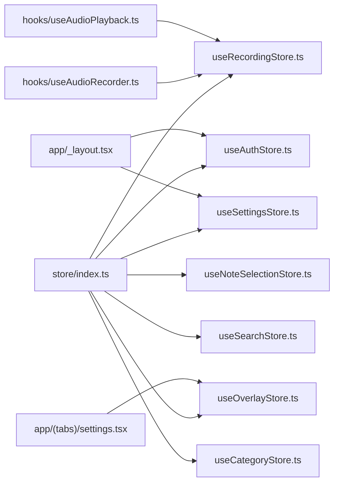

# Zustand 架构设计

<cite>
**本文档引用的文件**
- [store/index.ts](file://store/index.ts)
- [useAuthStore.ts](file://store/useAuthStore.ts)
- [useCategoryStore.ts](file://store/useCategoryStore.ts)
- [useNoteSelectionStore.ts](file://store/useNoteSelectionStore.ts)
- [useOverlayStore.ts](file://store/useOverlayStore.ts)
- [useRecordingStore.ts](file://store/useRecordingStore.ts)
- [useSearchStore.ts](file://store/useSearchStore.ts)
- [useSettingsStore.ts](file://store/useSettingsStore.ts)
- [app/_layout.tsx](file://app/_layout.tsx)
- [hooks/useAudioRecorder.ts](file://hooks/useAudioRecorder.ts)
- [hooks/useAudioPlayback.ts](file://hooks/useAudioPlayback.ts)
- [components/input/RecordButton.tsx](file://components/input/RecordButton.tsx)
- [app/(tabs)/settings.tsx](file://app/(tabs)/settings.tsx)
</cite>

## 目录
1. [简介](#简介)
2. [项目结构](#项目结构)
3. [核心组件](#核心组件)
4. [架构总览](#架构总览)
5. [详细组件分析](#详细组件分析)
6. [依赖关系分析](#依赖关系分析)
7. [性能考量](#性能考量)
8. [故障排除指南](#故障排除指南)
9. [结论](#结论)
10. [附录](#附录)

## 简介
本文件系统性梳理 VoiceNote 应用中的 Zustand 状态管理架构，解释为何选择 Zustand（轻量、易用、类型安全、可持久化），并详细说明全局状态容器的组织结构与导出机制。文档涵盖设计原则（单一职责、状态隔离）、命名规范与文件组织方式、架构图与组件交互示例，并提供性能优化与扩展的最佳实践建议。

## 项目结构
VoiceNote 将状态管理集中于 `store/` 目录，采用“按功能域拆分”的组织方式：每个领域一个独立的 store 文件，通过统一的 barrel 导出入口集中暴露给应用使用。这种结构清晰地实现了状态隔离与职责分离，便于维护与扩展。

**图表来源**
- [store/index.ts:1-8](file://store/index.ts#L1-L8)
- [useAuthStore.ts:1-82](file://store/useAuthStore.ts#L1-L82)
- [useRecordingStore.ts:1-71](file://store/useRecordingStore.ts#L1-L71)
- [useSettingsStore.ts:1-218](file://store/useSettingsStore.ts#L1-L218)
- [useNoteSelectionStore.ts:1-49](file://store/useNoteSelectionStore.ts#L1-L49)
- [useSearchStore.ts:1-14](file://store/useSearchStore.ts#L1-L14)
- [useOverlayStore.ts:1-16](file://store/useOverlayStore.ts#L1-L16)
- [useCategoryStore.ts:1-56](file://store/useCategoryStore.ts#L1-L56)
- [app/_layout.tsx:1-101](file://app/_layout.tsx#L1-L101)
- [hooks/useAudioRecorder.ts:1-270](file://hooks/useAudioRecorder.ts#L1-L270)
- [hooks/useAudioPlayback.ts:1-90](file://hooks/useAudioPlayback.ts#L1-L90)
- [components/input/RecordButton.tsx:1-131](file://components/input/RecordButton.tsx#L1-L131)
- [app/(tabs)/settings.tsx](file://app/(tabs)/settings.tsx#L1-L21)

**章节来源**
- [store/index.ts:1-8](file://store/index.ts#L1-L8)
- [app/_layout.tsx:1-101](file://app/_layout.tsx#L1-L101)

## 核心组件
本节对各状态容器进行深入分析，包括数据结构、动作定义、持久化策略与典型使用场景。

- 认证状态容器（useAuthStore）
  - 职责：用户信息、令牌、认证状态、加载与错误状态管理
  - 特点：使用持久化中间件，仅持久化必要字段（用户、令牌、认证状态）
  - 典型用途：登录/登出流程、权限控制、UI 主题切换

- 录音与播放状态容器（useRecordingStore）
  - 职责：录音状态、暂停状态、时长、当前录音 URI；以及播放器状态（播放中、当前曲目、位置、时长、速率）
  - 特点：在同一文件内导出两个 store（录音与播放），共享初始状态常量
  - 典型用途：录音界面、播放器控件、波形可视化

- 设置状态容器（useSettingsStore）
  - 职责：主题、音频质量、自动保存/同步、通知、语言、ASR/AI 技能与优化配置
  - 特点：复杂配置对象的默认值与兼容性处理、持久化合并策略、环境变量注入
  - 典型用途：设置页面、主题切换、ASR 提供商切换

- 笔记选择状态容器（useNoteSelectionStore）
  - 职责：多选集合、切换、全选、清空、查询是否选中与数量
  - 特点：使用 get() 读取当前状态，避免重复渲染
  - 典型用途：笔记列表批量操作、删除、分享

- 搜索状态容器（useSearchStore）
  - 职责：搜索面板开关
  - 特点：极简状态与动作
  - 典型用途：全局搜索入口

- 覆盖层状态容器（useOverlayStore）
  - 职责：当前激活的覆盖层类型（录音、相机、文本、附件、设置或空）
  - 特点：类型安全的枚举联合类型
  - 典型用途：从任意页面打开对应覆盖层

- 分类状态容器（useCategoryStore）
  - 职责：分类过滤、展开/收起集合、管理与分配弹窗可见性
  - 特点：Set 类型用于高效去重与更新
  - 典型用途：分类视图、分类筛选与管理

**章节来源**
- [useAuthStore.ts:1-82](file://store/useAuthStore.ts#L1-L82)
- [useRecordingStore.ts:1-71](file://store/useRecordingStore.ts#L1-L71)
- [useSettingsStore.ts:1-218](file://store/useSettingsStore.ts#L1-L218)
- [useNoteSelectionStore.ts:1-49](file://store/useNoteSelectionStore.ts#L1-L49)
- [useSearchStore.ts:1-14](file://store/useSearchStore.ts#L1-L14)
- [useOverlayStore.ts:1-16](file://store/useOverlayStore.ts#L1-L16)
- [useCategoryStore.ts:1-56](file://store/useCategoryStore.ts#L1-L56)

## 架构总览
下图展示 Zustand 在应用中的总体交互：组件通过 store 钩子订阅状态，触发动作修改状态；持久化中间件负责本地存储；应用根布局消费设置状态以驱动主题与国际化。

**图表来源**
- [useSettingsStore.ts:134-217](file://store/useSettingsStore.ts#L134-L217)
- [app/_layout.tsx:26-35](file://app/_layout.tsx#L26-L35)

## 详细组件分析

### 认证状态容器（useAuthStore）
- 设计要点
  - 使用持久化中间件，仅持久化用户、令牌与认证状态，减少存储体积
  - 动作函数简洁明确，保证状态原子性更新
- 数据流
  - 登录成功后同时更新用户、令牌与认证状态
  - 登出时清理用户、令牌与错误信息
- 性能与安全
  - 仅持久化必要字段，降低序列化开销
  - 错误状态在登录/登出时及时清理

**图表来源**
- [useAuthStore.ts:49-63](file://store/useAuthStore.ts#L49-L63)

**章节来源**
- [useAuthStore.ts:1-82](file://store/useAuthStore.ts#L1-L82)

### 录音与播放状态容器（useRecordingStore）
- 设计要点
  - 同一文件导出两个 store：录音与播放，共享初始状态常量
  - 录音 store 维护录音/暂停/时长/URI；播放 store 维护播放状态、当前曲目、位置、时长与速率
- 数据流
  - 录音开始/暂停/恢复/停止时更新录音 store
  - 播放器加载音频、播放/暂停/跳转时更新播放 store
- 性能考量
  - 将播放器状态与录音状态分离，避免无关状态导致的重渲染

**图表来源**
- [useRecordingStore.ts:25-33](file://store/useRecordingStore.ts#L25-L33)
- [useRecordingStore.ts:61-70](file://store/useRecordingStore.ts#L61-L70)
- [hooks/useAudioRecorder.ts:26-270](file://hooks/useAudioRecorder.ts#L26-L270)
- [hooks/useAudioPlayback.ts:1-90](file://hooks/useAudioPlayback.ts#L1-L90)

**章节来源**
- [useRecordingStore.ts:1-71](file://store/useRecordingStore.ts#L1-L71)
- [hooks/useAudioRecorder.ts:1-270](file://hooks/useAudioRecorder.ts#L1-L270)
- [hooks/useAudioPlayback.ts:1-90](file://hooks/useAudioPlayback.ts#L1-L90)

### 设置状态容器（useSettingsStore）
- 设计要点
  - 复杂配置对象的默认值与兼容性处理（如 ASR 模型架构映射）
  - 持久化合并策略：对不同配置分支进行差异化合并，确保向后兼容
  - 环境变量注入：从运行时环境读取配置，支持云/本地模型切换
- 数据流
  - 用户更改设置时更新对应字段
  - 应用启动时根据持久化设置初始化主题与语言

**图表来源**
- [useSettingsStore.ts:134-217](file://store/useSettingsStore.ts#L134-L217)
- [useSettingsStore.ts:47-71](file://store/useSettingsStore.ts#L47-L71)
- [useSettingsStore.ts:189-214](file://store/useSettingsStore.ts#L189-L214)

**章节来源**
- [useSettingsStore.ts:1-218](file://store/useSettingsStore.ts#L1-L218)
- [app/_layout.tsx:26-35](file://app/_layout.tsx#L26-L35)

### 笔记选择状态容器（useNoteSelectionStore）
- 设计要点
  - 使用 Set 存储选中 ID，支持高效增删查
  - 动作函数内部使用 get() 读取当前状态，避免外部传参带来的重复计算
- 数据流
  - 切换选择、全选、清空、查询数量等操作均在 store 内部完成

**图表来源**
- [useNoteSelectionStore.ts:18-47](file://store/useNoteSelectionStore.ts#L18-L47)

**章节来源**
- [useNoteSelectionStore.ts:1-49](file://store/useNoteSelectionStore.ts#L1-L49)

### 搜索状态容器（useSearchStore）
- 设计要点
  - 极简状态：仅记录搜索面板是否打开
  - 动作：打开/关闭搜索面板
- 数据流
  - 通过覆盖层或导航栏按钮触发开关

**章节来源**
- [useSearchStore.ts:1-14](file://store/useSearchStore.ts#L1-L14)

### 覆盖层状态容器（useOverlayStore）
- 设计要点
  - 类型安全的覆盖层类型枚举
  - 动作：打开指定覆盖层、关闭覆盖层
- 数据流
  - 设置路由会打开设置覆盖层并重定向至首页

**图表来源**
- [app/(tabs)/settings.tsx](file://app/(tabs)/settings.tsx#L10-L21)
- [useOverlayStore.ts:11-15](file://store/useOverlayStore.ts#L11-L15)

**章节来源**
- [useOverlayStore.ts:1-16](file://store/useOverlayStore.ts#L1-L16)
- [app/(tabs)/settings.tsx](file://app/(tabs)/settings.tsx#L1-L21)

### 分类状态容器（useCategoryStore）
- 设计要点
  - 过滤条件、展开集合、管理与分配弹窗可见性
  - 使用 Set 管理展开 ID，支持批量展开/收起
- 数据流
  - 切换展开/收起、打开/关闭管理与分配弹窗

**章节来源**
- [useCategoryStore.ts:1-56](file://store/useCategoryStore.ts#L1-L56)

## 依赖关系分析
- 统一导出入口
  - 通过 `store/index.ts` 将各 store 暴露给应用其他模块，实现集中导入与版本化管理
- 组件依赖
  - 根布局依赖设置 store 以初始化主题与语言
  - 录音/播放相关组件依赖对应的 store 以驱动 UI 行为
  - 设置路由依赖覆盖层 store 以打开设置覆盖层
- 持久化依赖
  - 认证与设置 store 使用持久化中间件，依赖 AsyncStorage 进行本地存储

**图表来源**
- [store/index.ts:1-8](file://store/index.ts#L1-L8)
- [app/_layout.tsx:12-13](file://app/_layout.tsx#L12-L13)
- [hooks/useAudioRecorder.ts:39-45](file://hooks/useAudioRecorder.ts#L39-L45)
- [hooks/useAudioPlayback.ts:1-9](file://hooks/useAudioPlayback.ts#L1-L9)
- [app/(tabs)/settings.tsx](file://app/(tabs)/settings.tsx#L2-L3)

**章节来源**
- [store/index.ts:1-8](file://store/index.ts#L1-L8)
- [app/_layout.tsx:1-101](file://app/_layout.tsx#L1-L101)

## 性能考量
- 状态隔离与最小化更新
  - 将录音与播放状态分离，避免播放状态变化影响录音 UI
  - 使用 Set 存储选择集合，减少不必要的对象重建
- 持久化优化
  - 认证 store 仅持久化必要字段，降低序列化与反序列化成本
  - 设置 store 使用自定义合并策略，避免配置字段丢失
- 渲染优化
  - 使用 get() 在 store 内部读取状态，减少外部依赖与重渲染
  - 将复杂配置的默认值与兼容性处理集中在 store 初始化阶段
- 内存管理
  - 及时清理播放器资源与录音文件引用
  - 在覆盖层关闭时重置相关状态，避免内存泄漏

[本节为通用性能建议，无需特定文件引用]

## 故障排除指南
- 持久化不生效
  - 检查持久化中间件配置与存储键名是否正确
  - 确认环境是否支持 AsyncStorage
- 状态未更新或更新异常
  - 确认动作函数是否使用 set 原子更新
  - 对于需要读取当前状态的动作，使用 get() 获取最新状态
- 覆盖层无法打开
  - 检查覆盖层类型是否在枚举范围内
  - 确认路由逻辑是否正确调用 openOverlay

**章节来源**
- [useAuthStore.ts:70-81](file://store/useAuthStore.ts#L70-L81)
- [useSettingsStore.ts:189-214](file://store/useSettingsStore.ts#L189-L214)
- [useOverlayStore.ts:11-15](file://store/useOverlayStore.ts#L11-L15)

## 结论
VoiceNote 的 Zustand 架构通过“按功能域拆分”的 store 组织方式与统一导出入口，实现了清晰的状态隔离与良好的可维护性。结合持久化中间件与类型安全的接口设计，既满足了移动端的性能要求，又提供了扩展性与可测试性。遵循本文的设计原则与最佳实践，可在保持架构一致性的同时快速迭代新功能。

## 附录

### 设计原则与最佳实践
- 单一职责原则
  - 每个 store 聚焦单一业务域，避免“上帝 store”
- 状态隔离策略
  - 将强耦合状态拆分为多个独立 store，减少跨域更新
- 命名规范与文件组织
  - store 文件命名为 useXStore.ts，导出为 useXStore
  - 通过 index.ts barrel 导出，统一导入路径
- 扩展指导
  - 新增 store 时先定义接口与动作，再实现持久化与默认值
  - 对复杂配置提供默认值与兼容性处理，确保升级平滑
  - 在组件中尽量通过 store 钩子直接消费状态，避免在 UI 层做过多状态管理

[本节为概念性内容，无需特定文件引用]