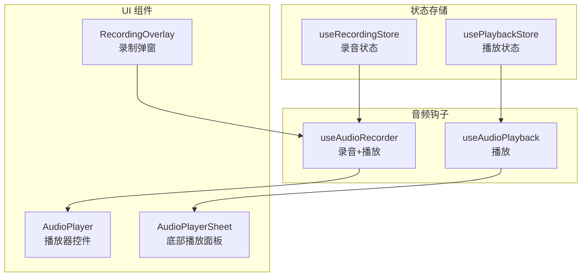
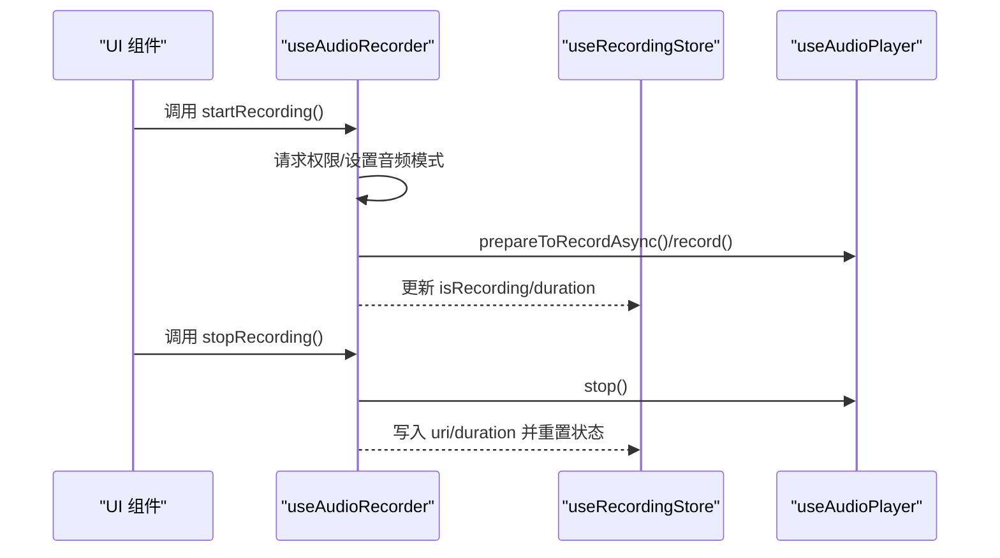
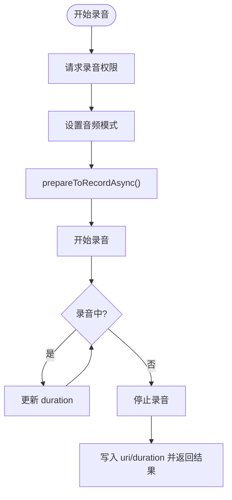
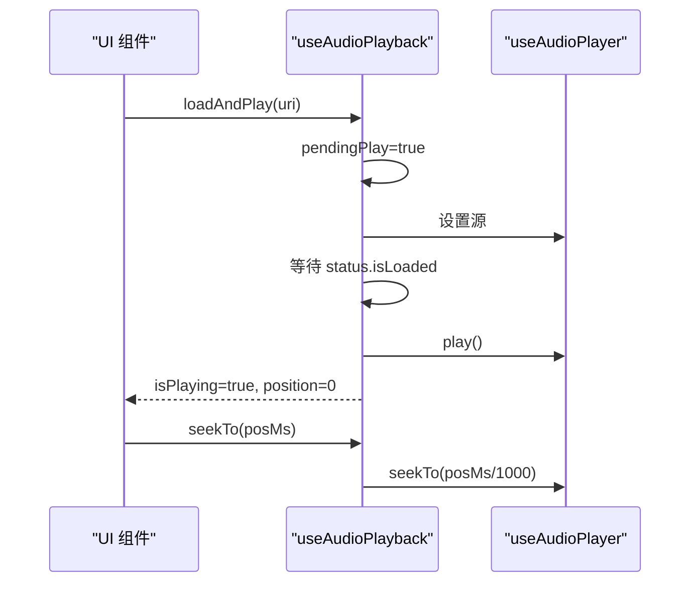
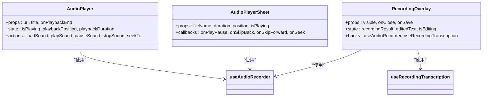
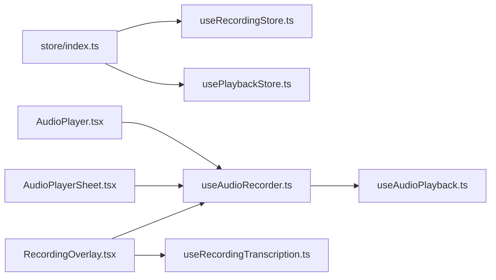

# 录音播放状态管理

<cite>
**本文档引用的文件**
- [useRecordingStore.ts](file://store/useRecordingStore.ts)
- [useAudioRecorder.ts](file://hooks/useAudioRecorder.ts)
- [useAudioPlayback.ts](file://hooks/useAudioPlayback.ts)
- [AudioPlayer.tsx](file://components/audio/AudioPlayer.tsx)
- [RecordingOverlay.tsx](file://components/input/RecordingOverlay.tsx)
- [AudioPlayerSheet.tsx](file://components/note/viewer/AudioPlayerSheet.tsx)
- [index.ts](file://store/index.ts)
- [useRecordingTranscription.ts](file://hooks/useRecordingTranscription.ts)
</cite>

## 目录
1. [简介](#简介)
2. [项目结构](#项目结构)
3. [核心组件](#核心组件)
4. [架构总览](#架构总览)
5. [详细组件分析](#详细组件分析)
6. [依赖关系分析](#依赖关系分析)
7. [性能考虑](#性能考虑)
8. [故障排除指南](#故障排除指南)
9. [结论](#结论)
10. [附录](#附录)

## 简介
本文件系统性阐述录音与播放状态管理的设计与实现，重点解析 Zustand 状态存储 useRecordingStore 与 usePlaybackStore 与音频钩子函数 useAudioRecorder、useAudioPlayback 的协同工作机制。内容涵盖：
- 录音状态生命周期管理（开始、暂停、恢复、停止、取消）
- 播放进度跟踪与控制（播放、暂停、停止、跳转）
- 状态数据结构设计与状态转换逻辑
- 状态与音频钩子函数的集成与数据绑定机制
- 完整使用示例（状态监听与事件处理）
- 状态同步策略与并发操作处理
- 扩展指导（新增播放状态或录音参数）
- 状态持久化与恢复机制的实现细节

## 项目结构
录音播放状态管理涉及以下关键模块：
- 状态存储：store/useRecordingStore.ts（Zustand）
- 音频钩子：hooks/useAudioRecorder.ts、hooks/useAudioPlayback.ts
- UI 组件：components/audio/AudioPlayer.tsx、components/note/viewer/AudioPlayerSheet.tsx
- 录制界面：components/input/RecordingOverlay.tsx
- 导出入口：store/index.ts

图表来源
- [useRecordingStore.ts:1-71](file://store/useRecordingStore.ts#L1-L71)
- [useAudioRecorder.ts:1-270](file://hooks/useAudioRecorder.ts#L1-L270)
- [useAudioPlayback.ts:1-90](file://hooks/useAudioPlayback.ts#L1-L90)
- [AudioPlayer.tsx:1-132](file://components/audio/AudioPlayer.tsx#L1-L132)
- [AudioPlayerSheet.tsx:1-84](file://components/note/viewer/AudioPlayerSheet.tsx#L1-L84)
- [RecordingOverlay.tsx:1-419](file://components/input/RecordingOverlay.tsx#L1-L419)

章节来源
- [useRecordingStore.ts:1-71](file://store/useRecordingStore.ts#L1-L71)
- [useAudioRecorder.ts:1-270](file://hooks/useAudioRecorder.ts#L1-L270)
- [useAudioPlayback.ts:1-90](file://hooks/useAudioPlayback.ts#L1-L90)
- [AudioPlayer.tsx:1-132](file://components/audio/AudioPlayer.tsx#L1-L132)
- [AudioPlayerSheet.tsx:1-84](file://components/note/viewer/AudioPlayerSheet.tsx#L1-L84)
- [RecordingOverlay.tsx:1-419](file://components/input/RecordingOverlay.tsx#L1-L419)
- [index.ts:1-7](file://store/index.ts#L1-L7)

## 核心组件
本节聚焦录音与播放状态的数据结构、动作定义与初始状态。

- 录音状态（useRecordingStore）
  - 关键字段：是否录音、是否暂停、时长（毫秒）、当前录音 URI
  - 动作：设置录音状态、设置暂停状态、设置时长、设置当前录音 URI、重置
- 播放状态（usePlaybackStore）
  - 关键字段：是否播放、当前曲目 ID、当前位置（毫秒）、总时长（毫秒）、播放速率
  - 动作：设置播放状态、设置当前曲目、设置位置、设置时长、设置播放速率、重置

这些状态通过 Zustand 提供的 create API 构建，具备高内聚、低耦合的特点，便于在组件中按需订阅。

章节来源
- [useRecordingStore.ts:3-33](file://store/useRecordingStore.ts#L3-L33)
- [useRecordingStore.ts:36-70](file://store/useRecordingStore.ts#L36-L70)

## 架构总览
录音与播放状态管理采用“状态存储 + 音频钩子 + UI 组件”的分层架构：
- 状态存储层：集中管理录音与播放的核心状态
- 音频钩子层：封装 Expo Audio 的录音与播放能力，提供统一的动作接口
- UI 组件层：负责渲染与交互，将状态与动作映射到用户界面

图表来源
- [useAudioRecorder.ts:79-175](file://hooks/useAudioRecorder.ts#L79-L175)
- [useRecordingStore.ts:25-33](file://store/useRecordingStore.ts#L25-L33)

章节来源
- [useAudioRecorder.ts:1-270](file://hooks/useAudioRecorder.ts#L1-L270)
- [useRecordingStore.ts:1-71](file://store/useRecordingStore.ts#L1-L71)

## 详细组件分析

### 录音状态管理（useAudioRecorder）
- 生命周期
  - 开始录音：请求权限、设置音频模式、准备并启动录音，更新 isRecording 与 duration
  - 暂停/恢复：调用暂停/继续录音，切换 isPaused
  - 停止录音：停止录音并禁用录音模式，读取 uri 与 duration，返回结果
  - 取消录音：停止录音并删除临时文件，重置本地状态
- 进度跟踪
  - 通过定时轮询获取播放器的 currentTime 与 duration，并转换为毫秒级进度
- 数据绑定
  - 将录音状态与播放器状态通过状态提升至 UI 组件，实现进度条与播放按钮联动

图表来源
- [useAudioRecorder.ts:79-175](file://hooks/useAudioRecorder.ts#L79-L175)

章节来源
- [useAudioRecorder.ts:26-269](file://hooks/useAudioRecorder.ts#L26-L269)

### 播放状态管理（useAudioPlayback）
- 加载与自动播放
  - 当源变更且加载完成时，自动触发播放（pendingPlay 机制）
- 控制接口
  - 加载、播放、暂停、停止、跳转、卸载
- 状态同步
  - 通过状态对象暴露 isPlaying、playbackPosition、playbackDuration，供 UI 组件绑定

图表来源
- [useAudioPlayback.ts:27-42](file://hooks/useAudioPlayback.ts#L27-L42)
- [useAudioPlayback.ts:8-21](file://hooks/useAudioPlayback.ts#L8-L21)

章节来源
- [useAudioPlayback.ts:1-90](file://hooks/useAudioPlayback.ts#L1-L90)

### UI 组件与状态集成
- AudioPlayer（播放器控件）
  - 使用 useAudioRecorder 获取 isPlaying、playbackPosition、playbackDuration
  - 提供播放/暂停、停止、拖拽进度等交互
- AudioPlayerSheet（底部播放面板）
  - 接收外部传入的 duration、position、isPlaying 等属性
  - 通过回调 onPlayPause/onSkipBack/onSkipForward/onSeek 实现外部控制
- RecordingOverlay（录制弹窗）
  - 聚合 useAudioRecorder 与 useRecordingTranscription
  - 处理录音开始/停止/取消、转写流程、保存逻辑

图表来源
- [AudioPlayer.tsx:15-28](file://components/audio/AudioPlayer.tsx#L15-L28)
- [AudioPlayerSheet.tsx:24-57](file://components/note/viewer/AudioPlayerSheet.tsx#L24-L57)
- [RecordingOverlay.tsx:75-102](file://components/input/RecordingOverlay.tsx#L75-L102)

章节来源
- [AudioPlayer.tsx:1-132](file://components/audio/AudioPlayer.tsx#L1-L132)
- [AudioPlayerSheet.tsx:1-84](file://components/note/viewer/AudioPlayerSheet.tsx#L1-L84)
- [RecordingOverlay.tsx:1-419](file://components/input/RecordingOverlay.tsx#L1-L419)

### 状态同步策略与并发处理
- 同步策略
  - 录音状态：useAudioRecorder 内部维护本地状态，同时通过状态提升写入 useRecordingStore
  - 播放状态：useAudioPlayback 通过状态对象暴露播放器状态，UI 组件直接绑定
- 并发处理
  - 录音与播放互斥：停止录音后禁用录音模式，避免冲突
  - 自动播放：loadAndPlay 中 pendingPlay 与 isLoaded 结合，确保加载完成后自动播放
  - 取消与保存：RecordingOverlay 在录制进行中点击保存时，标记 pendingSave，待停止与转写完成后自动保存

章节来源
- [useAudioRecorder.ts:141-142](file://hooks/useAudioRecorder.ts#L141-L142)
- [useAudioPlayback.ts:12-21](file://hooks/useAudioPlayback.ts#L12-L21)
- [RecordingOverlay.tsx:284-289](file://components/input/RecordingOverlay.tsx#L284-L289)

### 状态扩展指导
- 新增播放状态
  - 在 usePlaybackStore 中增加字段与对应动作（如缓冲状态、错误状态）
  - 在 useAudioPlayback 中根据播放器状态更新新字段
- 新增录音参数
  - 在 useRecordingStore 中扩展录音配置（如采样率、编码格式）
  - 在 useAudioRecorder 中传递新参数给底层录音器
- 注意事项
  - 保持状态结构稳定，避免破坏现有 UI 绑定
  - 为新状态提供默认值与 reset 行为

章节来源
- [useRecordingStore.ts:3-16](file://store/useRecordingStore.ts#L3-L16)
- [useRecordingStore.ts:36-51](file://store/useRecordingStore.ts#L36-L51)
- [useAudioRecorder.ts:39-45](file://hooks/useAudioRecorder.ts#L39-L45)

### 状态持久化与恢复机制
- 录音状态持久化
  - 录音完成后的 uri 与 duration 可写入数据库或本地存储，用于后续播放与展示
- 播放状态持久化
  - 当前曲目 ID、播放位置、播放速率可序列化保存；应用重启后可通过 loadAndPlay 或 loadSound 恢复
- 恢复策略
  - 应用启动时读取上次播放记录，调用 loadAndPlay 并延迟触发播放，保证资源加载完成后再播放

章节来源
- [useAudioRecorder.ts:155-160](file://hooks/useAudioRecorder.ts#L155-L160)
- [useAudioPlayback.ts:27-42](file://hooks/useAudioPlayback.ts#L27-L42)

## 依赖关系分析
- 模块导出
  - store/index.ts 统一导出 useRecordingStore 与 usePlaybackStore
- 组件依赖
  - AudioPlayer 与 AudioPlayerSheet 直接依赖 useAudioRecorder
  - RecordingOverlay 依赖 useAudioRecorder 与 useRecordingTranscription

图表来源
- [index.ts:1-7](file://store/index.ts#L1-L7)
- [useRecordingStore.ts:1-71](file://store/useRecordingStore.ts#L1-L71)
- [useAudioRecorder.ts:1-270](file://hooks/useAudioRecorder.ts#L1-L270)
- [useAudioPlayback.ts:1-90](file://hooks/useAudioPlayback.ts#L1-L90)
- [AudioPlayer.tsx:1-132](file://components/audio/AudioPlayer.tsx#L1-L132)
- [AudioPlayerSheet.tsx:1-84](file://components/note/viewer/AudioPlayerSheet.tsx#L1-L84)
- [RecordingOverlay.tsx:1-419](file://components/input/RecordingOverlay.tsx#L1-L419)
- [useRecordingTranscription.ts:1-199](file://hooks/useRecordingTranscription.ts#L1-L199)

章节来源
- [index.ts:1-7](file://store/index.ts#L1-L7)

## 性能考虑
- 状态粒度
  - 将录音与播放状态拆分为独立 store，降低不必要的重渲染
- 轮询频率
  - 播放进度轮询间隔建议根据 UI 需求调整，避免过于频繁导致性能开销
- 资源释放
  - 停止录音/播放后及时释放播放器资源，防止内存泄漏
- 异步操作
  - 录音与转写为异步流程，应避免阻塞主线程，合理使用回调与状态提示

## 故障排除指南
- 录音权限被拒绝
  - 检查权限请求流程与用户授权状态，提供明确的错误提示与重试机制
- 播放失败
  - 检查源是否已加载（isLoaded），避免在未加载完成时调用播放/跳转
- 录音与播放冲突
  - 停止录音后需禁用录音模式，确保播放器正常工作
- 状态不一致
  - 使用 reset 动作清理状态，避免残留状态影响后续操作

章节来源
- [useAudioRecorder.ts:74-77](file://hooks/useAudioRecorder.ts#L74-L77)
- [useAudioPlayback.ts:49-52](file://hooks/useAudioPlayback.ts#L49-L52)
- [useAudioRecorder.ts:141-142](file://hooks/useAudioRecorder.ts#L141-L142)

## 结论
本方案通过 Zustand 管理录音与播放状态，结合 Expo Audio 钩子函数，实现了清晰的状态生命周期与稳定的 UI 绑定。录音与播放状态相互解耦，支持并发场景下的安全操作；通过统一的导出入口与 UI 组件集成，满足多场景使用需求。扩展性强，易于新增状态与功能。

## 附录
- 使用示例路径
  - 录音开始/停止/取消：[useAudioRecorder.ts:79-204](file://hooks/useAudioRecorder.ts#L79-L204)
  - 播放控制（加载/播放/暂停/停止/跳转）：[useAudioPlayback.ts:27-87](file://hooks/useAudioPlayback.ts#L27-L87)
  - UI 绑定（播放器控件）：[AudioPlayer.tsx:19-47](file://components/audio/AudioPlayer.tsx#L19-L47)
  - 录制弹窗（录音+转写+保存）：[RecordingOverlay.tsx:161-282](file://components/input/RecordingOverlay.tsx#L161-L282)
- 状态导出入口：[store/index.ts:1-7](file://store/index.ts#L1-L7)