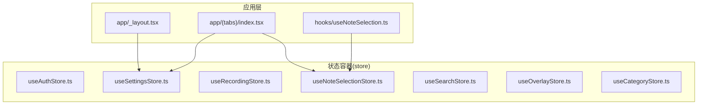
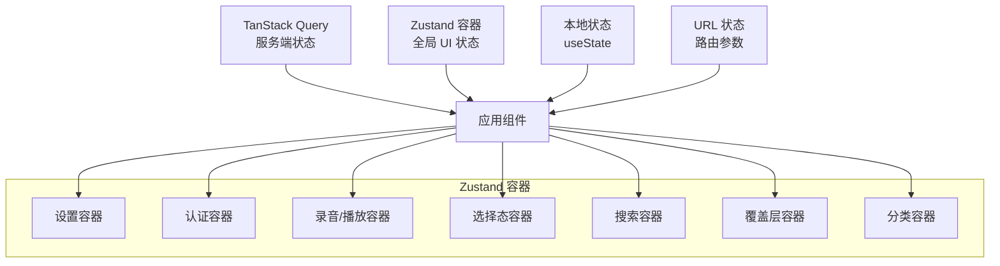
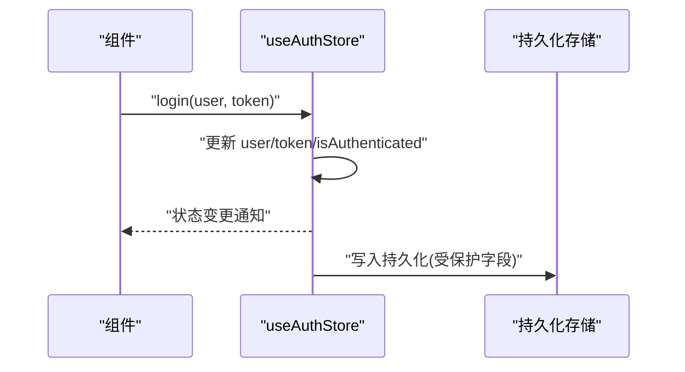
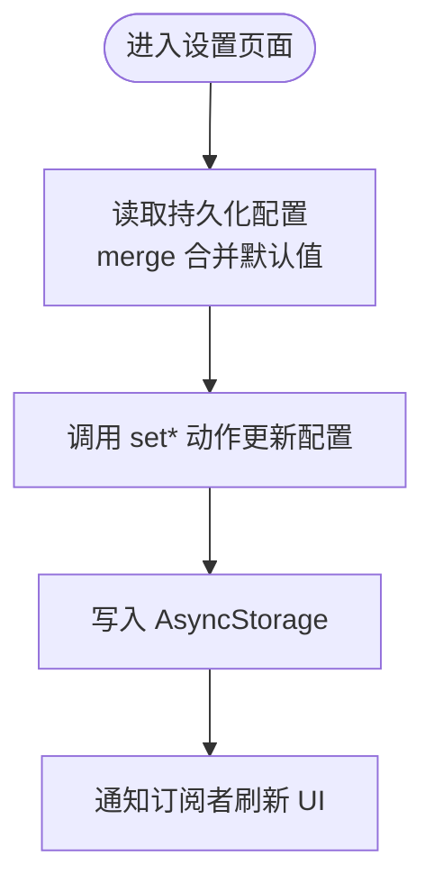
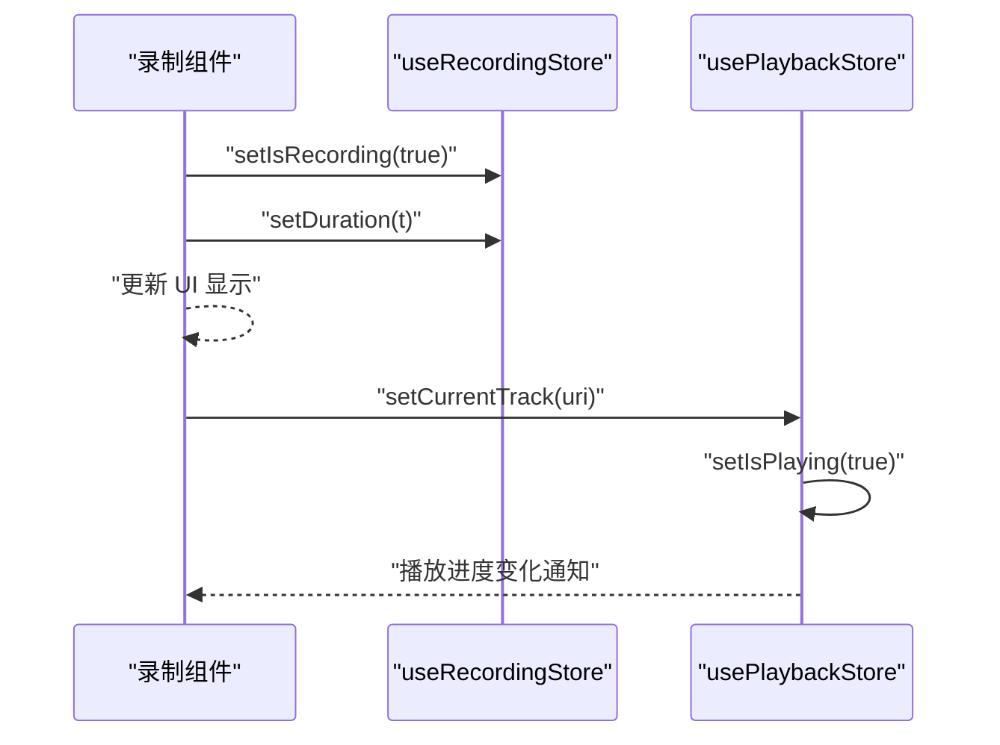
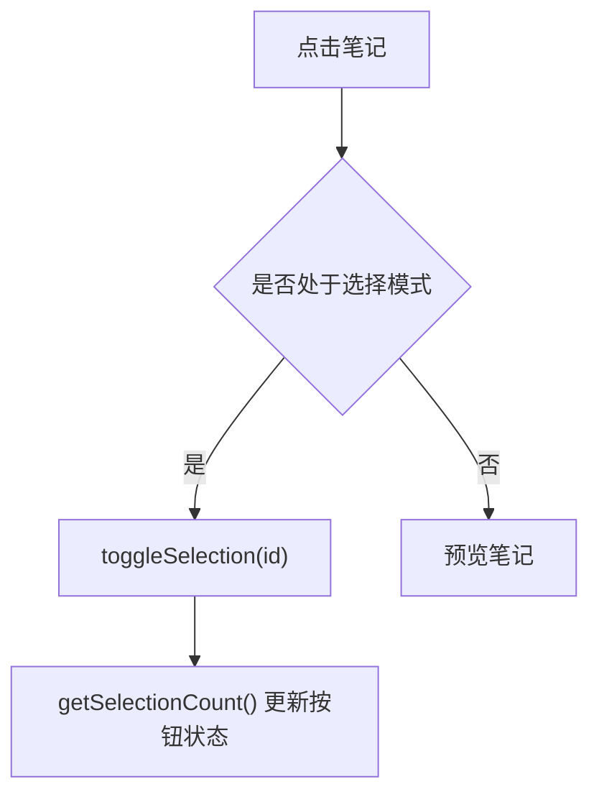
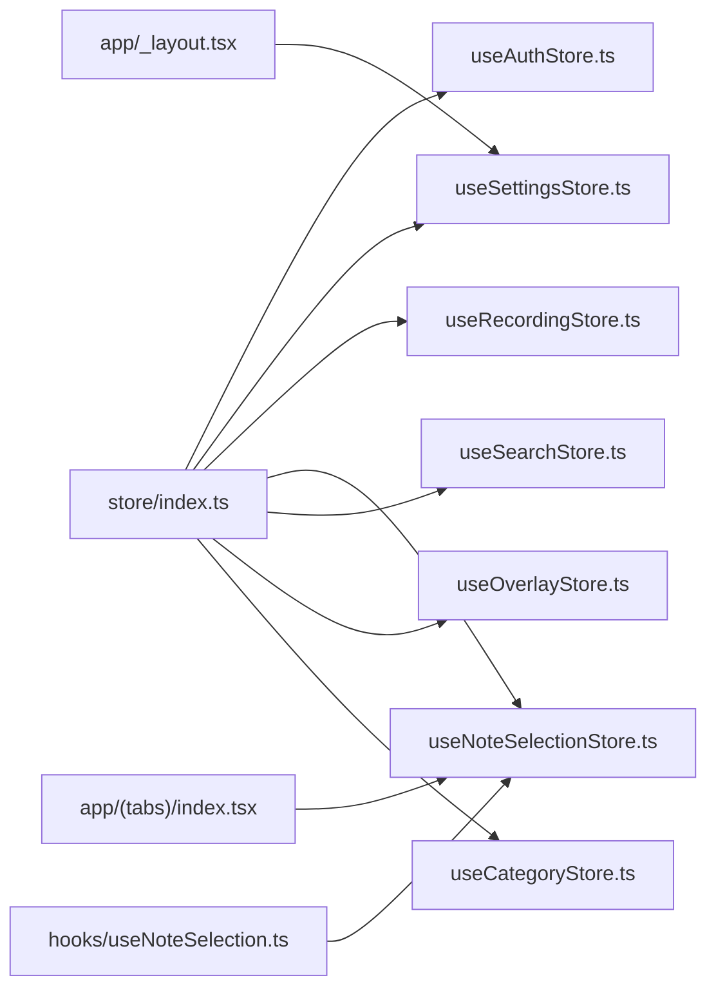

# 状态管理

<cite>
**本文引用的文件**
- [store/index.ts](file://store/index.ts)
- [store/useNoteSelectionStore.ts](file://store/useNoteSelectionStore.ts)
- [store/useRecordingStore.ts](file://store/useRecordingStore.ts)
- [store/useSettingsStore.ts](file://store/useSettingsStore.ts)
- [store/useAuthStore.ts](file://store/useAuthStore.ts)
- [store/useSearchStore.ts](file://store/useSearchStore.ts)
- [store/useOverlayStore.ts](file://store/useOverlayStore.ts)
- [store/useCategoryStore.ts](file://store/useCategoryStore.ts)
- [.trellis/spec/frontend/state-management.md](file://.trellis/spec/frontend/state-management.md)
- [app/_layout.tsx](file://app/_layout.tsx)
- [app/(tabs)/index.tsx](file://app/(tabs)/index.tsx)
- [hooks/useNoteSelection.ts](file://hooks/useNoteSelection.ts)
- [CLAUDE.md](file://CLAUDE.md)
</cite>

## 目录
1. [简介](#简介)
2. [项目结构](#项目结构)
3. [核心组件](#核心组件)
4. [架构总览](#架构总览)
5. [详细组件分析](#详细组件分析)
6. [依赖分析](#依赖分析)
7. [性能考量](#性能考量)
8. [故障排除指南](#故障排除指南)
9. [结论](#结论)
10. [附录](#附录)

## 简介
本文件系统性梳理 VoiceNote 的状态管理方案，重点围绕基于 Zustand 的全局状态容器设计与使用，涵盖状态容器的职责划分、订阅与更新机制、持久化策略、跨组件共享、调试与故障排除，以及与 React Hooks 的集成方式。同时给出最佳实践、扩展建议与自定义状态容器的创建方法，帮助开发者在保持代码清晰与可维护性的前提下高效扩展状态管理能力。

## 项目结构
- 状态容器集中于 store 目录，采用“按功能域分层”的组织方式：用户偏好与设置、录音播放、选择态、搜索、覆盖层、分类等。
- 通过统一的 barrel 文件导出，便于在应用各处以简洁路径导入。
- 全局 UI 状态与服务端数据分离：服务端数据由 TanStack Query 管理，Zustand 聚焦 UI 与用户偏好等跨屏幕状态。

图表来源
- [store/index.ts:1-8](file://store/index.ts#L1-L8)
- [store/useSettingsStore.ts:134-217](file://store/useSettingsStore.ts#L134-L217)
- [store/useRecordingStore.ts:25-70](file://store/useRecordingStore.ts#L25-L70)
- [store/useNoteSelectionStore.ts:15-48](file://store/useNoteSelectionStore.ts#L15-L48)
- [store/useSearchStore.ts:9-13](file://store/useSearchStore.ts#L9-L13)
- [store/useOverlayStore.ts:11-15](file://store/useOverlayStore.ts#L11-L15)
- [store/useCategoryStore.ts:23-55](file://store/useCategoryStore.ts#L23-L55)
- [app/_layout.tsx:27-35](file://app/_layout.tsx#L27-L35)
- [app/(tabs)/index.tsx:70-135](file://app/(tabs)/index.tsx#L70-L135)
- [hooks/useNoteSelection.ts:3-18](file://hooks/useNoteSelection.ts#L3-L18)

章节来源
- [store/index.ts:1-8](file://store/index.ts#L1-L8)
- [.trellis/spec/frontend/state-management.md:11-16](file://.trellis/spec/frontend/state-management.md#L11-L16)

## 核心组件
- 认证状态容器(useAuthStore)
  - 职责：用户信息、认证令牌、登录/登出、加载与错误状态管理。
  - 特点：使用持久化中间件，仅持久化必要字段，避免敏感信息泄露风险。
- 设置状态容器(useSettingsStore)
  - 职责：主题、音频质量、自动保存/同步、通知、触觉反馈、语言、ASR/AI 技能与优化配置。
  - 特点：默认值集中定义，合并策略处理旧版本迁移；持久化存储。
- 录音与播放状态容器(useRecordingStore/usePlaybackStore)
  - 职责：录音状态(isRecording/isPaused/duration/currentRecordingUri)与播放状态(isPlaying/currentTrack/currentPosition/duration/playbackRate)。
  - 特点：双容器解耦录音与播放，支持重置与速率控制。
- 选择态容器(useNoteSelectionStore)
  - 职责：多选集合(Set<number>)、切换、全选、清空、查询是否选中与数量。
  - 特点：返回 Set 的数组形式以便渲染组件订阅。
- 搜索容器(useSearchStore)
  - 职责：搜索面板开关。
- 覆盖层容器(useOverlayStore)
  - 职责：当前打开的覆盖层类型(record/camera/text/attachment/settings/null)。
- 分类容器(useCategoryStore)
  - 职责：分类筛选、展开/收起、管理与分配弹窗可见性。

章节来源
- [store/useAuthStore.ts:29-81](file://store/useAuthStore.ts#L29-L81)
- [store/useSettingsStore.ts:9-45](file://store/useSettingsStore.ts#L9-L45)
- [store/useRecordingStore.ts:3-16](file://store/useRecordingStore.ts#L3-L16)
- [store/useNoteSelectionStore.ts:3-13](file://store/useNoteSelectionStore.ts#L3-L13)
- [store/useSearchStore.ts:3-7](file://store/useSearchStore.ts#L3-L7)
- [store/useOverlayStore.ts:3-9](file://store/useOverlayStore.ts#L3-L9)
- [store/useCategoryStore.ts:4-21](file://store/useCategoryStore.ts#L4-L21)

## 架构总览
- 层次化状态模型
  - 服务端状态：TanStack Query 负责 API 数据读取、缓存与失效。
  - 全局 UI 状态：Zustand 管理跨屏幕 UI 与用户偏好。
  - 本地状态：组件级 useState 管理一次性或局部状态。
  - URL 状态：Expo Router 参数承载路由层面的状态。
- 状态容器导出与使用
  - 通过 store/index.ts 统一导出，便于在应用任意位置以 @store/* 路径导入。
  - 应用入口(app/_layout.tsx)读取语言设置驱动国际化初始化。
  - 主页(app/(tabs)/index.tsx)使用笔记选择容器实现批量操作与视图切换。

图表来源
- [.trellis/spec/frontend/state-management.md:9-16](file://.trellis/spec/frontend/state-management.md#L9-L16)
- [store/index.ts:1-8](file://store/index.ts#L1-L8)
- [app/_layout.tsx:27-35](file://app/_layout.tsx#L27-L35)
- [app/(tabs)/index.tsx:70-135](file://app/(tabs)/index.tsx#L70-L135)

## 详细组件分析

### 认证状态容器(useAuthStore)
- 设计要点
  - 使用持久化中间件，仅持久化用户、令牌与认证状态，避免持久化敏感数据。
  - 动作包括 setUser/setToken/login/logout/setLoading/setError，语义清晰。
- 订阅与更新
  - 组件通过选择器订阅所需字段，减少不必要重渲染。
- 性能与安全
  - 仅持久化必要字段，降低存储体积与泄露风险。
- 常见用法
  - 登录成功后调用 login，失败时 setError，加载中 setLoadin。

图表来源
- [store/useAuthStore.ts:49-63](file://store/useAuthStore.ts#L49-L63)
- [store/useAuthStore.ts:71-80](file://store/useAuthStore.ts#L71-L80)

章节来源
- [store/useAuthStore.ts:29-81](file://store/useAuthStore.ts#L29-L81)

### 设置状态容器(useSettingsStore)
- 设计要点
  - 默认配置集中定义，含 ASR/AI/技能/优化等复杂子配置。
  - 合并策略 merge 处理旧版持久化数据，保证兼容性。
  - 提供便捷动作：切换主题、音频质量、自动保存/同步、通知、触觉反馈、语言、ASR/AI 配置、技能增删改、优化开关与级别。
- 订阅与更新
  - 组件通过选择器读取子配置，如 asrConfig/aiConfig/skillsConfig/optimizationConfig。
- 持久化
  - 使用 persist 中间件与 JSON 存储，键名为 settings-storage。

图表来源
- [store/useSettingsStore.ts:134-188](file://store/useSettingsStore.ts#L134-L188)
- [store/useSettingsStore.ts:189-216](file://store/useSettingsStore.ts#L189-L216)

章节来源
- [store/useSettingsStore.ts:9-45](file://store/useSettingsStore.ts#L9-L45)
- [store/useSettingsStore.ts:134-217](file://store/useSettingsStore.ts#L134-L217)

### 录音与播放状态容器(useRecordingStore/usePlaybackStore)
- 设计要点
  - 录音容器：isRecording/isPaused/duration/currentRecordingUri/reset。
  - 播放容器：isPlaying/currentTrack/currentPosition/duration/playbackRate/reset。
  - 双容器解耦，便于独立控制与测试。
- 订阅与更新
  - 录制组件订阅 isRecording/isPaused/duration；播放组件订阅 isPlaying/currentPosition/duration。
- 性能
  - 状态粒度细，避免无关组件重渲染。

图表来源
- [store/useRecordingStore.ts:25-33](file://store/useRecordingStore.ts#L25-L33)
- [store/useRecordingStore.ts:61-70](file://store/useRecordingStore.ts#L61-L70)

章节来源
- [store/useRecordingStore.ts:3-16](file://store/useRecordingStore.ts#L3-L16)
- [store/useRecordingStore.ts:25-70](file://store/useRecordingStore.ts#L25-L70)

### 笔记选择态容器(useNoteSelectionStore)
- 设计要点
  - 使用 Set<number> 存储选中 ID，提供 toggleSelection/selectAll/clearSelection/isSelected/getSelectionCount。
  - 返回 Array.from(state.selectedIds) 供渲染组件订阅。
- 订阅与更新
  - 渲染组件通过选择器订阅 selectedIds 与 getSelectionCount，触发批量操作按钮显隐。
- 性能
  - 选择器仅返回必要数据，避免整组状态重渲染。

图表来源
- [store/useNoteSelectionStore.ts:18-47](file://store/useNoteSelectionStore.ts#L18-L47)
- [hooks/useNoteSelection.ts:3-18](file://hooks/useNoteSelection.ts#L3-L18)
- [app/(tabs)/index.tsx:124-134](file://app/(tabs)/index.tsx#L124-L134)

章节来源
- [store/useNoteSelectionStore.ts:3-13](file://store/useNoteSelectionStore.ts#L3-L13)
- [hooks/useNoteSelection.ts:3-18](file://hooks/useNoteSelection.ts#L3-L18)
- [app/(tabs)/index.tsx:70-135](file://app/(tabs)/index.tsx#L70-L135)

### 搜索容器(useSearchStore)
- 设计要点
  - 简单布尔开关与两个动作(openSearch/closeSearch)，用于控制搜索面板显示。
- 使用场景
  - 在主页或列表页快速打开/关闭搜索界面。

章节来源
- [store/useSearchStore.ts:3-13](file://store/useSearchStore.ts#L3-L13)

### 覆盖层容器(useOverlayStore)
- 设计要点
  - OverlayType 类型约束，支持多种覆盖层类型与 null。
  - 动作 openOverlay/closeOverlay 控制当前覆盖层。
- 使用场景
  - 录音、相机、文本、附件、设置等覆盖层的统一管理。

章节来源
- [store/useOverlayStore.ts:3-15](file://store/useOverlayStore.ts#L3-L15)

### 分类容器(useCategoryStore)
- 设计要点
  - 包含过滤条件、展开集合、管理与分配弹窗可见性。
  - 支持展开/收起、全展/全收、重置。
- 使用场景
  - 分类视图的筛选与交互状态管理。

章节来源
- [store/useCategoryStore.ts:4-21](file://store/useCategoryStore.ts#L4-L21)
- [store/useCategoryStore.ts:23-55](file://store/useCategoryStore.ts#L23-L55)

## 依赖分析
- 导出与聚合
  - store/index.ts 将多个容器统一导出，便于应用层以 @store/* 路径导入。
- 应用层使用
  - app/_layout.tsx 从设置容器读取语言并初始化国际化。
  - app/(tabs)/index.tsx 使用选择态容器进行批量操作与视图切换。
  - hooks/useNoteSelection.ts 对选择态容器进行二次封装，提供更易用的钩子。
- 依赖关系可视化

图表来源
- [store/index.ts:1-8](file://store/index.ts#L1-L8)
- [app/_layout.tsx:27-35](file://app/_layout.tsx#L27-L35)
- [app/(tabs)/index.tsx:70-135](file://app/(tabs)/index.tsx#L70-L135)
- [hooks/useNoteSelection.ts:3-18](file://hooks/useNoteSelection.ts#L3-L18)

章节来源
- [store/index.ts:1-8](file://store/index.ts#L1-L8)
- [app/_layout.tsx:27-35](file://app/_layout.tsx#L27-L35)
- [app/(tabs)/index.tsx:70-135](file://app/(tabs)/index.tsx#L70-L135)
- [hooks/useNoteSelection.ts:3-18](file://hooks/useNoteSelection.ts#L3-L18)

## 性能考量
- 订阅最小化
  - 使用选择器仅订阅需要的字段，避免整组状态变更导致的重渲染。
- 状态粒度
  - 将相关但独立的状态拆分为不同容器，如录音与播放分离，降低耦合与重渲染范围。
- 持久化策略
  - 仅持久化必要字段，减少存储体积与序列化开销；对复杂配置使用合并策略处理迁移。
- 重置与清理
  - 提供 reset 动作，便于在退出场景或切换用户时快速清理状态。

## 故障排除指南
- 常见问题与对策
  - 未持久化用户偏好：确认使用 persist 中间件并正确配置 storage 键名。
  - 状态未生效：检查选择器是否正确返回所需字段，避免直接比较引用导致的未更新。
  - 过度重渲染：拆分状态容器、细化选择器、避免在渲染期间执行昂贵计算。
  - 数据迁移异常：在 merge 中处理旧字段映射与默认值回退。
  - 调试技巧
    - 使用 Zustand Devtools 或日志输出 set 调用链路，定位状态变更来源。
    - 在容器内部打印关键动作的输入与输出，验证配置合并逻辑。
- 参考规范
  - 不要将服务端数据放入 Zustand；不要直接修改状态对象，始终使用 set。
  - 对于 API 数据，使用 TanStack Query 并在变更后调用 invalidateQueries。

章节来源
- [.trellis/spec/frontend/state-management.md:124-139](file://.trellis/spec/frontend/state-management.md#L124-L139)

## 结论
VoiceNote 的状态管理采用“服务端状态由 TanStack Query 管理、全局 UI 状态由 Zustand 管理”的分层架构。通过合理的容器职责划分、持久化策略与订阅模式，实现了跨屏幕的状态共享与高性能渲染。遵循本文的最佳实践与扩展指导，可在保证一致性的同时平滑扩展新的状态容器与业务场景。

## 附录

### 状态容器一览与职责
- useAuthStore：认证与用户信息，持久化受控字段。
- useSettingsStore：主题、语言、自动保存/同步、ASR/AI/技能/优化配置，持久化并处理迁移。
- useRecordingStore：录音状态与当前录音 URI。
- usePlaybackStore：播放状态与播放速率。
- useNoteSelectionStore：笔记多选集合与查询工具。
- useSearchStore：搜索面板开关。
- useOverlayStore：覆盖层类型管理。
- useCategoryStore：分类筛选与展开状态。

章节来源
- [store/useAuthStore.ts:29-81](file://store/useAuthStore.ts#L29-L81)
- [store/useSettingsStore.ts:9-45](file://store/useSettingsStore.ts#L9-L45)
- [store/useRecordingStore.ts:3-16](file://store/useRecordingStore.ts#L3-L16)
- [store/useNoteSelectionStore.ts:3-13](file://store/useNoteSelectionStore.ts#L3-L13)
- [store/useSearchStore.ts:3-7](file://store/useSearchStore.ts#L3-L7)
- [store/useOverlayStore.ts:3-9](file://store/useOverlayStore.ts#L3-L9)
- [store/useCategoryStore.ts:4-21](file://store/useCategoryStore.ts#L4-L21)

### 与 React Hooks 的集成
- 通过选择器订阅状态，如：useSettingsStore((s) => s.language)。
- 自定义钩子封装容器动作，如 hooks/useNoteSelection.ts。
- 在布局层(app/_layout.tsx)读取设置驱动国际化初始化。

章节来源
- [app/_layout.tsx:27-35](file://app/_layout.tsx#L27-L35)
- [hooks/useNoteSelection.ts:3-18](file://hooks/useNoteSelection.ts#L3-L18)

### 扩展指导与自定义状态容器
- 创建步骤
  - 定义状态接口与动作接口，明确职责边界。
  - 使用 create 创建容器，必要时引入 persist 中间件与合并策略。
  - 在 store/index.ts 中导出新容器，确保路径别名可用(@store/*)。
  - 在组件中通过选择器订阅状态，避免过度渲染。
- 最佳实践
  - 优先拆分容器，降低耦合；仅持久化必要字段；提供 reset 动作；在变更后调用 invalidateQueries（若涉及服务端数据）。
- 参考模板
  - 可参考现有容器的结构与持久化配置，保持一致的命名与导出风格。

章节来源
- [.trellis/spec/frontend/state-management.md:37-67](file://.trellis/spec/frontend/state-management.md#L37-L67)
- [CLAUDE.md:122-136](file://CLAUDE.md#L122-L136)