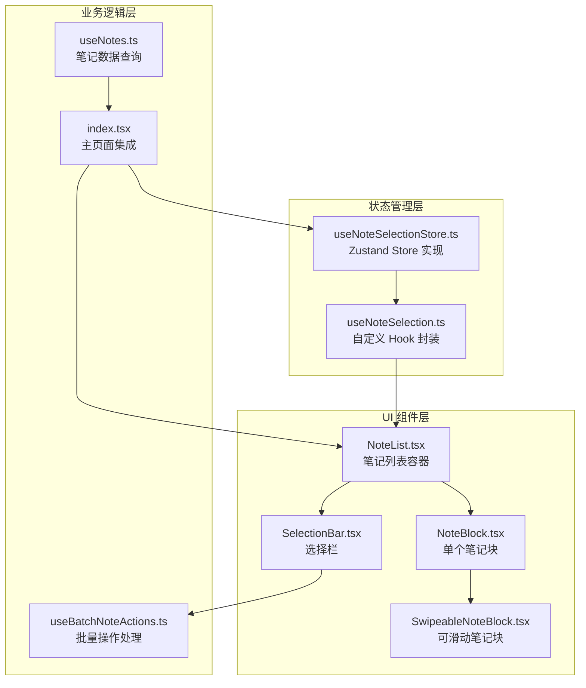
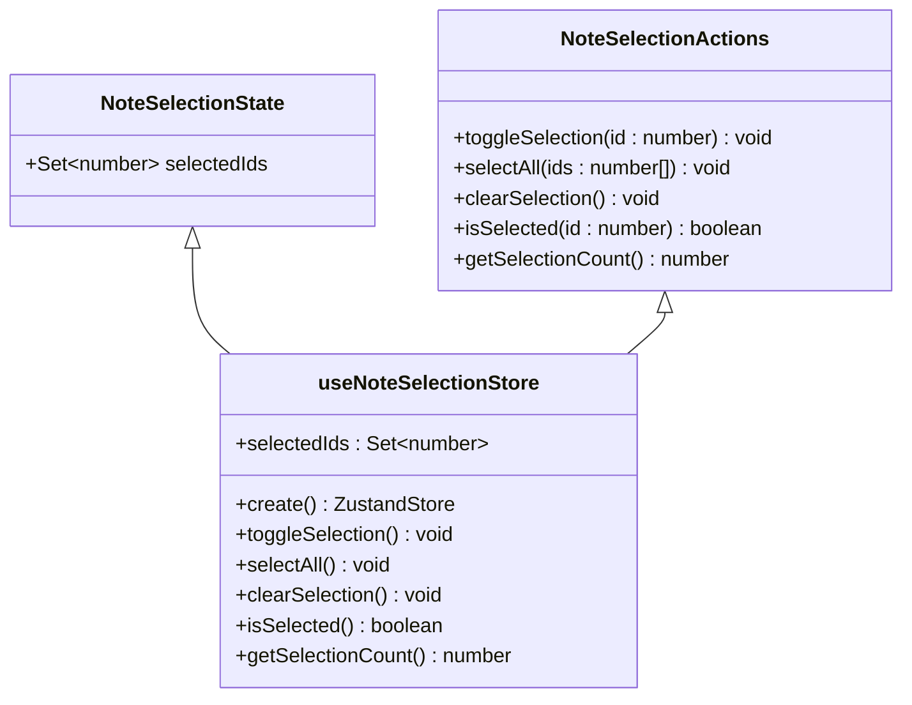
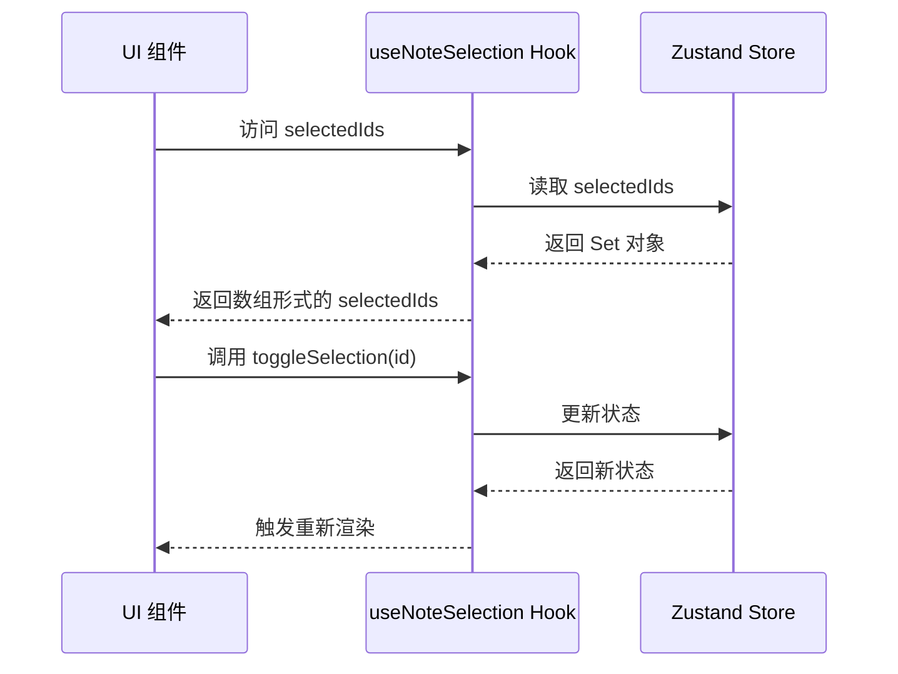
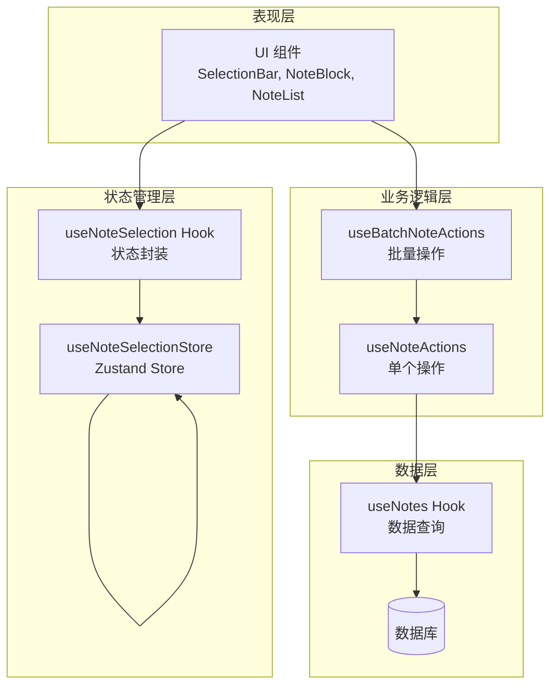
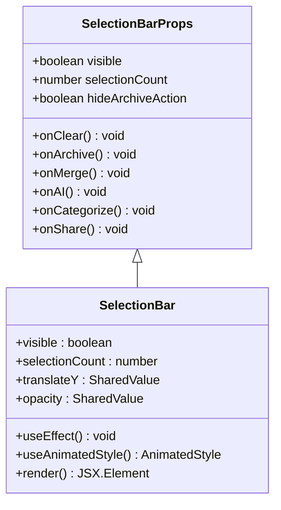
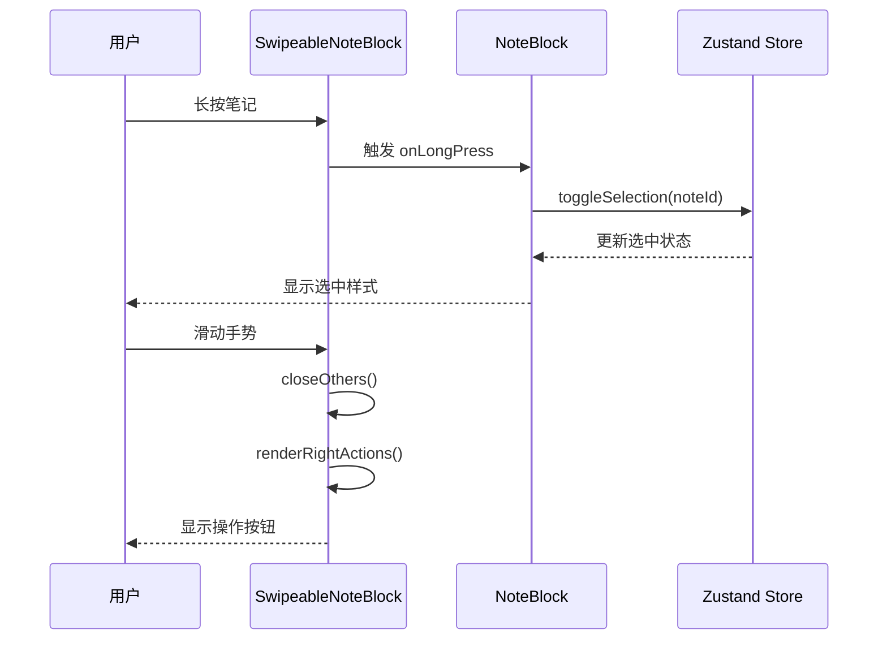
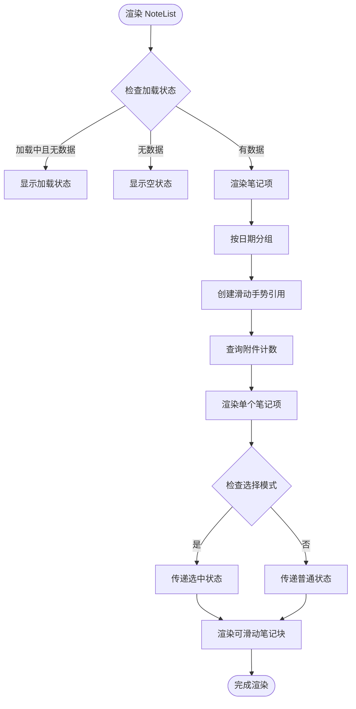
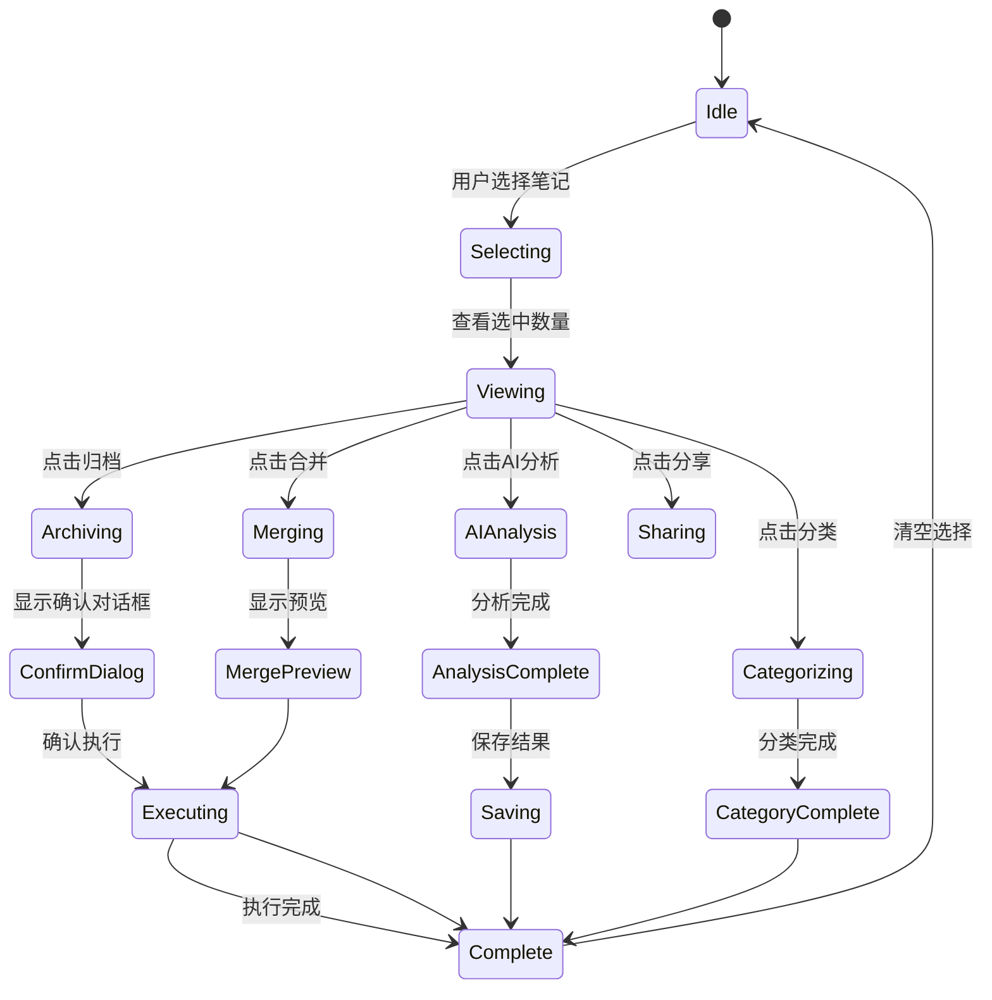

# 笔记选择状态管理

<cite>
**本文档引用的文件**
- [useNoteSelectionStore.ts](file://store/useNoteSelectionStore.ts)
- [useNoteSelection.ts](file://hooks/useNoteSelection.ts)
- [SelectionBar.tsx](file://components/note/SelectionBar.tsx)
- [SwipeableNoteBlock.tsx](file://components/note/SwipeableNoteBlock.tsx)
- [NoteList.tsx](file://components/note/NoteList.tsx)
- [NoteBlock.tsx](file://components/note/NoteBlock.tsx)
- [useBatchNoteActions.ts](file://hooks/useBatchNoteActions.ts)
- [index.tsx](file://app/(tabs)/index.tsx)
- [useNotes.ts](file://hooks/useNotes.ts)
</cite>

## 目录
1. [简介](#简介)
2. [项目结构](#项目结构)
3. [核心组件](#核心组件)
4. [架构概览](#架构概览)
5. [详细组件分析](#详细组件分析)
6. [依赖关系分析](#依赖关系分析)
7. [性能考虑](#性能考虑)
8. [故障排除指南](#故障排除指南)
9. [结论](#结论)

## 简介

本文件详细阐述了笔记应用中的选择状态管理系统，重点分析 `useNoteSelectionStore` 的实现原理和功能职责。该系统实现了高效的笔记多选模式状态管理，支持选中状态的维护、批量操作支持以及跨组件的状态同步机制。系统通过 Zustand 状态管理库实现轻量级的状态存储，并与 UI 组件（如 SwipeableNoteBlock 和 SelectionBar）深度集成，提供流畅的用户交互体验。

## 项目结构

笔记选择状态管理系统主要分布在以下目录结构中：



**图表来源**
- [useNoteSelectionStore.ts:1-49](file://store/useNoteSelectionStore.ts#L1-L49)
- [useNoteSelection.ts:1-20](file://hooks/useNoteSelection.ts#L1-L20)
- [NoteList.tsx:1-240](file://components/note/NoteList.tsx#L1-L240)

**章节来源**
- [useNoteSelectionStore.ts:1-49](file://store/useNoteSelectionStore.ts#L1-L49)
- [useNoteSelection.ts:1-20](file://hooks/useNoteSelection.ts#L1-L20)
- [NoteList.tsx:1-240](file://components/note/NoteList.tsx#L1-L240)

## 核心组件

### Zustand Store 实现

`useNoteSelectionStore` 是整个选择状态管理系统的核心，基于 Zustand 库实现轻量级状态管理：



**图表来源**
- [useNoteSelectionStore.ts:3-13](file://store/useNoteSelectionStore.ts#L3-L13)
- [useNoteSelectionStore.ts:15-48](file://store/useNoteSelectionStore.ts#L15-L48)

该 Store 提供了以下核心功能：
- **状态存储**：使用 Set 数据结构高效存储选中笔记的 ID
- **状态更新**：提供原子性的状态更新操作
- **查询接口**：提供状态查询和计算方法
- **响应式更新**：自动触发依赖组件的重新渲染

**章节来源**
- [useNoteSelectionStore.ts:1-49](file://store/useNoteSelectionStore.ts#L1-L49)

### 自定义 Hook 封装

`useNoteSelection` Hook 提供了更友好的状态访问接口：



**图表来源**
- [useNoteSelection.ts:3-19](file://hooks/useNoteSelection.ts#L3-L19)
- [useNoteSelectionStore.ts:18-27](file://store/useNoteSelectionStore.ts#L18-L27)

**章节来源**
- [useNoteSelection.ts:1-20](file://hooks/useNoteSelection.ts#L1-L20)

## 架构概览

笔记选择状态管理系统采用分层架构设计，确保各层职责清晰分离：



**图表来源**
- [index.tsx:68-90](file://app/(tabs)/index.tsx#L68-L90)
- [useBatchNoteActions.ts:55-60](file://hooks/useBatchNoteActions.ts#L55-L60)

系统的关键特性包括：
- **单一数据源**：所有选择状态统一由 Zustand Store 管理
- **响应式更新**：状态变化自动触发相关组件更新
- **类型安全**：完整的 TypeScript 类型定义
- **性能优化**：避免不必要的重渲染

## 详细组件分析

### 选择栏组件 (SelectionBar)

SelectionBar 是用户界面中最重要的交互组件，负责显示当前选中数量和提供批量操作按钮：



**图表来源**
- [SelectionBar.tsx:11-21](file://components/note/SelectionBar.tsx#L11-L21)
- [SelectionBar.tsx:25-53](file://components/note/SelectionBar.tsx#L25-L53)

SelectionBar 的关键实现特点：
- **动画效果**：使用 react-native-reanimated 实现平滑的显示/隐藏动画
- **响应式布局**：根据屏幕宽度自适应布局
- **无障碍支持**：完整的无障碍标签和角色定义
- **条件渲染**：根据配置动态显示不同的操作按钮

**章节来源**
- [SelectionBar.tsx:1-196](file://components/note/SelectionBar.tsx#L1-L196)

### 可滑动笔记块 (SwipeableNoteBlock)

SwipeableNoteBlock 扩展了基础的 NoteBlock，增加了侧滑手势支持：



**图表来源**
- [SwipeableNoteBlock.tsx:29-32](file://components/note/SwipeableNoteBlock.tsx#L29-L32)
- [NoteBlock.tsx:42-53](file://components/note/NoteBlock.tsx#L42-L53)

**章节来源**
- [SwipeableNoteBlock.tsx:1-131](file://components/note/SwipeableNoteBlock.tsx#L1-L131)

### 笔记列表容器 (NoteList)

NoteList 作为笔记列表的容器组件，负责协调多个笔记块的状态：



**图表来源**
- [NoteList.tsx:139-157](file://components/note/NoteList.tsx#L139-L157)
- [NoteList.tsx:159-181](file://components/note/NoteList.tsx#L159-L181)

**章节来源**
- [NoteList.tsx:1-240](file://components/note/NoteList.tsx#L1-L240)

### 批量操作处理

useBatchNoteActions Hook 处理所有批量操作逻辑：



**图表来源**
- [useBatchNoteActions.ts:105-124](file://hooks/useBatchNoteActions.ts#L105-L124)
- [useBatchNoteActions.ts:125-155](file://hooks/useBatchNoteActions.ts#L125-L155)

**章节来源**
- [useBatchNoteActions.ts:1-287](file://hooks/useBatchNoteActions.ts#L1-L287)

## 依赖关系分析

系统各组件之间的依赖关系如下：

```mermaid
graph TB
subgraph "外部依赖"
Zustand[Zustand]
Reanimated[react-native-reanimated]
Gesture[react-native-gesture-handler]
FlashList[@shopify/flash-list]
end
subgraph "内部模块"
Store[useNoteSelectionStore]
Hook[useNoteSelection]
Components[UI Components]
Hooks[Custom Hooks]
Pages[Page Components]
end
Zustand --> Store
Reanimated --> Components
Gesture --> Components
FlashList --> Components
Store --> Hook
Hook --> Components
Components --> Hooks
Hooks --> Pages
```

**图表来源**
- [useNoteSelectionStore.ts:1](file://store/useNoteSelectionStore.ts#L1)
- [SelectionBar.tsx:4-8](file://components/note/SelectionBar.tsx#L4-L8)

**章节来源**
- [index.tsx:8-29](file://app/(tabs)/index.tsx#L8-L29)

## 性能考虑

### 内存管理策略

1. **Set 数据结构优化**
   - 使用 Set 存储选中 ID，提供 O(1) 的查找和插入性能
   - 避免重复存储相同 ID
   - 支持高效的集合操作

2. **状态更新优化**
   - 原子性状态更新，避免中间状态
   - 使用不可变更新模式
   - 减少不必要的状态复制

3. **组件渲染优化**
   - 使用 useMemo 缓存计算结果
   - 避免在渲染过程中进行昂贵的操作
   - 合理使用 React.memo

### 性能优化建议

1. **大数据集处理**
   ```typescript
   // 使用分页加载减少一次性渲染压力
   const { data: notes = [] } = useNotes({
     page: currentPage,
     limit: pageSize
   });
   ```

2. **批量操作优化**
   - 在批量操作前先清理选择状态
   - 使用事务性数据库操作
   - 避免频繁的状态更新

3. **动画性能**
   - 使用 useAnimatedStyle 而非 style 属性
   - 合理设置动画参数
   - 避免复杂的动画链

## 故障排除指南

### 常见问题及解决方案

1. **选择状态不更新**
   - 检查是否正确使用了 useNoteSelection Hook
   - 确认组件是否在正确的上下文中渲染
   - 验证状态更新函数的调用时机

2. **性能问题**
   - 检查是否有过多的重渲染
   - 确认是否使用了适当的缓存策略
   - 优化大数据集的渲染

3. **内存泄漏**
   - 确保及时清理事件监听器
   - 避免循环引用
   - 正确管理异步操作

**章节来源**
- [useNoteSelectionStore.ts:18-47](file://store/useNoteSelectionStore.ts#L18-L47)
- [NoteList.tsx:124-130](file://components/note/NoteList.tsx#L124-L130)

## 结论

笔记选择状态管理系统通过精心设计的架构实现了高效、可扩展的选择功能。系统的主要优势包括：

1. **简洁的 API 设计**：通过 Hook 封装提供了直观的使用接口
2. **高性能实现**：使用 Set 数据结构和原子性状态更新
3. **良好的用户体验**：流畅的动画效果和响应式交互
4. **可扩展性**：模块化设计便于添加新的功能

该系统为开发者提供了坚实的基础，可以在此基础上扩展更多高级功能，如拖拽排序、智能分组等。同时，系统的架构设计也为未来的性能优化和功能扩展预留了充足的空间。