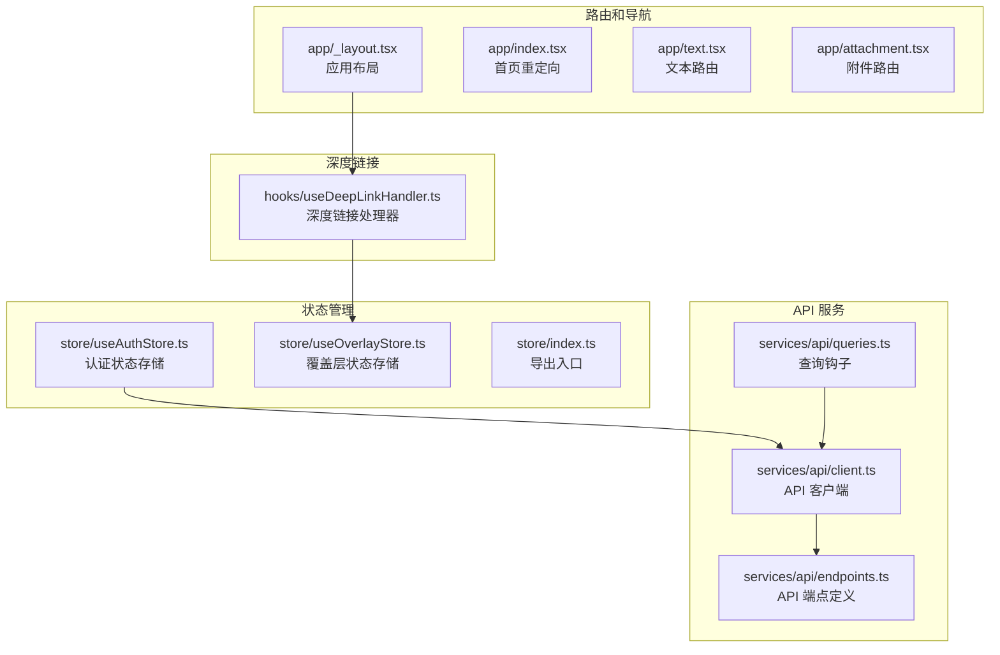
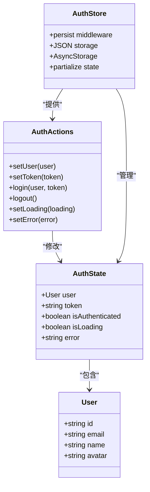
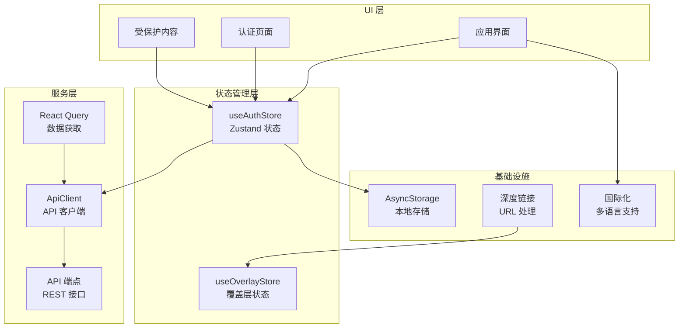
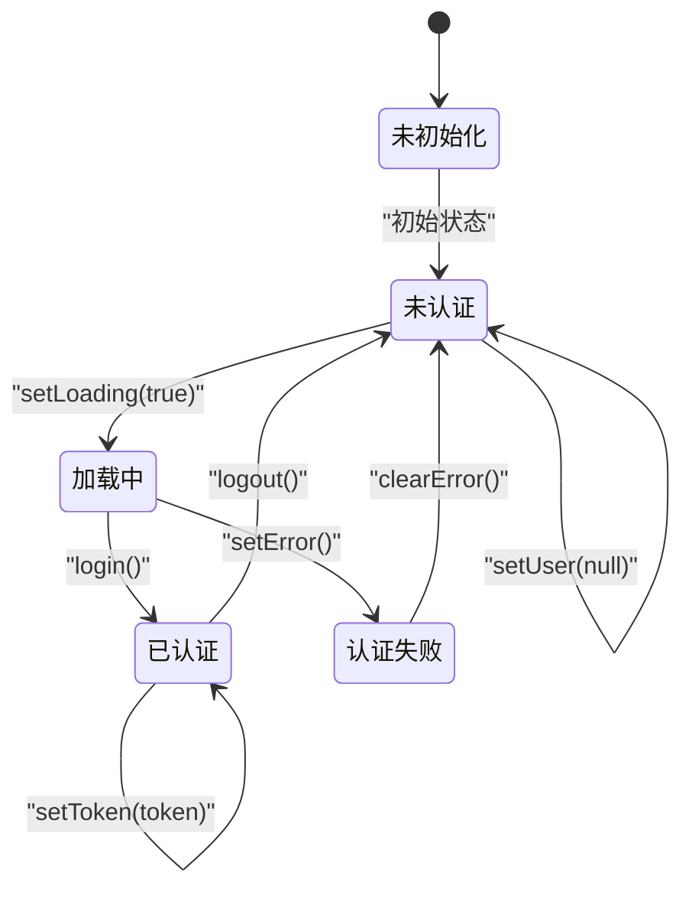
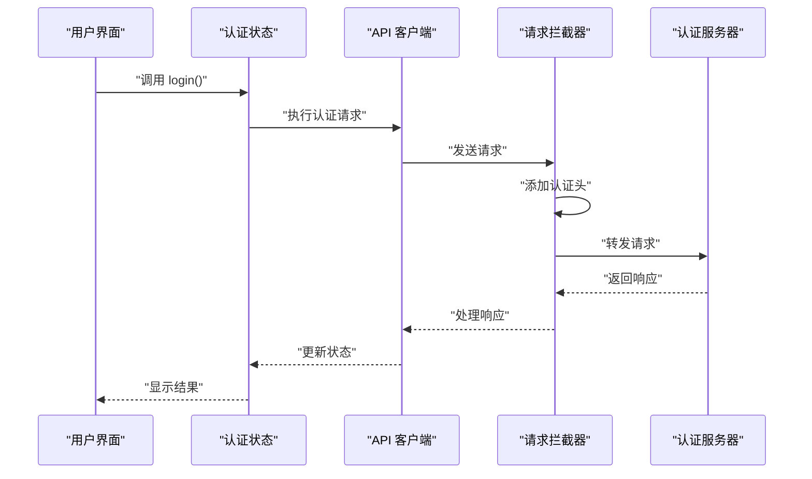
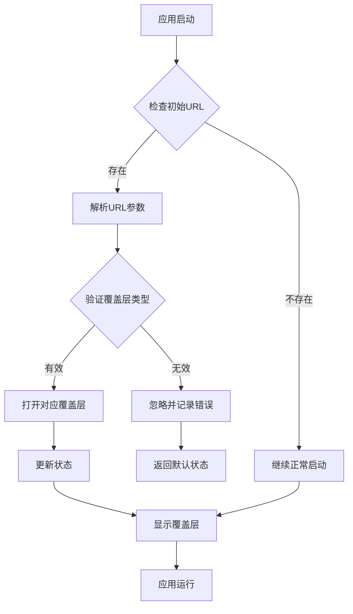
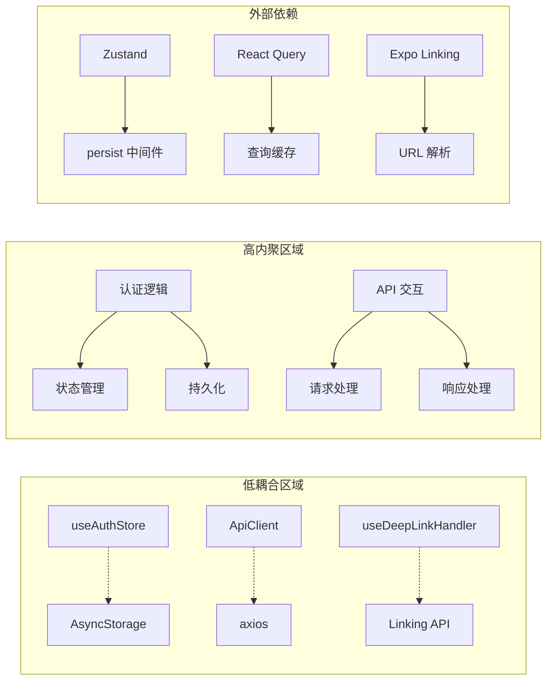
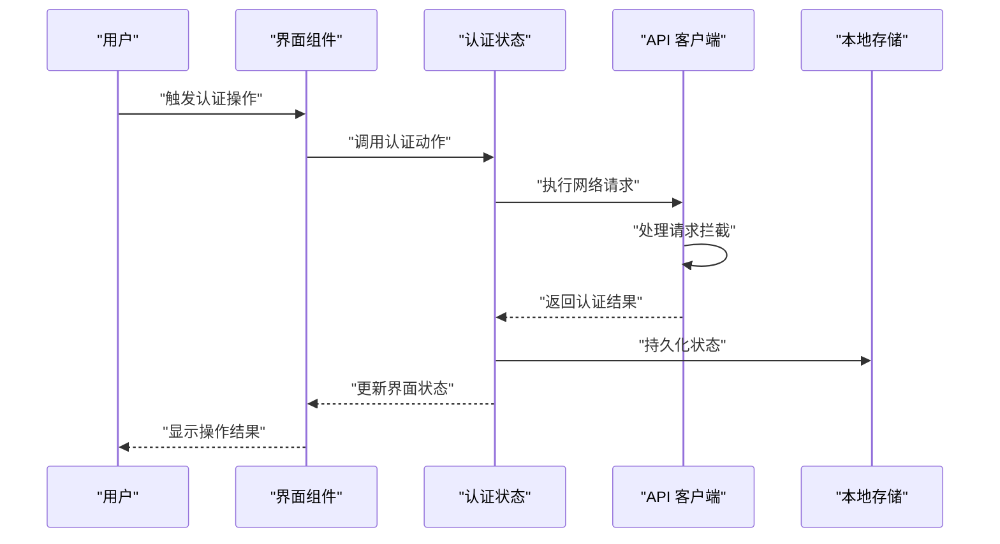

# 认证状态管理

<cite>
**本文档引用的文件**
- [useAuthStore.ts](file://store/useAuthStore.ts)
- [client.ts](file://services/api/client.ts)
- [endpoints.ts](file://services/api/endpoints.ts)
- [queries.ts](file://services/api/queries.ts)
- [useDeepLinkHandler.ts](file://hooks/useDeepLinkHandler.ts)
- [useOverlayStore.ts](file://store/useOverlayStore.ts)
- [index.ts](file://store/index.ts)
- [_layout.tsx](file://app/_layout.tsx)
- [index.tsx](file://app/index.tsx)
- [text.tsx](file://app/text.tsx)
- [attachment.tsx](file://app/attachment.tsx)
</cite>

## 目录
1. [简介](#简介)
2. [项目结构](#项目结构)
3. [核心组件](#核心组件)
4. [架构概览](#架构概览)
5. [详细组件分析](#详细组件分析)
6. [依赖关系分析](#依赖关系分析)
7. [性能考量](#性能考量)
8. [故障排除指南](#故障排除指南)
9. [结论](#结论)
10. [附录](#附录)

## 简介

本文件详细阐述了应用中的认证状态管理系统，重点分析 `useAuthStore` 的实现原理和认证流程管理。系统采用 Zustand 进行状态管理，结合 React Query 实现数据获取和缓存，通过 API 客户端进行网络通信。认证状态包括用户信息、访问令牌、认证状态标识、加载状态和错误信息等关键要素。

## 项目结构

认证状态管理相关的文件组织如下：



**图表来源**
- [useAuthStore.ts:1-82](file://store/useAuthStore.ts#L1-L82)
- [client.ts:1-104](file://services/api/client.ts#L1-L104)
- [endpoints.ts:1-61](file://services/api/endpoints.ts#L1-L61)
- [useDeepLinkHandler.ts:1-42](file://hooks/useDeepLinkHandler.ts#L1-L42)

**章节来源**
- [useAuthStore.ts:1-82](file://store/useAuthStore.ts#L1-L82)
- [client.ts:1-104](file://services/api/client.ts#L1-L104)
- [endpoints.ts:1-61](file://services/api/endpoints.ts#L1-L61)
- [useDeepLinkHandler.ts:1-42](file://hooks/useDeepLinkHandler.ts#L1-L42)

## 核心组件

### 认证状态模型

认证状态管理采用 Zustand 的持久化中间件，实现状态的本地存储和恢复：



**图表来源**
- [useAuthStore.ts:5-27](file://store/useAuthStore.ts#L5-L27)
- [useAuthStore.ts:29-81](file://store/useAuthStore.ts#L29-L81)

认证状态包含以下关键属性：
- 用户信息：ID、邮箱、姓名、头像
- 访问令牌：用于 API 身份验证
- 认证状态：布尔值表示是否已认证
- 加载状态：指示认证操作进行中
- 错误信息：存储认证过程中的错误详情

**章节来源**
- [useAuthStore.ts:12-18](file://store/useAuthStore.ts#L12-L18)
- [useAuthStore.ts:40-69](file://store/useAuthStore.ts#L40-L69)

## 架构概览

认证系统的整体架构采用分层设计，各组件职责明确：



**图表来源**
- [useAuthStore.ts:29-81](file://store/useAuthStore.ts#L29-L81)
- [client.ts:12-25](file://services/api/client.ts#L12-L25)
- [useDeepLinkHandler.ts:23-41](file://hooks/useDeepLinkHandler.ts#L23-L41)

## 详细组件分析

### useAuthStore 组件分析

#### 状态结构设计

认证状态采用类型安全的设计模式，确保类型正确性和开发体验：



**图表来源**
- [useAuthStore.ts:31-70](file://store/useAuthStore.ts#L31-L70)

#### 持久化机制

系统使用 Zustand 的持久化中间件实现状态的本地存储：

| 配置项 | 值 | 说明 |
|--------|-----|------|
| 存储名称 | 'auth-storage' | 本地存储键名前缀 |
| 存储介质 | AsyncStorage | React Native 原生存储 |
| 序列化方法 | JSON.stringify | 状态序列化 |
| 反序列化方法 | JSON.parse | 状态反序列化 |
| 部分化状态 | user, token, isAuthenticated | 仅持久化必要状态 |

**章节来源**
- [useAuthStore.ts:71-80](file://store/useAuthStore.ts#L71-L80)

### API 客户端集成

#### 请求拦截器设计

API 客户端当前实现了基础的拦截器框架，为未来的令牌集成预留接口：



**图表来源**
- [client.ts:27-54](file://services/api/client.ts#L27-L54)
- [useAuthStore.ts:49-55](file://store/useAuthStore.ts#L49-L55)

#### 错误处理机制

API 客户端实现了全面的错误处理策略：

| 错误类型 | 处理方式 | 影响范围 |
|----------|----------|----------|
| 401 未授权 | 触发认证状态清理 | 全局认证状态 |
| 网络超时 | 重试机制 | 当前请求 |
| 服务器错误 | 用户友好的错误消息 | 当前请求 |
| 网络连接失败 | 提供离线提示 | 当前请求 |

**章节来源**
- [client.ts:56-75](file://services/api/client.ts#L56-L75)

### 深度链接处理

#### 覆盖层导航系统

深度链接处理器与覆盖层状态管理协同工作，实现无刷新的界面切换：



**图表来源**
- [useDeepLinkHandler.ts:26-40](file://hooks/useDeepLinkHandler.ts#L26-L40)
- [useOverlayStore.ts:11-15](file://store/useOverlayStore.ts#L11-L15)

**章节来源**
- [useDeepLinkHandler.ts:12-21](file://hooks/useDeepLinkHandler.ts#L12-L21)
- [useOverlayStore.ts:3-9](file://store/useOverlayStore.ts#L3-L9)

## 依赖关系分析

### 组件耦合度分析

认证状态管理系统展现了良好的模块化设计：



**图表来源**
- [useAuthStore.ts:1-3](file://store/useAuthStore.ts#L1-L3)
- [client.ts:1](file://services/api/client.ts#L1)
- [useDeepLinkHandler.ts:2](file://hooks/useDeepLinkHandler.ts#L2)

### 数据流图

认证状态在系统中的流转过程：



**图表来源**
- [useAuthStore.ts:29-81](file://store/useAuthStore.ts#L29-L81)
- [client.ts:15-25](file://services/api/client.ts#L15-L25)

**章节来源**
- [index.ts:1-7](file://store/index.ts#L1-L7)

## 性能考量

### 状态管理优化

认证状态管理采用了多项性能优化策略：

1. **选择性状态更新**：使用 Zustand 的状态选择器避免不必要的重渲染
2. **部分化持久化**：仅持久化必要的状态字段，减少存储开销
3. **异步存储**：利用 AsyncStorage 的异步特性避免阻塞主线程
4. **内存管理**：合理设置查询缓存时间，平衡内存使用和性能

### 缓存策略

系统集成了 React Query 的缓存机制，提供智能的数据缓存：

| 缓存类型 | 过期时间 | 说明 |
|----------|----------|------|
| 查询缓存 | 5 分钟 | 基于 staleTime 设置 |
| 对象缓存 | 30 分钟 | 基于 gcTime 设置 |
| 重试次数 | 2 次 | 自动重试机制 |
| 缓存清理 | 按需清理 | 手动失效相关查询 |

**章节来源**
- [app/_layout.tsx:16-24](file://app/_layout.tsx#L16-L24)

## 故障排除指南

### 常见问题诊断

#### 认证状态不一致

**症状**：登录后状态未正确更新
**排查步骤**：
1. 检查 `login` 动作是否被正确调用
2. 验证状态持久化是否成功
3. 确认组件订阅的状态是否正确

#### API 请求失败

**症状**：认证请求无法到达服务器
**排查步骤**：
1. 检查请求拦截器配置
2. 验证 API 端点配置
3. 确认网络连接状态

#### 深度链接无法处理

**症状**：URL 无法正确打开对应功能
**排查步骤**：
1. 验证 URL 格式是否符合预期
2. 检查覆盖层类型映射表
3. 确认 Linking API 配置

**章节来源**
- [client.ts:27-54](file://services/api/client.ts#L27-L54)
- [useDeepLinkHandler.ts:12-21](file://hooks/useDeepLinkHandler.ts#L12-L21)

## 结论

认证状态管理系统展现了现代 React Native 应用的最佳实践。通过 Zustand 的轻量级状态管理、持久化中间件的本地存储能力、以及完善的错误处理机制，系统提供了可靠的认证体验。

系统的主要优势包括：
- 类型安全的状态管理
- 高效的本地存储机制  
- 清晰的组件分离
- 完善的错误处理
- 可扩展的架构设计

未来可以考虑的改进方向：
- 实现完整的令牌管理机制
- 添加多因素认证支持
- 增强安全审计功能
- 优化并发请求处理

## 附录

### 使用示例

#### 基本认证操作

```typescript
// 登录操作
const handleLogin = async () => {
  const { login } = useAuthStore.getState();
  login(user, token);
};

// 登出操作  
const handleLogout = () => {
  const { logout } = useAuthStore.getState();
  logout();
};

// 状态检查
const checkAuthStatus = () => {
  const { isAuthenticated, user } = useAuthStore.getState();
  return { isAuthenticated, user };
};
```

#### API 集成示例

```typescript
// 使用认证状态的 API 调用
const useAuthenticatedQuery = (url: string) => {
  const { token } = useAuthStore(state => state);
  
  return useQuery({
    queryKey: [url],
    queryFn: () => {
      // 在这里使用 token 进行认证
      return apiClient.get(url);
    },
    enabled: !!token,
  });
};
```

### 安全最佳实践

1. **令牌安全存储**：使用加密存储敏感信息
2. **最小权限原则**：仅请求必要的用户权限
3. **会话超时处理**：实现自动登出机制
4. **输入验证**：对所有用户输入进行验证
5. **错误信息过滤**：避免泄露敏感错误细节

### 扩展指导

#### 添加新的认证方式

1. 在 `AuthState` 中添加新状态字段
2. 实现相应的 action 函数
3. 更新持久化配置
4. 在 UI 组件中集成新功能

#### 状态管理扩展

1. 创建新的 Zustand store
2. 定义状态接口和 action 类型
3. 实现持久化中间件配置
4. 在组件中正确使用新状态