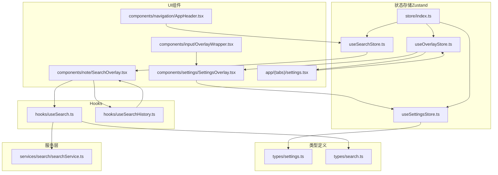
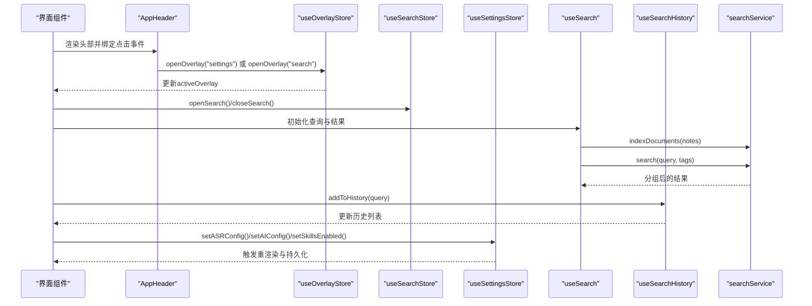
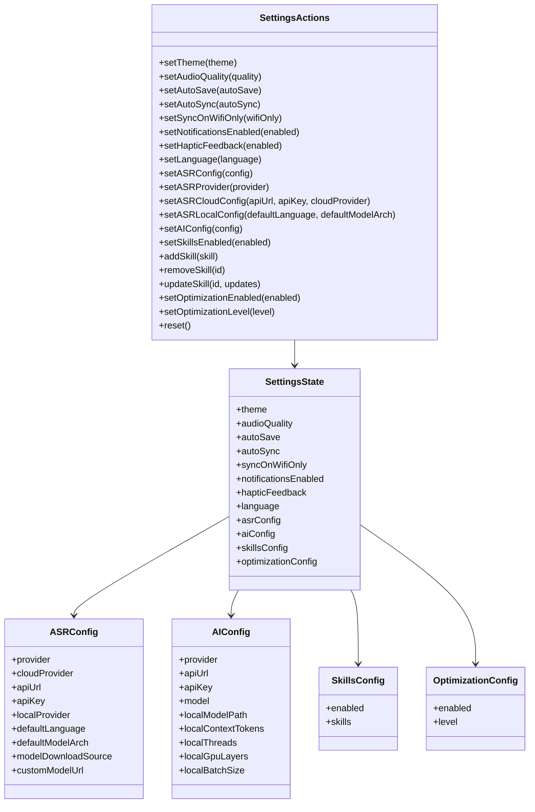
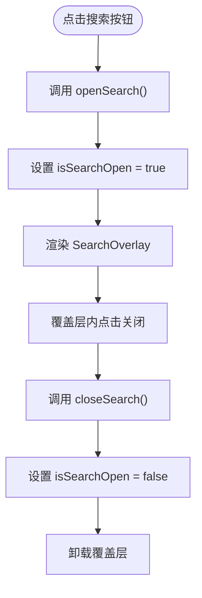
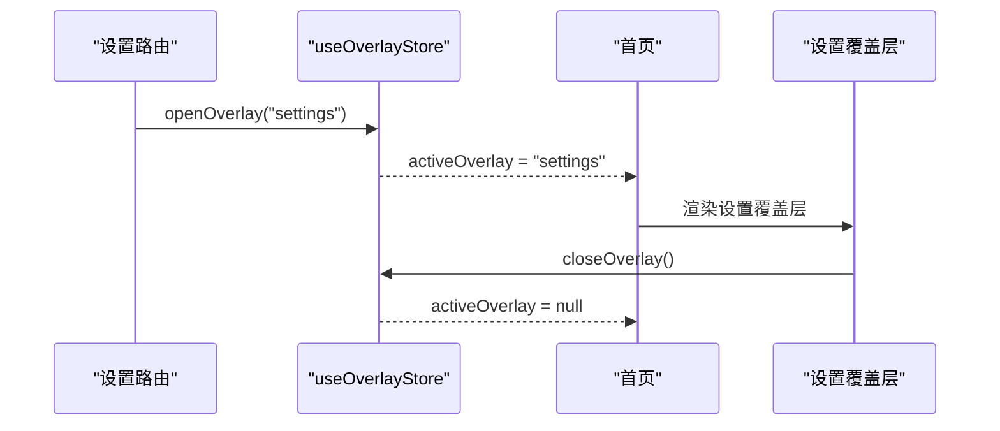
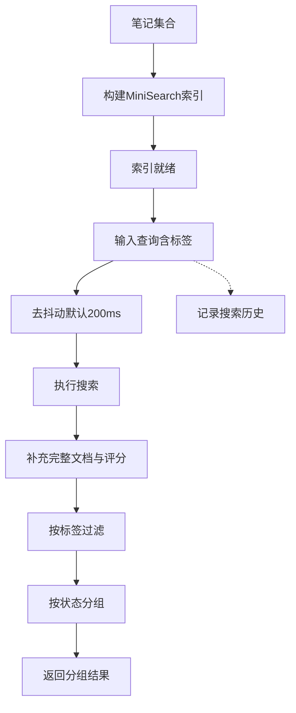
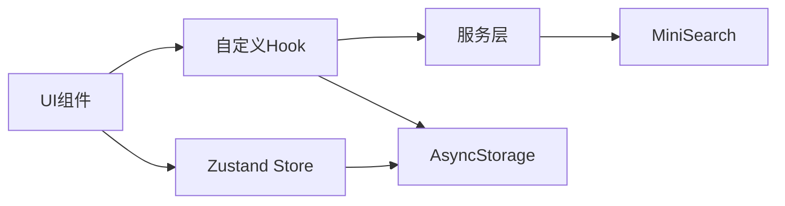

# 设置与搜索状态管理

<cite>
**本文档引用的文件**
- [store/useSettingsStore.ts](file://store/useSettingsStore.ts)
- [store/useSearchStore.ts](file://store/useSearchStore.ts)
- [store/useOverlayStore.ts](file://store/useOverlayStore.ts)
- [store/index.ts](file://store/index.ts)
- [types/settings.ts](file://types/settings.ts)
- [types/search.ts](file://types/search.ts)
- [services/search/searchService.ts](file://services/search/searchService.ts)
- [hooks/useSearch.ts](file://hooks/useSearch.ts)
- [hooks/useSearchHistory.ts](file://hooks/useSearchHistory.ts)
- [components/note/SearchOverlay.tsx](file://components/note/SearchOverlay.tsx)
- [components/settings/SettingsOverlay.tsx](file://components/settings/SettingsOverlay.tsx)
- [components/input/OverlayWrapper.tsx](file://components/input/OverlayWrapper.tsx)
- [components/navigation/AppHeader.tsx](file://components/navigation/AppHeader.tsx)
- [app/(tabs)/settings.tsx](file://app/(tabs)/settings.tsx)
</cite>

## 目录
1. [简介](#简介)
2. [项目结构](#项目结构)
3. [核心组件](#核心组件)
4. [架构总览](#架构总览)
5. [详细组件分析](#详细组件分析)
6. [依赖关系分析](#依赖关系分析)
7. [性能考虑](#性能考虑)
8. [故障排除指南](#故障排除指南)
9. [结论](#结论)
10. [附录](#附录)

## 简介
本文件聚焦于应用中的设置与搜索状态管理，系统性解析以下三个Zustand状态存储模块的功能职责、实现原理与相互关系：
- useSettingsStore：用户设置状态管理，涵盖主题、音频质量、自动保存/同步、通知与触觉反馈、语言、ASR/AI/技能/优化配置等，并通过持久化中间件实现跨会话的数据保留与兼容性迁移。
- useSearchStore：搜索覆盖层的显隐状态，用于控制全局搜索面板的打开与关闭。
- useOverlayStore：通用覆盖层状态管理，统一管理录音、相机、文本输入、附件、设置等覆盖层的激活与关闭。

同时，文档将深入说明：
- 用户设置的存储、验证与同步机制
- 搜索状态的实现原理，包括搜索历史、过滤条件与结果分组
- 覆盖层状态管理的设计思路与交互控制
- 综合使用示例与状态间通信机制
- 状态扩展指导与持久化策略

## 项目结构
围绕设置与搜索状态管理的相关文件组织如下：
- store：状态存储模块（Zustand）
- types：类型定义（设置与搜索）
- services：服务层（搜索服务）
- hooks：自定义Hook（搜索与搜索历史）
- components：UI组件（搜索覆盖层、设置覆盖层、覆盖层包装器）
- app：路由与入口（设置页面重定向）

**图表来源**
- [store/useSettingsStore.ts:1-218](file://store/useSettingsStore.ts#L1-L218)
- [store/useSearchStore.ts:1-14](file://store/useSearchStore.ts#L1-L14)
- [store/useOverlayStore.ts:1-16](file://store/useOverlayStore.ts#L1-L16)
- [store/index.ts:1-8](file://store/index.ts#L1-L8)
- [types/settings.ts:1-58](file://types/settings.ts#L1-L58)
- [types/search.ts:1-25](file://types/search.ts#L1-L25)
- [services/search/searchService.ts:1-142](file://services/search/searchService.ts#L1-L142)
- [hooks/useSearch.ts:1-84](file://hooks/useSearch.ts#L1-L84)
- [hooks/useSearchHistory.ts:1-53](file://hooks/useSearchHistory.ts#L1-L53)
- [components/note/SearchOverlay.tsx:1-388](file://components/note/SearchOverlay.tsx#L1-L388)
- [components/settings/SettingsOverlay.tsx:1-186](file://components/settings/SettingsOverlay.tsx#L1-L186)
- [components/input/OverlayWrapper.tsx:1-77](file://components/input/OverlayWrapper.tsx#L1-L77)
- [components/navigation/AppHeader.tsx:1-84](file://components/navigation/AppHeader.tsx#L1-L84)
- [app/(tabs)/settings.tsx:1-22](file://app/(tabs)/settings.tsx#L1-L22)

**章节来源**
- [store/index.ts:1-8](file://store/index.ts#L1-L8)

## 核心组件
本节从职责、数据结构、处理逻辑与集成点四个维度，系统解析三大状态存储模块。

- useSettingsStore
  - 职责：集中管理用户偏好与系统配置，支持主题、音频质量、自动保存/同步、通知与触觉反馈、语言、ASR/AI/技能/优化配置等。
  - 数据结构：SettingsState + SettingsActions，包含基础设置与嵌套配置对象（ASRConfig、AIConfig、SkillsConfig、OptimizationConfig）。
  - 处理逻辑：提供批量setter方法、ASR/AI子配置专用setter、技能增删改、优化开关与级别设置、默认值与兼容性归一化、持久化合并策略。
  - 集成点：被设置覆盖层组件消费，作为全局配置源；与环境变量结合初始化默认值。

- useSearchStore
  - 职责：管理“搜索覆盖层”的显隐状态，提供打开/关闭接口。
  - 数据结构：布尔型isSearchOpen与对应动作函数。
  - 处理逻辑：极简状态机，仅控制面板显示与否。
  - 集成点：与AppHeader按钮联动，触发搜索覆盖层展示。

- useOverlayStore
  - 职责：统一管理多种覆盖层（录音、相机、文本、附件、设置）的激活与关闭。
  - 数据结构：activeOverlay枚举类型与open/close动作。
  - 处理逻辑：单一状态多用途，避免多处重复状态。
  - 集成点：设置页面路由重定向到首页并打开设置覆盖层；导航栏更多按钮可触发不同覆盖层。

**章节来源**
- [store/useSettingsStore.ts:9-45](file://store/useSettingsStore.ts#L9-L45)
- [store/useSearchStore.ts:3-7](file://store/useSearchStore.ts#L3-L7)
- [store/useOverlayStore.ts:3-9](file://store/useOverlayStore.ts#L3-L9)
- [types/settings.ts:14-57](file://types/settings.ts#L14-L57)

## 架构总览
下图展示了设置、搜索与覆盖层三者在UI与服务层的交互关系，以及状态持久化与数据流路径。

**图表来源**
- [components/navigation/AppHeader.tsx:48-55](file://components/navigation/AppHeader.tsx#L48-L55)
- [store/useOverlayStore.ts:11-15](file://store/useOverlayStore.ts#L11-L15)
- [store/useSearchStore.ts:9-13](file://store/useSearchStore.ts#L9-L13)
- [hooks/useSearch.ts:11-55](file://hooks/useSearch.ts#L11-L55)
- [services/search/searchService.ts:58-116](file://services/search/searchService.ts#L58-L116)
- [hooks/useSearchHistory.ts:27-49](file://hooks/useSearchHistory.ts#L27-L49)
- [store/useSettingsStore.ts:134-187](file://store/useSettingsStore.ts#L134-L187)

## 详细组件分析

### useSettingsStore：用户设置状态管理
- 功能职责
  - 基础设置：主题、音频质量、自动保存/同步、仅WiFi同步、通知、触觉反馈、语言。
  - ASR配置：云/本地双栈支持，包含提供商、API地址/密钥、默认语言与模型架构、下载源与自定义模型URL。
  - AI配置：云/本地双栈支持，包含提供商、API地址/密钥、模型名称与本地推理参数。
  - 技能配置：启用开关与技能数组，支持增删改。
  - 优化配置：启用开关与优化等级。
  - 默认值与兼容性：从环境变量注入默认值，并对旧版模型架构进行归一化处理。
  - 持久化：通过persist中间件与AsyncStorage实现跨会话保存与merge策略，确保字段兼容与回退。

- 关键实现要点
  - 归一化与兼容：normalizeASRConfig与LEGACY_MODEL_ARCH_MAP保证旧配置平滑迁移。
  - 合并策略：merge中对ASR/AI/技能/优化配置分别处理，避免丢失部分字段。
  - 子配置setter：setASRProvider、setASRCloudConfig、setASRLocalConfig等精细化更新。
  - 技能管理：add/remove/update配合当前store状态进行全量替换以保持一致性。
  - 默认配置导出：defaultASRConfig/defaultAIConfig/defaultSkillsConfig/defaultOptimizationConfig供恢复默认使用。

- 使用示例（路径指引）
  - 在设置覆盖层中读取与写入配置：[components/settings/SettingsOverlay.tsx:31-77](file://components/settings/SettingsOverlay.tsx#L31-L77)
  - 在组件中直接调用setter更新设置：[store/useSettingsStore.ts:139-187](file://store/useSettingsStore.ts#L139-L187)

**图表来源**
- [store/useSettingsStore.ts:9-45](file://store/useSettingsStore.ts#L9-L45)
- [types/settings.ts:14-57](file://types/settings.ts#L14-L57)

**章节来源**
- [store/useSettingsStore.ts:47-71](file://store/useSettingsStore.ts#L47-L71)
- [store/useSettingsStore.ts:189-214](file://store/useSettingsStore.ts#L189-L214)
- [components/settings/SettingsOverlay.tsx:53-77](file://components/settings/SettingsOverlay.tsx#L53-L77)

### useSearchStore：搜索覆盖层显隐状态
- 功能职责：提供isSearchOpen状态与openSearch/closeSearch动作，用于控制搜索覆盖层的显示与隐藏。
- 集成点：与AppHeader的搜索按钮绑定，点击后调用openSearch打开覆盖层；覆盖层内部关闭时调用closeSearch。

- 使用示例（路径指引）
  - 打开/关闭搜索覆盖层：[store/useSearchStore.ts:9-13](file://store/useSearchStore.ts#L9-L13)
  - 导航栏按钮触发：[components/navigation/AppHeader.tsx:48-51](file://components/navigation/AppHeader.tsx#L48-L51)

**图表来源**
- [store/useSearchStore.ts:9-13](file://store/useSearchStore.ts#L9-L13)
- [components/navigation/AppHeader.tsx:48-51](file://components/navigation/AppHeader.tsx#L48-L51)

**章节来源**
- [store/useSearchStore.ts:3-7](file://store/useSearchStore.ts#L3-L7)
- [components/navigation/AppHeader.tsx:48-55](file://components/navigation/AppHeader.tsx#L48-L55)

### useOverlayStore：覆盖层状态管理
- 功能职责：统一管理多种覆盖层（录音、相机、文本、附件、设置）的激活与关闭，避免分散状态导致的竞态。
- 类型约束：OverlayType枚举限定可选覆盖层类型，确保类型安全。
- 集成点：设置页面路由重定向至首页并打开设置覆盖层；导航栏更多按钮可触发不同覆盖层。

- 使用示例（路径指引）
  - 打开设置覆盖层：[app/(tabs)/settings.tsx:14-18](file://app/(tabs)/settings.tsx#L14-L18)
  - 打开/关闭任意覆盖层：[store/useOverlayStore.ts:11-15](file://store/useOverlayStore.ts#L11-L15)

**图表来源**
- [app/(tabs)/settings.tsx:14-18](file://app/(tabs)/settings.tsx#L14-L18)
- [store/useOverlayStore.ts:11-15](file://store/useOverlayStore.ts#L11-L15)

**章节来源**
- [store/useOverlayStore.ts:3-9](file://store/useOverlayStore.ts#L3-L9)
- [app/(tabs)/settings.tsx:10-21](file://app/(tabs)/settings.tsx#L10-L21)

### 搜索状态实现原理
- 搜索历史：基于AsyncStorage的本地历史存储，支持去重、截断与清空。
- 过滤条件：标签过滤（多选），支持切换与清空。
- 结果缓存：MiniSearch索引（内存级），按笔记集合重建索引；搜索结果按状态分组。
- 去抖动：防抖延迟可配置，默认200ms，减少频繁查询带来的性能压力。

- 关键流程（路径指引）
  - 搜索Hook：索引构建、查询去抖、标签过滤、结果分组：[hooks/useSearch.ts:11-55](file://hooks/useSearch.ts#L11-L55)
  - 搜索服务：中文分词、索引与查询、结果分组与标签提取：[services/search/searchService.ts:40-116](file://services/search/searchService.ts#L40-L116)
  - 搜索历史Hook：加载、持久化、新增、移除、清空：[hooks/useSearchHistory.ts:7-52](file://hooks/useSearchHistory.ts#L7-L52)
  - 搜索覆盖层：渲染输入、标签过滤、历史展示、结果列表：[components/note/SearchOverlay.tsx:57-231](file://components/note/SearchOverlay.tsx#L57-L231)

**图表来源**
- [hooks/useSearch.ts:11-55](file://hooks/useSearch.ts#L11-L55)
- [services/search/searchService.ts:58-116](file://services/search/searchService.ts#L58-L116)
- [hooks/useSearchHistory.ts:27-49](file://hooks/useSearchHistory.ts#L27-L49)
- [components/note/SearchOverlay.tsx:63-104](file://components/note/SearchOverlay.tsx#L63-L104)

**章节来源**
- [hooks/useSearch.ts:1-84](file://hooks/useSearch.ts#L1-L84)
- [services/search/searchService.ts:1-142](file://services/search/searchService.ts#L1-L142)
- [hooks/useSearchHistory.ts:1-53](file://hooks/useSearchHistory.ts#L1-L53)
- [components/note/SearchOverlay.tsx:1-388](file://components/note/SearchOverlay.tsx#L1-L388)

### 覆盖层设计思路与交互控制
- 设计目标：统一覆盖层生命周期管理，避免多处状态散落；提供一致的动画与遮罩体验。
- 组件封装：OverlayWrapper提供统一的底部弹出动画与蒙层；SearchOverlay与SettingsOverlay分别承载具体业务。
- 交互控制：通过useOverlayStore.activeOverlay决定当前显示的覆盖层；通过openOverlay/closeOverlay进行切换与关闭。

- 使用示例（路径指引）
  - 底部弹出包装器：[components/input/OverlayWrapper.tsx:20-54](file://components/input/OverlayWrapper.tsx#L20-L54)
  - 设置覆盖层：[components/settings/SettingsOverlay.tsx:29-151](file://components/settings/SettingsOverlay.tsx#L29-L151)

**章节来源**
- [components/input/OverlayWrapper.tsx:1-77](file://components/input/OverlayWrapper.tsx#L1-L77)
- [components/settings/SettingsOverlay.tsx:1-186](file://components/settings/SettingsOverlay.tsx#L1-L186)

### 综合使用示例与状态间通信
- 示例场景：从首页导航栏点击“搜索”打开搜索覆盖层，输入关键词并选择标签过滤，查看分组结果；从“更多”按钮打开设置覆盖层，修改ASR/AI配置并保存。
- 状态间通信：
  - AppHeader通过useSearchStore.openSearch打开搜索覆盖层。
  - SearchOverlay通过useSearch与useSearchHistory管理查询与历史。
  - SettingsOverlay通过useSettingsStore更新全局设置并持久化。
  - 设置页面路由通过useOverlayStore.openOverlay('settings')打开设置覆盖层。

- 使用示例（路径指引）
  - 导航栏搜索按钮：[components/navigation/AppHeader.tsx:48-51](file://components/navigation/AppHeader.tsx#L48-L51)
  - 搜索覆盖层交互：[components/note/SearchOverlay.tsx:57-231](file://components/note/SearchOverlay.tsx#L57-L231)
  - 设置覆盖层保存：[components/settings/SettingsOverlay.tsx:62-77](file://components/settings/SettingsOverlay.tsx#L62-L77)
  - 设置路由重定向：[app/(tabs)/settings.tsx:14-18](file://app/(tabs)/settings.tsx#L14-L18)

**章节来源**
- [components/navigation/AppHeader.tsx:48-55](file://components/navigation/AppHeader.tsx#L48-L55)
- [components/note/SearchOverlay.tsx:57-231](file://components/note/SearchOverlay.tsx#L57-L231)
- [components/settings/SettingsOverlay.tsx:62-77](file://components/settings/SettingsOverlay.tsx#L62-L77)
- [app/(tabs)/settings.tsx:14-18](file://app/(tabs)/settings.tsx#L14-L18)

## 依赖关系分析
- 组件耦合与内聚
  - SearchOverlay高内聚地组合useSearch与useSearchHistory，负责UI渲染与交互；与searchService解耦，仅通过Hook暴露的接口交互。
  - SettingsOverlay通过useSettingsStore读写全局设置，采用本地临时状态+显式保存的模式，降低频繁写入风险。
  - useOverlayStore与useSearchStore均被UI组件直接依赖，形成清晰的单向数据流。

- 外部依赖与集成点
  - AsyncStorage：设置持久化与搜索历史持久化。
  - MiniSearch：搜索索引与查询，支持中文分词与模糊匹配。
  - Expo Router：设置路由重定向至首页并打开设置覆盖层。

**图表来源**
- [store/useSettingsStore.ts:189-216](file://store/useSettingsStore.ts#L189-L216)
- [hooks/useSearchHistory.ts:12-25](file://hooks/useSearchHistory.ts#L12-L25)
- [services/search/searchService.ts:40-56](file://services/search/searchService.ts#L40-L56)

**章节来源**
- [store/useSettingsStore.ts:189-216](file://store/useSettingsStore.ts#L189-L216)
- [hooks/useSearchHistory.ts:1-53](file://hooks/useSearchHistory.ts#L1-L53)
- [services/search/searchService.ts:1-142](file://services/search/searchService.ts#L1-L142)

## 性能考虑
- 搜索性能
  - 去抖动：默认200ms，平衡响应速度与计算成本。
  - 索引重建：仅在笔记集合变化时重建，避免重复索引。
  - 中文分词：字符级与二元组组合提升召回率，但需注意token数量增长。
  - 标签过滤：先MiniSearch检索再二次过滤，减少后续处理量。

- 设置持久化
  - 使用persist中间件与merge策略，避免字段丢失；对复杂嵌套配置进行逐字段合并。
  - 归一化处理：对旧版模型架构进行映射，减少迁移成本。

- 覆盖层动画
  - 使用react-native-reanimated进行硬件加速动画，保证流畅度；在关闭完成后及时卸载组件以释放资源。

[本节为通用性能建议，不直接分析具体文件]

## 故障排除指南
- 搜索无结果或结果异常
  - 检查笔记集合是否已索引：确认notes长度大于0且触发过indexDocuments。
  - 检查查询与标签过滤：确认query非空且标签过滤逻辑正确。
  - 检查中文分词：确认输入包含中文字符，MiniSearch配置正确。

- 搜索历史无法加载或清空
  - 检查AsyncStorage键名与最大条数限制：确认STORAGE_KEY一致且MAX_HISTORY合理。
  - 检查JSON序列化/反序列化：确认历史数据格式正确。

- 设置未生效或丢失
  - 检查persist中间件配置：确认storage与merge策略正确。
  - 检查归一化逻辑：确认旧版模型架构映射正常。
  - 检查显式保存：确认SettingsOverlay中点击了保存按钮。

- 覆盖层无法关闭或动画异常
  - 检查activeOverlay状态：确认closeOverlay被调用。
  - 检查动画库版本与配置：确认reanimated版本兼容。

**章节来源**
- [hooks/useSearch.ts:20-25](file://hooks/useSearch.ts#L20-L25)
- [hooks/useSearchHistory.ts:12-21](file://hooks/useSearchHistory.ts#L12-L21)
- [store/useSettingsStore.ts:189-214](file://store/useSettingsStore.ts#L189-L214)
- [components/input/OverlayWrapper.tsx:28-42](file://components/input/OverlayWrapper.tsx#L28-L42)

## 结论
本项目通过Zustand实现了轻量而强大的状态管理：
- useSettingsStore提供完善的用户设置与系统配置管理，并具备持久化与兼容性保障。
- useSearchStore与useOverlayStore分别承担搜索覆盖层显隐与通用覆盖层管理，简化了UI状态控制。
- 搜索模块采用MiniSearch与自定义中文分词，结合去抖动与标签过滤，提供了高效稳定的搜索体验。
- 通过明确的类型定义与Hook封装，提升了代码可维护性与可测试性。

对于未来扩展，建议遵循现有模式：新增设置项时在类型定义中声明并在store中提供setter；新增搜索功能时复用useSearch与searchService；新增覆盖层时通过useOverlayStore统一管理。

[本节为总结性内容，不直接分析具体文件]

## 附录

### 状态扩展指导
- 添加新的设置选项
  - 在类型定义中新增字段：[types/settings.ts:14-57](file://types/settings.ts#L14-L57)
  - 在默认设置中提供默认值：[store/useSettingsStore.ts:117-130](file://store/useSettingsStore.ts#L117-L130)
  - 在store中提供setter方法：[store/useSettingsStore.ts:139-187](file://store/useSettingsStore.ts#L139-L187)
  - 在设置覆盖层中添加UI控件并绑定setter：[components/settings/SettingsOverlay.tsx:31-77](file://components/settings/SettingsOverlay.tsx#L31-L77)

- 添加新的搜索功能
  - 在searchService中扩展索引字段或查询逻辑：[services/search/searchService.ts:40-116](file://services/search/searchService.ts#L40-L116)
  - 在useSearch中增加新参数与处理逻辑：[hooks/useSearch.ts:6-11](file://hooks/useSearch.ts#L6-L11)
  - 在UI中添加相应控件并调用Hook：[components/note/SearchOverlay.tsx:63-104](file://components/note/SearchOverlay.tsx#L63-L104)

- 新增覆盖层类型
  - 在OverlayType中添加新类型：[store/useOverlayStore.ts:3](file://store/useOverlayStore.ts#L3)
  - 在useOverlayStore中提供openOverlay/closeOverlay：[store/useOverlayStore.ts:11-15](file://store/useOverlayStore.ts#L11-L15)
  - 在UI中通过useOverlayStore.openOverlay('newType')打开新覆盖层：[components/settings/SettingsOverlay.tsx:12-12](file://components/settings/SettingsOverlay.tsx#L12-L12)

**章节来源**
- [types/settings.ts:14-57](file://types/settings.ts#L14-L57)
- [store/useSettingsStore.ts:117-130](file://store/useSettingsStore.ts#L117-L130)
- [store/useSettingsStore.ts:139-187](file://store/useSettingsStore.ts#L139-L187)
- [components/settings/SettingsOverlay.tsx:31-77](file://components/settings/SettingsOverlay.tsx#L31-L77)
- [services/search/searchService.ts:40-116](file://services/search/searchService.ts#L40-L116)
- [hooks/useSearch.ts:6-11](file://hooks/useSearch.ts#L6-L11)
- [components/note/SearchOverlay.tsx:63-104](file://components/note/SearchOverlay.tsx#L63-L104)
- [store/useOverlayStore.ts:3](file://store/useOverlayStore.ts#L3)
- [store/useOverlayStore.ts:11-15](file://store/useOverlayStore.ts#L11-L15)
- [components/settings/SettingsOverlay.tsx:12-12](file://components/settings/SettingsOverlay.tsx#L12-L12)

### 状态持久化策略
- 设置持久化：使用persist中间件与AsyncStorage，merge策略确保字段兼容与回退。
- 搜索历史持久化：使用AsyncStorage，限制最大条数并去重。
- 覆盖层状态：仅管理显隐，无需持久化；若需持久化可在persist中扩展。

**章节来源**
- [store/useSettingsStore.ts:189-216](file://store/useSettingsStore.ts#L189-L216)
- [hooks/useSearchHistory.ts:4-6](file://hooks/useSearchHistory.ts#L4-L6)