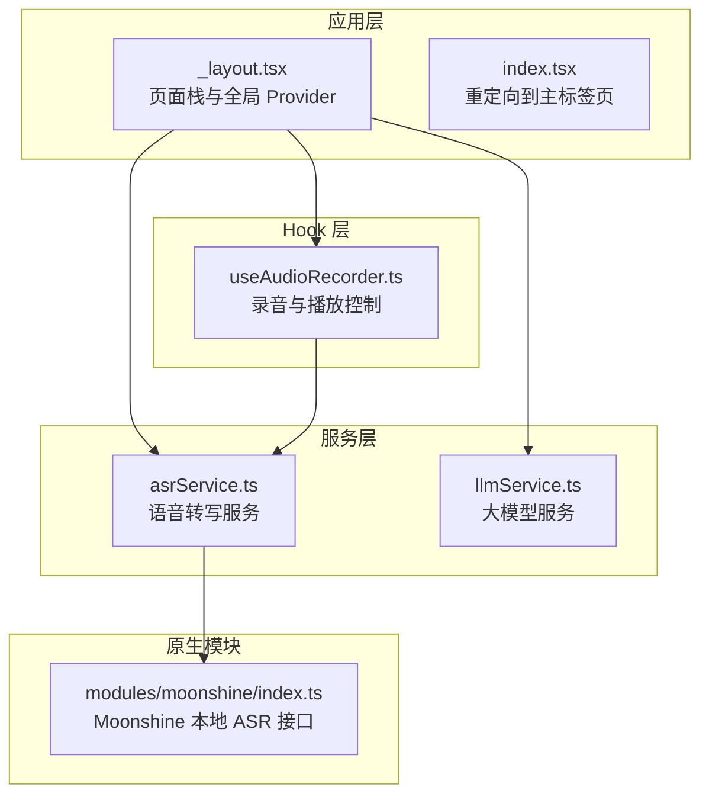
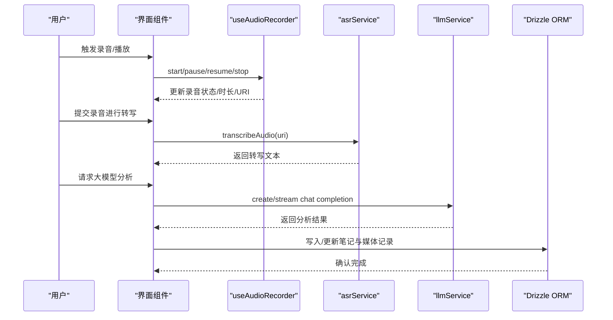
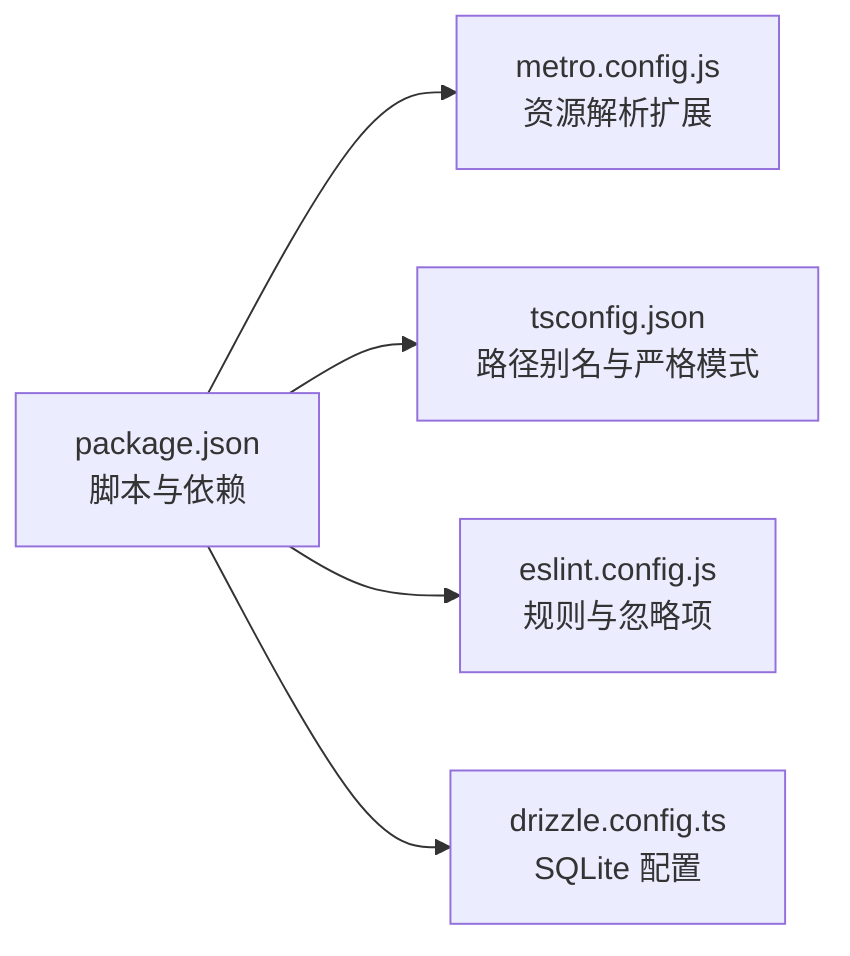

# 快速开始

<cite>
**本文引用的文件**
- [package.json](file://package.json)
- [app.json](file://app.json)
- [metro.config.js](file://metro.config.js)
- [babel.config.js](file://babel.config.js)
- [react-native.config.js](file://react-native.config.js)
- [drizzle.config.ts](file://drizzle.config.ts)
- [tsconfig.json](file://tsconfig.json)
- [eslint.config.js](file://eslint.config.js)
- [app/_layout.tsx](file://app/_layout.tsx)
- [app/index.tsx](file://app/index.tsx)
- [hooks/useAudioRecorder.ts](file://hooks/useAudioRecorder.ts)
- [services/asr/asrService.ts](file://services/asr/asrService.ts)
- [services/llm/llmService.ts](file://services/llm/llmService.ts)
- [modules/moonshine/index.ts](file://modules/moonshine/index.ts)
- [modules/moonshine/package.json](file://modules/moonshine/package.json)
</cite>

## 目录
1. [简介](#简介)
2. [项目结构](#项目结构)
3. [核心组件](#核心组件)
4. [架构总览](#架构总览)
5. [详细组件分析](#详细组件分析)
6. [依赖分析](#依赖分析)
7. [性能考虑](#性能考虑)
8. [故障排除指南](#故障排除指南)
9. [结论](#结论)
10. [附录](#附录)

## 简介
本指南面向首次接触 VoiceNote（Pieces）项目的开发者，帮助你在本地快速搭建完整的开发环境，并成功运行 iOS/Android 模拟器或真机。内容涵盖 Node.js、Expo CLI、Xcode/Android Studio 的安装与配置，项目克隆、依赖安装、开发服务器启动、模拟器/设备调试，以及常见环境问题与解决方案。

## 项目结构
VoiceNote 是基于 Expo Router 的 React Native 应用，采用 TypeScript 开发，使用 Tamagui 进行主题与 UI 布局，集成 Drizzle ORM 进行 SQLite 数据库管理，并通过自定义原生模块 Moonshine 提供本地语音识别能力。项目目录组织遵循功能域划分：app、components、hooks、services、store、theme、types、utils 等。

**图表来源**
- [app/_layout.tsx:1-101](file://app/_layout.tsx#L1-L101)
- [app/index.tsx:1-6](file://app/index.tsx#L1-L6)
- [services/asr/asrService.ts:1-74](file://services/asr/asrService.ts#L1-L74)
- [services/llm/llmService.ts:1-61](file://services/llm/llmService.ts#L1-L61)
- [hooks/useAudioRecorder.ts:1-270](file://hooks/useAudioRecorder.ts#L1-L270)
- [modules/moonshine/index.ts:1-94](file://modules/moonshine/index.ts#L1-L94)

**章节来源**
- [app/_layout.tsx:1-101](file://app/_layout.tsx#L1-L101)
- [app/index.tsx:1-6](file://app/index.tsx#L1-L6)

## 核心组件
- 应用入口与路由
  - 全局布局与 Provider 包装：状态管理、国际化、主题、手势处理、查询缓存等。
  - 页面栈定义：包含标签页、录音、相机、文本输入、附件、笔记详情、录音详情、模型设置等。
- 音频录制与播放
  - 使用 expo-audio 提供的 Hook 管理录音状态、权限请求、模式切换、文件读取与删除。
- 语音转写服务
  - 支持云端 SenseVoice 小模型转写，具备超时控制与错误处理。
- 大模型服务
  - 统一本地（llama.cpp）与云侧 LLM 调用接口，支持流式输出。
- Moonshine 本地 ASR
  - React Native TurboModule 接口，支持事件回调去重、模型加载与卸载、流式识别。

**章节来源**
- [app/_layout.tsx:15-87](file://app/_layout.tsx#L15-L87)
- [hooks/useAudioRecorder.ts:26-269](file://hooks/useAudioRecorder.ts#L26-L269)
- [services/asr/asrService.ts:24-73](file://services/asr/asrService.ts#L24-L73)
- [services/llm/llmService.ts:18-60](file://services/llm/llmService.ts#L18-L60)
- [modules/moonshine/index.ts:17-94](file://modules/moonshine/index.ts#L17-L94)

## 架构总览
下图展示了从用户交互到数据与服务调用的整体流程，包括录音、转写、模型推理与数据库存储的关系。

**图表来源**
- [hooks/useAudioRecorder.ts:79-175](file://hooks/useAudioRecorder.ts#L79-L175)
- [services/asr/asrService.ts:24-73](file://services/asr/asrService.ts#L24-L73)
- [services/llm/llmService.ts:32-45](file://services/llm/llmService.ts#L32-L45)
- [drizzle.config.ts:1-12](file://drizzle.config.ts#L1-L12)

## 详细组件分析

### 开发环境准备与工具链
- Node.js
  - 版本要求：请参考项目中对 React Native 与 Expo 的版本约束，建议使用 LTS 版本。
  - 安装方式：官方下载或包管理器安装。
- Expo CLI
  - 全局安装：用于启动开发服务器与运行应用。
  - 启动命令：npm start 或 yarn start。
- iOS 开发环境
  - Xcode：Apple 平台模拟器与真机调试必备。
  - 证书与签名：首次运行需配置开发者账号与签名。
- Android 开发环境
  - Android Studio：包含模拟器与 SDK。
  - AVD：创建并启动一个虚拟设备。
  - USB 调试：连接真机时启用开发者选项与 USB 调试。

### 项目克隆与依赖安装
- 克隆仓库后，在项目根目录执行依赖安装：
  - npm install
- 若使用缓存或网络受限，可考虑使用 pnpm/yarn 并配置镜像源。

**章节来源**
- [package.json:5-18](file://package.json#L5-L18)

### 启动开发服务器与运行应用
- 启动开发服务器
  - npm start
  - 打开 Expo DevTools，选择以下任一方式运行：
    - iOS：扫描二维码或在 DevTools 中点击“iOS 模拟器”
    - Android：扫描二维码或在 DevTools 中点击“Android 模拟器”
    - Web：在浏览器中打开 http://localhost:8081
- 命令别名
  - npm run android / npm run ios 可直接运行到已连接的设备或模拟器。

**章节来源**
- [package.json:5-18](file://package.json#L5-L18)
- [app.json:1-86](file://app.json#L1-L86)

### 权限与平台配置
- iOS 权限
  - 相机、麦克风、相册读写权限描述已在 app.json 中声明。
- Android 权限
  - 相机、录音、外部存储、媒体读取等权限已在 app.json 中声明。
- 本地模块 Moonshine
  - 通过 react-native.config.js 配置本地模块路径与 CodeGen。
  - 模块声明与代码生成配置位于 modules/moonshine/package.json。

**章节来源**
- [app.json:16-42](file://app.json#L16-L42)
- [react-native.config.js:12-29](file://react-native.config.js#L12-L29)
- [modules/moonshine/package.json:8-17](file://modules/moonshine/package.json#L8-L17)

### 首次运行常见错误与解决
- Metro 服务器无法连接
  - 现象：DevTools 报错无法连接 Metro。
  - 解决：
    - 清理缓存：npx expo start -c
    - 检查端口占用：关闭占用 8081 的进程或修改端口
    - 网络代理：临时关闭系统代理或配置 npm/Expo 代理
- 设备权限被拒绝
  - 现象：录音/相机/相册权限未授权导致功能异常。
  - 解决：
    - iOS：在设置中手动开启对应权限；或在模拟器中通过“设置 > 隐私与安全性”调整
    - Android：在应用权限设置中开启；或在 DevTools 中点击“权限”按钮授予
- 本地模块编译失败
  - 现象：构建时报错找不到 moonshine 模块或 CodeGen 失败。
  - 解决：
    - 重新安装依赖：npm install
    - 清理构建缓存：npx expo prebuild --clean
    - 确认 react-native.config.js 与模块 package.json 配置一致
- 语音转写服务不可用
  - 现象：提示未配置 ASR 或网络错误。
  - 解决：
    - 在设置中配置 ASR 的 API 地址与密钥，或通过环境变量注入
    - 确认网络连通性与超时时间（默认 2 分钟）
- 大模型未配置
  - 现象：本地模型路径缺失或云侧 API 未配置。
  - 解决：
    - 本地模式：准备模型文件并设置模型路径
    - 云侧模式：配置正确的 API 地址与密钥

**章节来源**
- [hooks/useAudioRecorder.ts:74-77](file://hooks/useAudioRecorder.ts#L74-L77)
- [services/asr/asrService.ts:24-27](file://services/asr/asrService.ts#L24-L27)
- [services/llm/llmService.ts:18-30](file://services/llm/llmService.ts#L18-L30)
- [react-native.config.js:12-29](file://react-native.config.js#L12-L29)
- [modules/moonshine/package.json:8-17](file://modules/moonshine/package.json#L8-L17)

## 依赖分析
- 构建与运行时
  - Expo 与 React Native 版本由 package.json 约束，确保与项目特性兼容。
  - Metro 配置扩展了模型文件后缀，便于本地 ASR 模型加载。
- 类型与规范
  - TypeScript 严格模式与路径别名配置，提升开发体验与可维护性。
  - ESLint + Prettier 统一代码风格与静态检查。
- 数据库
  - Drizzle ORM 配置为 SQLite 驱动，适用于移动端离线场景。

**图表来源**
- [package.json:1-83](file://package.json#L1-L83)
- [metro.config.js:1-8](file://metro.config.js#L1-L8)
- [tsconfig.json:1-63](file://tsconfig.json#L1-L63)
- [eslint.config.js:1-84](file://eslint.config.js#L1-L84)
- [drizzle.config.ts:1-12](file://drizzle.config.ts#L1-L12)

**章节来源**
- [package.json:1-83](file://package.json#L1-L83)
- [metro.config.js:1-8](file://metro.config.js#L1-L8)
- [tsconfig.json:1-63](file://tsconfig.json#L1-L63)
- [eslint.config.js:1-84](file://eslint.config.js#L1-L84)
- [drizzle.config.ts:1-12](file://drizzle.config.ts#L1-L12)

## 性能考虑
- 录音与播放
  - 使用实时状态监听与节流更新，避免频繁重渲染。
  - 录制完成后及时释放音频模式，保证播放流畅。
- 转写与模型推理
  - 设置合理的超时时间与错误处理，避免长时间阻塞。
  - 本地模型建议预热与缓存，减少首次加载耗时。
- UI 与主题
  - Tamagui 主题按系统明暗自动切换，减少不必要的主题切换开销。
- 数据库
  - 合理设计表结构与索引，避免在主线程执行重型查询。

**章节来源**
- [hooks/useAudioRecorder.ts:51-71](file://hooks/useAudioRecorder.ts#L51-L71)
- [services/asr/asrService.ts:42-44](file://services/asr/asrService.ts#L42-L44)
- [app/_layout.tsx:38-41](file://app/_layout.tsx#L38-L41)

## 故障排除指南
- Metro 无法连接
  - 清理缓存与重试
  - 检查防火墙与代理
- 设备权限
  - iOS：在设置中开启权限
  - Android：在应用权限中开启
- 本地模块
  - 重新安装依赖与清理构建缓存
- 语音转写
  - 检查 API 地址与密钥配置
  - 确认网络与超时设置
- 大模型
  - 本地模型路径与云侧密钥配置

**章节来源**
- [hooks/useAudioRecorder.ts:74-77](file://hooks/useAudioRecorder.ts#L74-L77)
- [services/asr/asrService.ts:24-27](file://services/asr/asrService.ts#L24-L27)
- [services/llm/llmService.ts:18-30](file://services/llm/llmService.ts#L18-L30)
- [react-native.config.js:12-29](file://react-native.config.js#L12-L29)

## 结论
按照本指南完成环境准备与项目启动后，你可以在 iOS/Android 模拟器或真机上运行 VoiceNote，并进行日常开发与调试。若遇到权限、网络或本地模块相关问题，请根据故障排除章节逐一排查。随着功能扩展，建议持续关注依赖版本与配置文件变更，保持开发环境一致性。

## 附录
- 常用命令
  - 启动：npm start
  - 运行到 iOS：npm run ios
  - 运行到 Android：npm run android
  - 运行到 Web：npm run web
  - 数据库迁移：npm run db:migrate
- 关键配置文件
  - app.json：应用元数据、权限与插件
  - babel.config.js：模块别名与插件
  - tsconfig.json：路径别名与严格模式
  - metro.config.js：资源解析扩展
  - react-native.config.js：本地模块配置
  - drizzle.config.ts：数据库驱动与输出目录

**章节来源**
- [package.json:5-18](file://package.json#L5-L18)
- [app.json:1-86](file://app.json#L1-L86)
- [babel.config.js:1-27](file://babel.config.js#L1-L27)
- [tsconfig.json:1-63](file://tsconfig.json#L1-L63)
- [metro.config.js:1-8](file://metro.config.js#L1-L8)
- [react-native.config.js:1-31](file://react-native.config.js#L1-L31)
- [drizzle.config.ts:1-12](file://drizzle.config.ts#L1-L12)