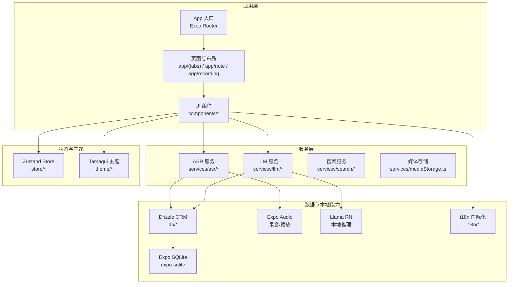
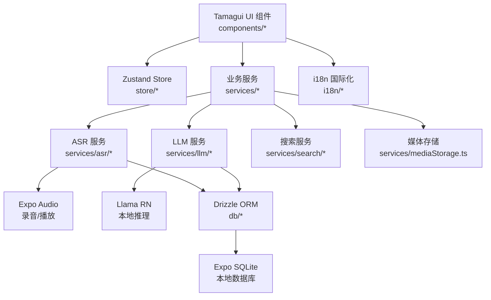
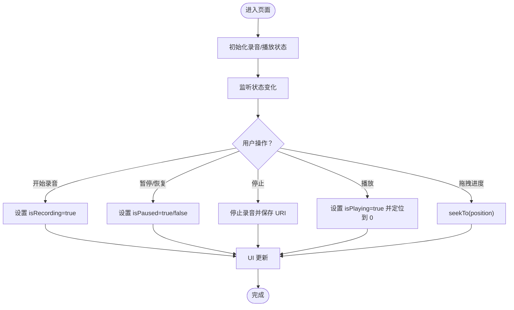
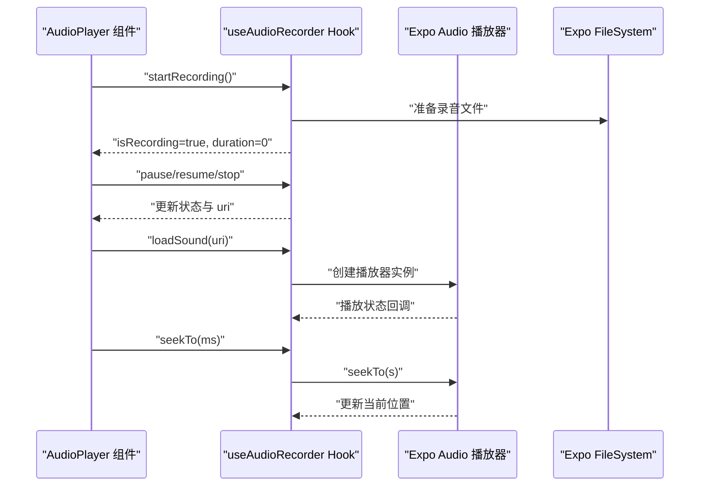
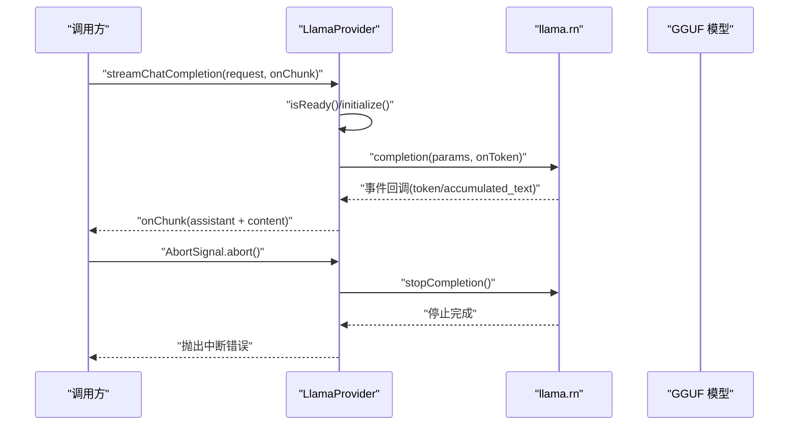
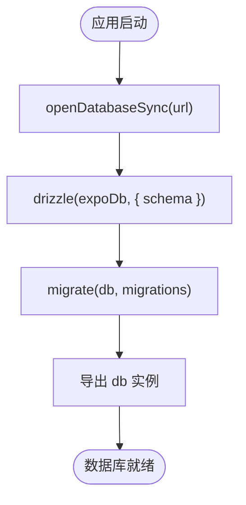
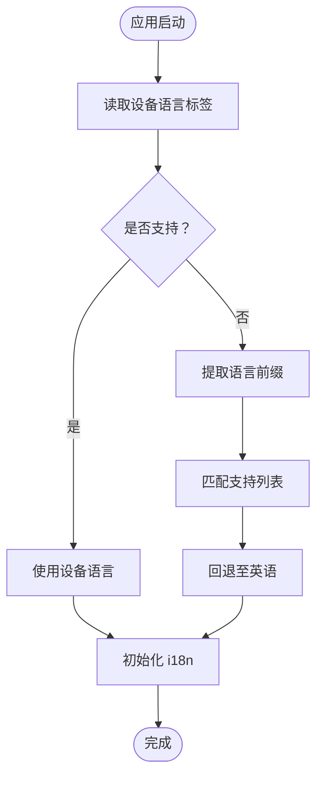
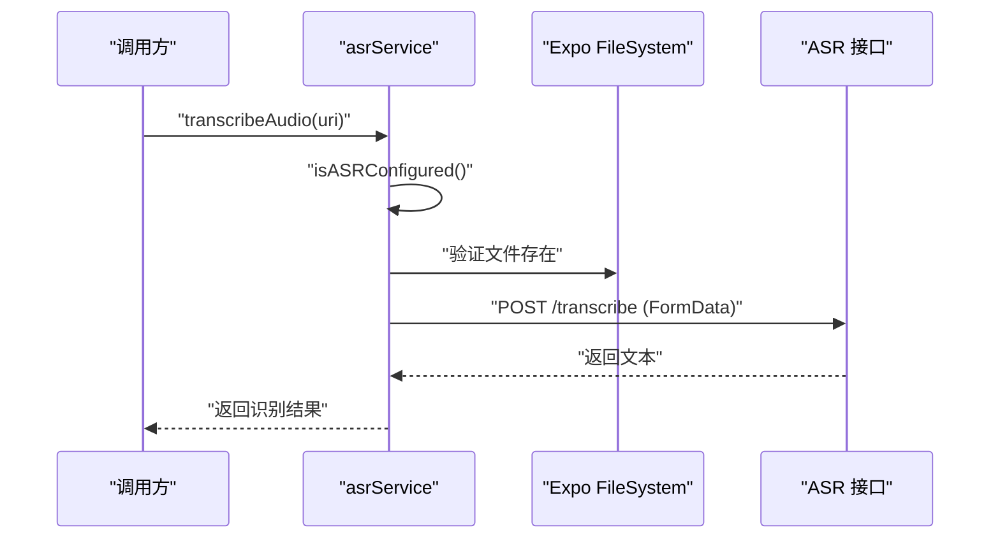
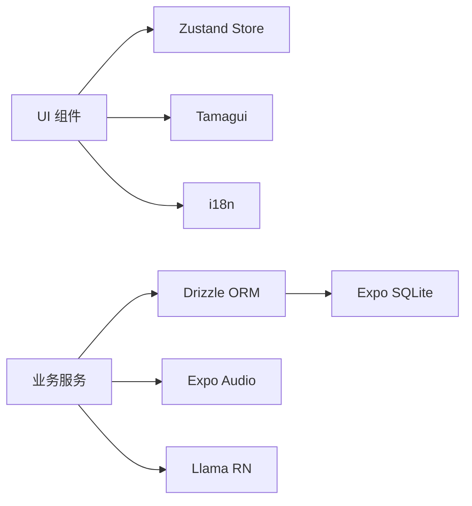

# 技术栈概览

<cite>
**本文档引用的文件**
- [package.json](file://package.json)
- [app.json](file://app.json)
- [tsconfig.json](file://tsconfig.json)
- [drizzle.config.ts](file://drizzle.config.ts)
- [store/index.ts](file://store/index.ts)
- [theme/tamagui.config.ts](file://theme/tamagui.config.ts)
- [db/client.ts](file://db/client.ts)
- [i18n/index.ts](file://i18n/index.ts)
- [services/asr/asrService.ts](file://services/asr/asrService.ts)
- [modules/moonshine/package.json](file://modules/moonshine/package.json)
- [services/llm/providers/local/LlamaProvider.ts](file://services/llm/providers/local/LlamaProvider.ts)
- [hooks/useAudioRecorder.ts](file://hooks/useAudioRecorder.ts)
- [components/audio/AudioPlayer.tsx](file://components/audio/AudioPlayer.tsx)
- [store/useRecordingStore.ts](file://store/useRecordingStore.ts)
</cite>

## 目录
1. [引言](#引言)
2. [项目结构](#项目结构)
3. [核心组件](#核心组件)
4. [架构总览](#架构总览)
5. [详细组件分析](#详细组件分析)
6. [依赖关系分析](#依赖关系分析)
7. [性能考虑](#性能考虑)
8. [故障排除指南](#故障排除指南)
9. [结论](#结论)

## 引言

VoiceNote 是一个基于 React Native + Expo 的跨平台语音笔记应用，专注于提供本地化的 AI 能力与流畅的用户体验。本技术栈概览将深入解析项目采用的核心技术组合及其选择原因，包括：

- 跨平台开发框架：React Native + Expo（路由、权限、插件生态）
- 类型安全：TypeScript
- 原生支持的 UI 组件库：Tamagui
- 轻量级状态管理：Zustand
- 本地数据持久化：Drizzle ORM + Expo SQLite
- 本地 AI 推理：Llama RN（llama.cpp 绑定）
- 音频处理：Expo Audio
- 国际化支持：i18n（react-i18next）

同时，我们将为开发者提供技术选型背景与学习路径建议，帮助快速上手并高效扩展功能。

## 项目结构

项目采用按功能域分层的组织方式，核心目录职责如下：
- app：应用入口与页面布局，使用 Expo Router 管理路由
- components：可复用 UI 组件与业务组件
- hooks：自定义 Hook，封装音频录制、状态管理等逻辑
- services：服务层，包含 ASR、LLM、搜索、技能等业务服务
- db：数据库客户端与 Drizzle Schema 定义
- store：Zustand 状态管理仓库
- theme：Tamagui 主题配置
- i18n：国际化资源与语言初始化
- modules：原生模块（如 Moonshine ASR 模块）封装

**图表来源**
- [app/_layout.tsx](file://app/_layout.tsx)
- [store/index.ts](file://store/index.ts)
- [theme/tamagui.config.ts](file://theme/tamagui.config.ts)
- [db/client.ts](file://db/client.ts)
- [i18n/index.ts](file://i18n/index.ts)

**章节来源**
- [package.json:1-83](file://package.json#L1-L83)
- [app.json:1-86](file://app.json#L1-L86)
- [tsconfig.json:1-63](file://tsconfig.json#L1-L63)

## 核心组件

本节从技术选型与实现角度，系统性介绍各核心组件的作用、优势与集成方式。

- React Native + Expo
  - 作用：提供跨平台移动应用开发框架，统一 iOS/Android/Web 开发体验；通过 Expo Router 实现声明式路由；通过插件系统集成相机、音频、SQLite 等原生能力。
  - 优势：开发效率高、生态完善、热重载友好；对原生模块有良好抽象与封装。
  - 关键证据：脚本命令、插件配置、权限声明、路由入口。

- TypeScript
  - 作用：提供静态类型检查，提升代码质量与可维护性；配合路径别名与严格模式，降低大型项目的维护成本。
  - 优势：编译期错误检测、智能提示、重构安全。
  - 关键证据：tsconfig.json 中的严格模式、路径映射与 include 规则。

- Tamagui
  - 作用：原生支持的 UI 组件库，提供主题系统、动画、响应式设计与高性能渲染。
  - 优势：原生动画与交互、暗黑模式、可定制令牌体系、与 React Native 生态无缝集成。
  - 关键证据：主题配置、组件中对 Tamagui 组件的使用。

- Zustand
  - 作用：轻量级状态管理，替代 Redux/Redux Toolkit，以更少样板代码实现复杂状态逻辑。
  - 优势：API 简洁、易于测试、无中间件开销。
  - 关键证据：store 目录下的多个 store 文件导出。

- Drizzle ORM + Expo SQLite
  - 作用：本地数据库 ORM，支持迁移、查询构建与类型安全；结合 Expo SQLite 提供跨平台 SQL 能力。
  - 优势：零运行时类型转换、迁移工具完善、Schema 驱动开发。
  - 关键证据：drizzle.config.ts、db/client.ts、schema 定义与迁移文件。

- Llama RN（本地 AI 推理）
  - 作用：基于 llama.cpp 的 React Native 绑定，实现在设备端运行 GGUF 模型，支持流式与非流式对话。
  - 优势：隐私安全、离线可用、可调参数多（上下文、线程、GPU 层等）。
  - 关键证据：LlamaProvider 实现、模型路径解析、流式回调处理。

- Expo Audio（音频处理）
  - 作用：提供录音、播放、权限请求与实时状态监听，覆盖录音生命周期与播放控制。
  - 优势：API 简洁、权限与模式管理完善、与文件系统集成良好。
  - 关键证据：useAudioRecorder Hook、AudioPlayer 组件。

- i18n（国际化）
  - 作用：多语言资源加载与语言回退策略，支持设备语言检测与命名空间组织。
  - 优势：资源解耦、命名空间隔离、运行时切换语言。
  - 关键证据：i18n 初始化、支持语言列表、命名空间配置。

**章节来源**
- [package.json:20-62](file://package.json#L20-L62)
- [app.json:50-83](file://app.json#L50-L83)
- [tsconfig.json:3-55](file://tsconfig.json#L3-L55)
- [drizzle.config.ts:1-12](file://drizzle.config.ts#L1-L12)
- [db/client.ts:1-15](file://db/client.ts#L1-L15)
- [services/llm/providers/local/LlamaProvider.ts:1-316](file://services/llm/providers/local/LlamaProvider.ts#L1-L316)
- [hooks/useAudioRecorder.ts:1-270](file://hooks/useAudioRecorder.ts#L1-L270)
- [components/audio/AudioPlayer.tsx:1-132](file://components/audio/AudioPlayer.tsx#L1-L132)
- [i18n/index.ts:1-76](file://i18n/index.ts#L1-L76)

## 架构总览

下图展示了应用的整体架构：UI 层通过 Tamagui 组件与 Zustand 状态管理；业务层由 ASR/LLM/搜索等服务组成；数据层通过 Drizzle ORM 与 Expo SQLite 进行本地持久化；音频能力由 Expo Audio 提供；本地 AI 推理由 Llama RN 承载；国际化通过 i18n 管理。

**图表来源**
- [theme/tamagui.config.ts](file://theme/tamagui.config.ts)
- [store/index.ts](file://store/index.ts)
- [services/asr/asrService.ts](file://services/asr/asrService.ts)
- [services/llm/providers/local/LlamaProvider.ts](file://services/llm/providers/local/LlamaProvider.ts)
- [hooks/useAudioRecorder.ts](file://hooks/useAudioRecorder.ts)
- [db/client.ts](file://db/client.ts)
- [i18n/index.ts](file://i18n/index.ts)

## 详细组件分析

### 状态管理：Zustand Store

- 设计要点
  - 将全局状态拆分为多个小 store，避免单一 store 过大导致重渲染。
  - 使用 create 函数创建带状态与动作的 store，API 简洁直观。
  - 录音与播放分别维护独立 store，职责清晰。

- 数据结构与复杂度
  - 状态读写为 O(1)，动作函数在单次更新中批量设置状态。
  - 通过最小化订阅范围，减少不必要的 UI 重渲染。

- 错误处理与边界
  - 在录音/播放过程中，通过状态位控制 UI 行为，避免竞态。
  - 外部错误通过抛错或回调传递，保持 UI 一致性。

**图表来源**
- [store/useRecordingStore.ts](file://store/useRecordingStore.ts)

**章节来源**
- [store/index.ts](file://store/index.ts)
- [store/useRecordingStore.ts](file://store/useRecordingStore.ts)

### 音频处理：Expo Audio 与自定义 Hook

- 设计要点
  - useAudioRecorder 封装录音生命周期、权限请求、iOS 模式切换与文件信息获取。
  - 播放器通过 playerSource 切换音源，提供播放/暂停/停止/拖拽进度等能力。
  - AudioPlayer 组件使用 Tamagui 组件实现进度条与控制按钮。

- 数据流
  - 录音：prepare -> record -> pause/resume -> stop -> 获取 uri/时长/大小
  - 播放：loadSound -> play/pause/stop -> seekTo -> 同步进度

- 性能与可靠性
  - 定时轮询播放状态，确保 UI 与实际播放同步。
  - 录音前请求权限，失败时返回明确错误信息。

**图表来源**
- [hooks/useAudioRecorder.ts](file://hooks/useAudioRecorder.ts)
- [components/audio/AudioPlayer.tsx](file://components/audio/AudioPlayer.tsx)

**章节来源**
- [hooks/useAudioRecorder.ts](file://hooks/useAudioRecorder.ts)
- [components/audio/AudioPlayer.tsx](file://components/audio/AudioPlayer.tsx)

### 本地 AI 推理：Llama RN Provider

- 设计要点
  - LlamaProvider 基于 LLMProviderBase，实现本地 GGUF 模型的初始化、聊天补全与流式输出。
  - 支持温度、top_p、最大 token 数、停止词等参数；支持中断生成。
  - 通过 resolveLocalModelPath 解析模型路径，支持环境变量与设置覆盖。

- 流式处理
  - 事件驱动的 token 输出，先发送角色，再增量发送内容，最后发送结束标记。
  - 支持 AbortSignal 中断，保证 UI 与底层生成的一致性。

**图表来源**
- [services/llm/providers/local/LlamaProvider.ts](file://services/llm/providers/local/LlamaProvider.ts)

**章节来源**
- [services/llm/providers/local/LlamaProvider.ts](file://services/llm/providers/local/LlamaProvider.ts)

### 本地数据持久化：Drizzle ORM + Expo SQLite

- 设计要点
  - drizzle.config.ts 指定 schema、输出目录、方言与驱动（expo）。
  - db/client.ts 创建数据库连接并执行迁移，确保 schema 与版本一致。
  - 通过 typed query builder 与类型推断，减少运行时错误。

- 运行流程
  - 应用启动时打开数据库 -> 加载 schema -> 执行迁移 -> 导出 db 实例供查询使用。

**图表来源**
- [drizzle.config.ts](file://drizzle.config.ts)
- [db/client.ts](file://db/client.ts)

**章节来源**
- [drizzle.config.ts](file://drizzle.config.ts)
- [db/client.ts](file://db/client.ts)

### 国际化：i18n 与多语言资源

- 设计要点
  - 支持语言：简体中文、繁体中文、英语、日语、韩语。
  - 设备语言检测与回退策略：优先匹配完整语言标签，其次按语言前缀匹配，最后回退至英语。
  - 命名空间组织：将翻译按功能域拆分，便于维护与按需加载。

- 初始化流程
  - 读取设备语言 -> 校验支持列表 -> 设置默认命名空间 -> 初始化 react-i18next。

**图表来源**
- [i18n/index.ts](file://i18n/index.ts)

**章节来源**
- [i18n/index.ts](file://i18n/index.ts)

### 语音转文字：ASR 服务

- 设计要点
  - 支持云端与本地两种模式（通过 provider 管理器），当前实现中使用云端 SenseVoice 模型。
  - 配置项从设置 store 与环境变量读取，具备超时控制与错误处理。
  - 使用 FormData 上传音频文件，支持超时中断。

- 关键流程
  - 校验配置 -> 读取文件 -> 组装表单 -> 发起请求 -> 解析响应 -> 返回文本。

**图表来源**
- [services/asr/asrService.ts](file://services/asr/asrService.ts)

**章节来源**
- [services/asr/asrService.ts](file://services/asr/asrService.ts)

## 依赖关系分析

- 模块耦合与内聚
  - UI 组件依赖 Tamagui 与 Zustand，保持 UI 与状态的低耦合。
  - 服务层通过接口抽象（如 ProviderManager）与具体实现解耦，便于扩展新提供商。
  - 数据层通过 Drizzle ORM 与 SQLite 解耦，便于迁移与版本管理。

- 外部依赖与集成点
  - Expo 插件系统：相机、音频、视频、图片库、SQLite 等原生能力通过 app.json 插件启用。
  - Llama RN：通过原生模块桥接，提供本地推理能力。
  - i18n：与 UI 组件解耦，通过命名空间与资源文件组织。

**图表来源**
- [package.json](file://package.json)
- [app.json](file://app.json)
- [theme/tamagui.config.ts](file://theme/tamagui.config.ts)
- [store/index.ts](file://store/index.ts)
- [db/client.ts](file://db/client.ts)
- [i18n/index.ts](file://i18n/index.ts)

**章节来源**
- [package.json:20-62](file://package.json#L20-L62)
- [app.json:50-83](file://app.json#L50-L83)

## 性能考虑

- 渲染性能
  - Tamagui 使用原生动画与轻量级组件树，减少 JS 线程压力。
  - Zustand 通过细粒度 store 分离，避免全局状态变更引发的全量重渲染。

- 数据访问
  - Drizzle ORM 查询编译期类型检查，减少运行时错误与无效查询。
  - SQLite 事务与批处理可减少频繁写入带来的 I/O 压力。

- 音频处理
  - 使用 Expo Audio 的预设与状态监听，避免阻塞主线程。
  - 录音/播放切换时及时释放资源，防止内存泄漏。

- 本地 AI 推理
  - 合理设置上下文长度与线程数，平衡性能与效果。
  - 流式输出减少首 token 延迟，提升交互体验。

## 故障排除指南

- 本地 AI 模型未找到
  - 症状：初始化失败或提示模型不可用。
  - 排查：确认模型路径解析逻辑、EXPO_PUBLIC_AI_LOCAL_MODEL_PATH 环境变量、打包时模型资源是否包含。
  - 参考实现：[services/llm/providers/local/LlamaProvider.ts](file://services/llm/providers/local/LlamaProvider.ts)

- 音频权限被拒绝
  - 症状：录音无法开始，抛出权限相关错误。
  - 排查：检查 app.json 中权限声明与运行时权限请求流程。
  - 参考实现：[hooks/useAudioRecorder.ts](file://hooks/useAudioRecorder.ts)

- ASR 配置缺失或超时
  - 症状：识别失败或超时中断。
  - 排查：确认设置中的 API 地址与密钥、网络连通性、超时时间设置。
  - 参考实现：[services/asr/asrService.ts](file://services/asr/asrService.ts)

- 数据库迁移失败
  - 症状：启动时报 schema 不匹配或迁移异常。
  - 排查：检查 drizzle.config.ts 配置、迁移文件完整性、数据库版本。
  - 参考实现：[drizzle.config.ts](file://drizzle.config.ts)、[db/client.ts](file://db/client.ts)

**章节来源**
- [services/llm/providers/local/LlamaProvider.ts](file://services/llm/providers/local/LlamaProvider.ts)
- [hooks/useAudioRecorder.ts](file://hooks/useAudioRecorder.ts)
- [services/asr/asrService.ts](file://services/asr/asrService.ts)
- [drizzle.config.ts](file://drizzle.config.ts)
- [db/client.ts](file://db/client.ts)

## 结论

VoiceNote 的技术栈围绕“跨平台 + 类型安全 + 原生体验 + 本地能力”展开，通过 React Native + Expo 快速构建跨平台应用，借助 TypeScript 保障质量，Tamagui 提升 UI 体验，Zustand 简化状态管理，Drizzle ORM + Expo SQLite 实现可靠的本地数据持久化。本地 AI 推理（Llama RN）、音频处理（Expo Audio）与国际化（i18n）进一步强化了应用的核心能力。

对于开发者，建议：
- 先掌握 React Native + Expo 基础与路由、权限、插件机制；
- 学习 TypeScript 严格模式与路径别名配置；
- 理解 Tamagui 的主题与组件体系；
- 熟悉 Zustand 的 store 设计与最佳实践；
- 掌握 Drizzle ORM 的 Schema 设计与迁移流程；
- 了解 Llama RN 的模型管理与流式推理；
- 熟练使用 Expo Audio 的录音/播放 API；
- 建立完善的 i18n 资源与命名空间组织。