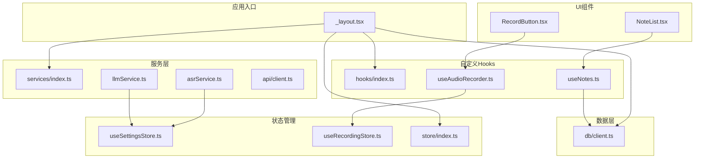
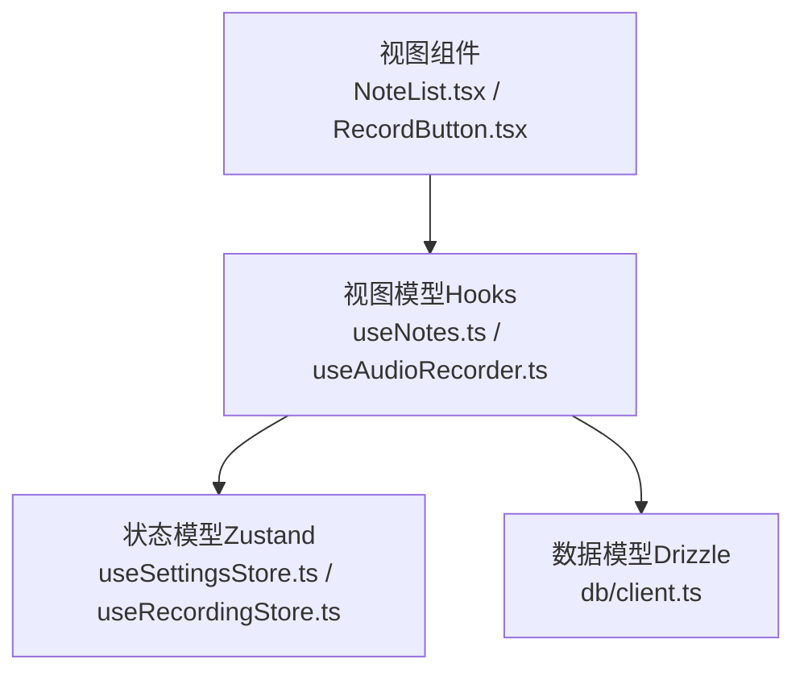
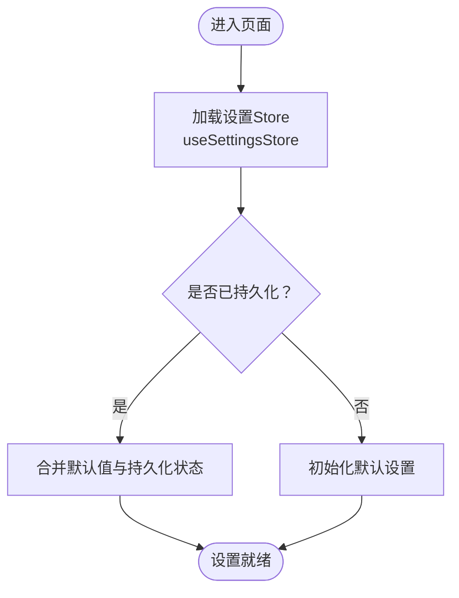
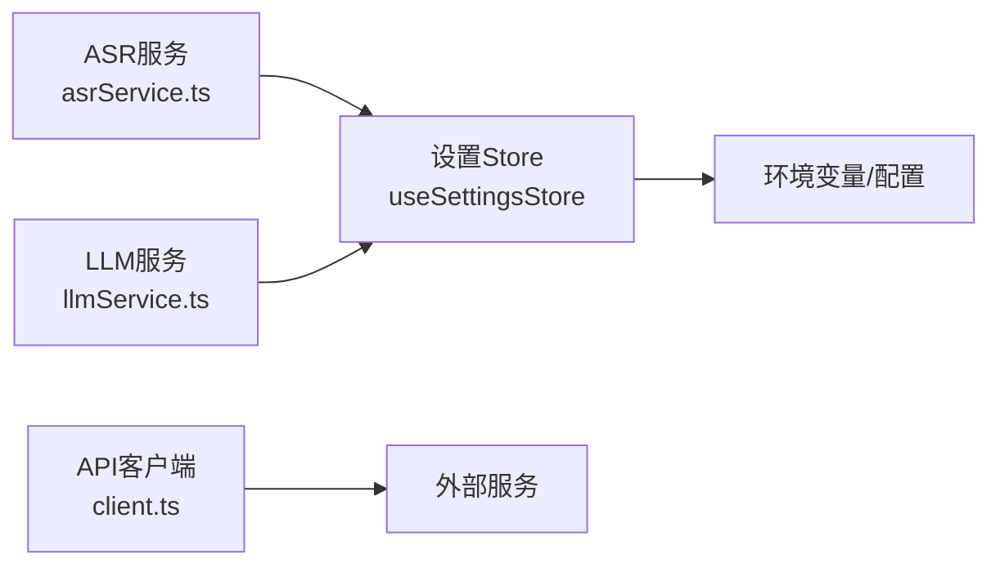
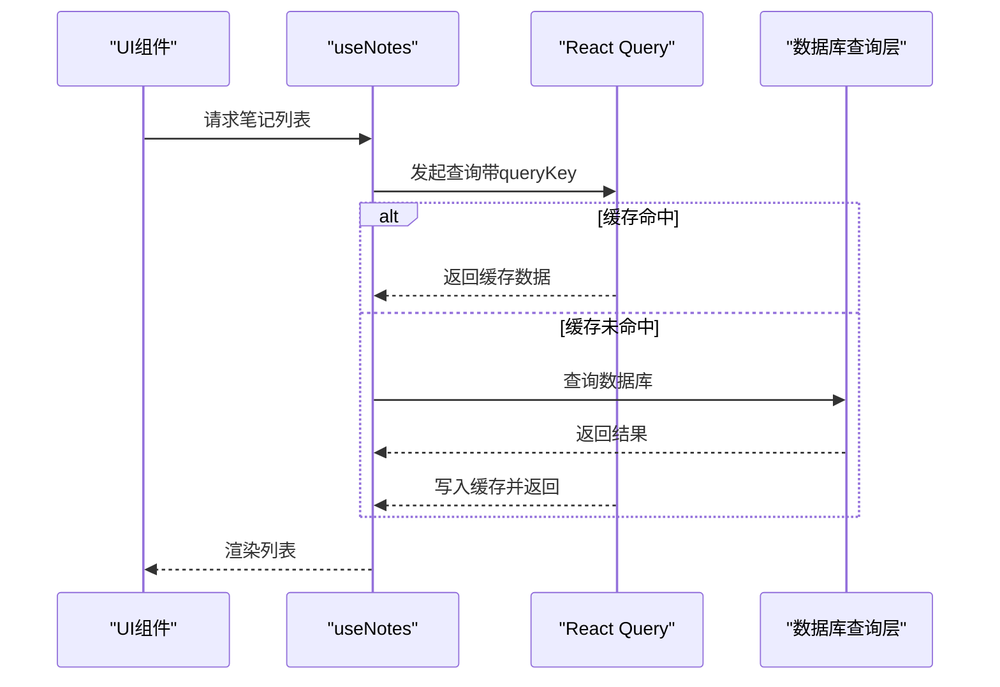
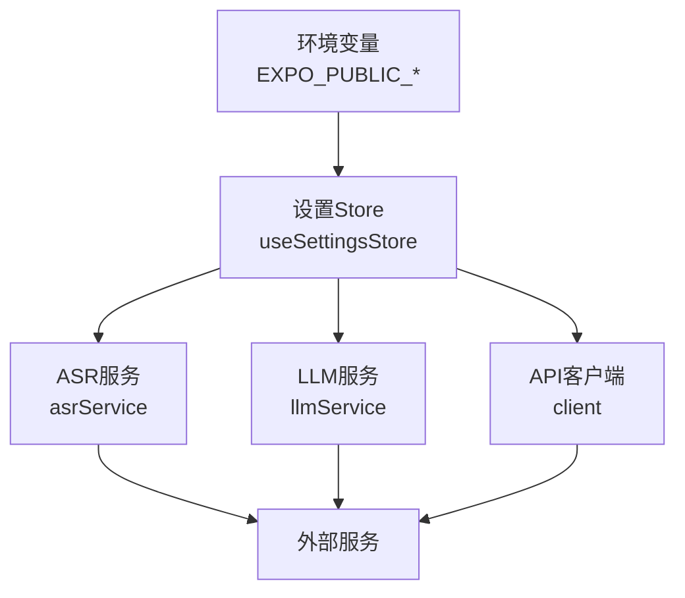
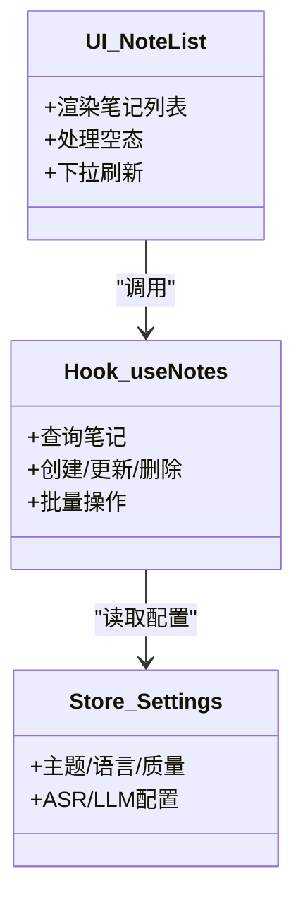
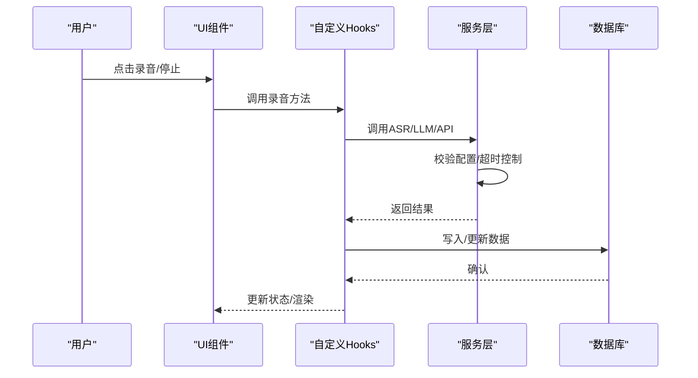
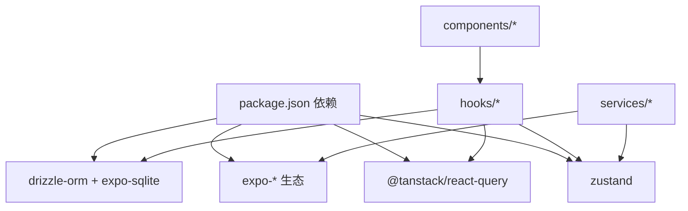

# 架构设计理念

<cite>
**本文引用的文件**
- [package.json](file://package.json)
- [app/_layout.tsx](file://app/_layout.tsx)
- [store/index.ts](file://store/index.ts)
- [store/useSettingsStore.ts](file://store/useSettingsStore.ts)
- [store/useRecordingStore.ts](file://store/useRecordingStore.ts)
- [hooks/index.ts](file://hooks/index.ts)
- [hooks/useNotes.ts](file://hooks/useNotes.ts)
- [hooks/useAudioRecorder.ts](file://hooks/useAudioRecorder.ts)
- [services/index.ts](file://services/index.ts)
- [services/asr/asrService.ts](file://services/asr/asrService.ts)
- [services/llm/llmService.ts](file://services/llm/llmService.ts)
- [services/api/client.ts](file://services/api/client.ts)
- [db/client.ts](file://db/client.ts)
- [components/note/NoteList.tsx](file://components/note/NoteList.tsx)
- [components/input/RecordButton.tsx](file://components/input/RecordButton.tsx)
</cite>

## 目录
1. [引言](#引言)
2. [项目结构](#项目结构)
3. [核心组件](#核心组件)
4. [架构总览](#架构总览)
5. [详细组件分析](#详细组件分析)
6. [依赖关系分析](#依赖关系分析)
7. [性能考虑](#性能考虑)
8. [故障排查指南](#故障排查指南)
9. [结论](#结论)
10. [附录](#附录)

## 引言
本文件系统性阐述 VoiceNote 项目的架构设计理念，重点包括：
- 采用 MVVM 风格的分层组织：视图层（UI 组件）、模型层（Zustand 状态与数据库）、视图模型层（React Query + 自定义 Hooks）。
- 使用 Zustand 替代传统 Redux 的设计考量：更轻量、更易组合、与 React 生态无缝集成。
- 模块化设计原则：按领域拆分服务（ASR、LLM、上传、媒体存储等），并通过统一入口导出。
- Hook 模式：通过自定义 Hooks 将业务逻辑封装在可复用、可测试的单元中。
- 依赖注入思想：通过配置文件与环境变量集中管理外部服务（ASR、LLM、API）。
- 组件化开发策略：UI 组件与业务逻辑解耦，通过 Hooks 和 Store 提供数据与行为。
- 数据流设计：从用户交互到本地数据库与云端服务的完整闭环。

## 项目结构
项目采用“按功能域划分”的模块化组织方式：
- app：应用入口与路由容器，负责全局主题、国际化、手势与查询客户端的装配。
- components：UI 组件库，包含音频、相机、输入、导航、笔记等子模块。
- hooks：自定义 Hooks，封装业务逻辑与状态管理。
- services：领域服务，如 ASR、LLM、API、媒体存储、搜索等。
- store：Zustand 状态管理，覆盖设置、录音播放、选择、搜索、遮罩等。
- db：Drizzle ORM 与 SQLite 数据库初始化及迁移。
- i18n：多语言资源与初始化。
- theme：Tamagui 主题与样式配置。

图表来源
- [app/_layout.tsx:1-101](file://app/_layout.tsx#L1-L101)
- [store/index.ts:1-8](file://store/index.ts#L1-L8)
- [store/useSettingsStore.ts:1-218](file://store/useSettingsStore.ts#L1-L218)
- [store/useRecordingStore.ts:1-71](file://store/useRecordingStore.ts#L1-L71)
- [hooks/index.ts:1-79](file://hooks/index.ts#L1-L79)
- [hooks/useNotes.ts:1-217](file://hooks/useNotes.ts#L1-L217)
- [hooks/useAudioRecorder.ts:1-270](file://hooks/useAudioRecorder.ts#L1-L270)
- [services/index.ts:1-7](file://services/index.ts#L1-L7)
- [services/asr/asrService.ts:1-74](file://services/asr/asrService.ts#L1-L74)
- [services/llm/llmService.ts:1-61](file://services/llm/llmService.ts#L1-L61)
- [services/api/client.ts:1-104](file://services/api/client.ts#L1-L104)
- [db/client.ts:1-15](file://db/client.ts#L1-L15)
- [components/note/NoteList.tsx:1-240](file://components/note/NoteList.tsx#L1-L240)
- [components/input/RecordButton.tsx:1-131](file://components/input/RecordButton.tsx#L1-L131)

章节来源
- [package.json:1-83](file://package.json#L1-L83)
- [app/_layout.tsx:1-101](file://app/_layout.tsx#L1-L101)

## 核心组件
- 应用入口与全局装配
  - 在应用根布局中装配国际化、主题、手势处理、查询客户端与深度链接处理器，确保全局一致的用户体验与数据流。
- 状态管理（Zustand）
  - 设置状态：持久化存储应用设置，支持默认值合并与兼容性迁移。
  - 录音/播放状态：集中管理录音与播放的 UI 状态，避免跨组件重复逻辑。
- 自定义 Hooks
  - 笔记相关：提供查询、增删改、批量归档与合并等操作，结合 React Query 实现缓存、乐观更新与失效重取。
  - 录音相关：封装录音权限、录制控制、播放控制与文件信息读取。
- 服务层
  - ASR：统一调用云/本地语音识别，支持超时控制与配置校验。
  - LLM：统一本地/云端大模型调用，支持流式输出与模型信息查询。
  - API：基于 Axios 的通用客户端，内置错误处理与拦截器占位。
- 数据层（Drizzle + Expo SQLite）
  - 初始化数据库与迁移，保证本地数据一致性。

章节来源
- [app/_layout.tsx:1-101](file://app/_layout.tsx#L1-L101)
- [store/useSettingsStore.ts:1-218](file://store/useSettingsStore.ts#L1-L218)
- [store/useRecordingStore.ts:1-71](file://store/useRecordingStore.ts#L1-L71)
- [hooks/useNotes.ts:1-217](file://hooks/useNotes.ts#L1-L217)
- [hooks/useAudioRecorder.ts:1-270](file://hooks/useAudioRecorder.ts#L1-L270)
- [services/asr/asrService.ts:1-74](file://services/asr/asrService.ts#L1-L74)
- [services/llm/llmService.ts:1-61](file://services/llm/llmService.ts#L1-L61)
- [services/api/client.ts:1-104](file://services/api/client.ts#L1-L104)
- [db/client.ts:1-15](file://db/client.ts#L1-L15)

## 架构总览
VoiceNote 采用 MVVM 风格的分层架构：
- 视图（View）：UI 组件（如笔记列表、录音按钮）负责渲染与用户交互。
- 视图模型（ViewModel）：自定义 Hooks（如 useNotes、useAudioRecorder）封装业务逻辑与状态，向视图暴露简洁的接口。
- 模型（Model）：Zustand Store（设置、录音/播放）与 Drizzle 数据库（本地持久化）共同构成数据模型。

图表来源
- [components/note/NoteList.tsx:1-240](file://components/note/NoteList.tsx#L1-L240)
- [components/input/RecordButton.tsx:1-131](file://components/input/RecordButton.tsx#L1-L131)
- [hooks/useNotes.ts:1-217](file://hooks/useNotes.ts#L1-L217)
- [hooks/useAudioRecorder.ts:1-270](file://hooks/useAudioRecorder.ts#L1-L270)
- [store/useSettingsStore.ts:1-218](file://store/useSettingsStore.ts#L1-L218)
- [store/useRecordingStore.ts:1-71](file://store/useRecordingStore.ts#L1-L71)
- [db/client.ts:1-15](file://db/client.ts#L1-L15)

## 详细组件分析

### 状态管理：Zustand 替代 Redux 的设计考量
- 轻量化与易用性：Zustand 以函数式 API 降低样板代码，适合移动端快速迭代。
- 与 React 生态融合：无需 Provider 包裹，直接在组件中订阅状态，减少上下文传播成本。
- 持久化与默认值：通过 persist 中间件实现设置类状态的本地持久化，并在升级时进行字段兼容与默认值合并。
- 分离关注点：将 UI 状态（录音/播放）与业务状态（设置）拆分到不同 Store，职责清晰。

图表来源
- [store/useSettingsStore.ts:134-218](file://store/useSettingsStore.ts#L134-L218)

章节来源
- [store/index.ts:1-8](file://store/index.ts#L1-L8)
- [store/useSettingsStore.ts:1-218](file://store/useSettingsStore.ts#L1-L218)
- [store/useRecordingStore.ts:1-71](file://store/useRecordingStore.ts#L1-L71)

### 模块化设计：按领域拆分服务
- ASR 服务：统一处理云/本地语音识别，支持配置校验、超时控制与错误提示。
- LLM 服务：统一本地/云端大模型调用，支持流式输出与模型信息查询。
- API 客户端：基于 Axios 的通用封装，预留鉴权与错误处理扩展点。
- 媒体与笔记：通过 Hooks 与数据库查询层对接，形成清晰的领域边界。

图表来源
- [services/asr/asrService.ts:1-74](file://services/asr/asrService.ts#L1-L74)
- [services/llm/llmService.ts:1-61](file://services/llm/llmService.ts#L1-L61)
- [services/api/client.ts:1-104](file://services/api/client.ts#L1-L104)
- [store/useSettingsStore.ts:73-105](file://store/useSettingsStore.ts#L73-L105)

章节来源
- [services/index.ts:1-7](file://services/index.ts#L1-L7)
- [services/asr/asrService.ts:1-74](file://services/asr/asrService.ts#L1-L74)
- [services/llm/llmService.ts:1-61](file://services/llm/llmService.ts#L1-L61)
- [services/api/client.ts:1-104](file://services/api/client.ts#L1-L104)

### Hook 模式：封装业务逻辑
- useNotes：提供查询、创建、更新（含乐观更新）、删除、批量归档与合并等能力，配合 React Query 的缓存与失效策略。
- useAudioRecorder：封装录音权限、录制控制、播放控制与文件信息读取，屏蔽平台差异。
- useNotes 与数据库：通过查询层与 Drizzle ORM 对接，确保数据访问的一致性与类型安全。

图表来源
- [hooks/useNotes.ts:19-41](file://hooks/useNotes.ts#L19-L41)
- [hooks/useNotes.ts:61-102](file://hooks/useNotes.ts#L61-L102)

章节来源
- [hooks/index.ts:1-79](file://hooks/index.ts#L1-L79)
- [hooks/useNotes.ts:1-217](file://hooks/useNotes.ts#L1-L217)
- [hooks/useAudioRecorder.ts:1-270](file://hooks/useAudioRecorder.ts#L1-L270)

### 依赖注入：配置文件与环境变量
- 设置 Store：集中管理 ASR/LLM/API 等外部服务的配置，支持默认值与环境变量回退。
- 环境变量：通过 EXPO_PUBLIC_* 前缀在构建期注入，运行时由服务层读取。
- 服务层：根据配置动态选择云/本地提供方，统一对外接口。

图表来源
- [store/useSettingsStore.ts:73-105](file://store/useSettingsStore.ts#L73-L105)
- [services/asr/asrService.ts:11-17](file://services/asr/asrService.ts#L11-L17)
- [services/llm/llmService.ts:18-30](file://services/llm/llmService.ts#L18-L30)
- [services/api/client.ts:4](file://services/api/client.ts#L4)

章节来源
- [store/useSettingsStore.ts:1-218](file://store/useSettingsStore.ts#L1-L218)
- [services/asr/asrService.ts:1-74](file://services/asr/asrService.ts#L1-L74)
- [services/llm/llmService.ts:1-61](file://services/llm/llmService.ts#L1-L61)
- [services/api/client.ts:1-104](file://services/api/client.ts#L1-L104)

### 组件化开发：UI 与业务逻辑分离
- UI 组件：专注于视觉与交互（如录音按钮的动画与反馈），不直接访问状态或服务。
- 业务逻辑：通过 Hooks 与 Store 提供数据与行为，组件仅负责调用。
- 列表组件：NoteList 通过查询 Hook 获取数据并渲染，同时处理空态与下拉刷新。

图表来源
- [components/note/NoteList.tsx:109-205](file://components/note/NoteList.tsx#L109-L205)
- [hooks/useNotes.ts:19-41](file://hooks/useNotes.ts#L19-L41)
- [store/useSettingsStore.ts:9-22](file://store/useSettingsStore.ts#L9-L22)

章节来源
- [components/note/NoteList.tsx:1-240](file://components/note/NoteList.tsx#L1-L240)
- [components/input/RecordButton.tsx:1-131](file://components/input/RecordButton.tsx#L1-L131)
- [hooks/useNotes.ts:1-217](file://hooks/useNotes.ts#L1-L217)

### 数据流向设计：从用户交互到持久化
- 用户交互：点击录音按钮触发录音 Hook，更新录音 Store；长按或滑动触发笔记操作。
- 业务处理：Hooks 调用服务层（ASR/LLM/API），服务层根据配置选择提供方。
- 数据持久化：通过数据库查询层写入本地数据库，React Query 缓存与失效策略保证一致性。
- 状态同步：设置 Store 与录音/播放 Store 作为 UI 状态源，贯穿整个生命周期。

图表来源
- [hooks/useAudioRecorder.ts:79-175](file://hooks/useAudioRecorder.ts#L79-L175)
- [services/asr/asrService.ts:24-73](file://services/asr/asrService.ts#L24-L73)
- [db/client.ts:1-15](file://db/client.ts#L1-L15)

章节来源
- [hooks/useAudioRecorder.ts:1-270](file://hooks/useAudioRecorder.ts#L1-L270)
- [services/asr/asrService.ts:1-74](file://services/asr/asrService.ts#L1-L74)
- [db/client.ts:1-15](file://db/client.ts#L1-L15)

## 依赖关系分析
- 外部依赖
  - Zustand：状态管理
  - @tanstack/react-query：数据获取与缓存
  - Drizzle ORM + Expo SQLite：本地数据库
  - Expo 生态：音频、相机、文件系统、国际化、主题等
- 内部依赖
  - Hooks 依赖 Store 与数据库查询层
  - 服务层依赖 Store 读取配置
  - UI 组件依赖 Hooks

图表来源
- [package.json:20-62](file://package.json#L20-L62)
- [hooks/useNotes.ts:1](file://hooks/useNotes.ts#L1)
- [hooks/useAudioRecorder.ts:1](file://hooks/useAudioRecorder.ts#L1)
- [services/asr/asrService.ts:1](file://services/asr/asrService.ts#L1)
- [db/client.ts:1](file://db/client.ts#L1)

章节来源
- [package.json:1-83](file://package.json#L1-L83)

## 性能考虑
- 状态粒度：将设置与 UI 状态拆分到不同 Store，避免无关状态导致的重渲染。
- 查询缓存：React Query 默认缓存与失效策略减少网络请求，提升交互流畅度。
- 列表优化：使用高性能列表组件与分组渲染，降低渲染开销。
- 动画与反馈：使用原生动画库与触觉反馈，兼顾体验与性能。
- 本地优先：优先使用本地数据库与持久化 Store，减少网络抖动影响。

## 故障排查指南
- ASR 未配置：检查设置 Store 中的 ASR 配置与环境变量，确认 API 地址与密钥。
- LLM 未配置：检查 AI 提供商与本地模型路径，确保本地模型准备完成。
- 网络异常：查看 API 客户端错误处理与国际化提示，确认服务可用性。
- 录音失败：检查录音权限、设备状态与文件系统访问，确认临时文件存在。
- 数据不一致：检查 React Query 缓存失效策略与数据库写入确认。

章节来源
- [services/asr/asrService.ts:19-22](file://services/asr/asrService.ts#L19-L22)
- [services/llm/llmService.ts:18-30](file://services/llm/llmService.ts#L18-L30)
- [services/api/client.ts:56-75](file://services/api/client.ts#L56-L75)
- [hooks/useAudioRecorder.ts:74-77](file://hooks/useAudioRecorder.ts#L74-L77)
- [hooks/useNotes.ts:68-94](file://hooks/useNotes.ts#L68-L94)

## 结论
VoiceNote 通过 MVVM 风格的分层与模块化设计，实现了 UI 与业务逻辑的清晰分离；Zustand 的引入简化了状态管理，提升了开发效率；自定义 Hooks 将复杂业务封装为可复用单元；服务层通过配置中心统一管理外部依赖；数据流从用户交互到本地持久化形成闭环。该架构既满足移动端性能要求，又便于扩展与维护。

## 附录
- 最佳实践建议
  - 保持 Hooks 的单一职责，避免在 UI 组件中直接访问 Store 或服务。
  - 使用 React Query 的查询键与失效策略，确保缓存一致性。
  - 将配置集中于 Store 并通过环境变量回退，便于部署与调试。
  - 对关键流程绘制序列图与数据流图，辅助团队理解与评审。