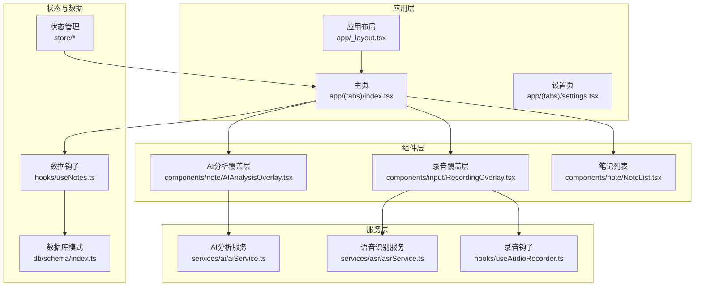
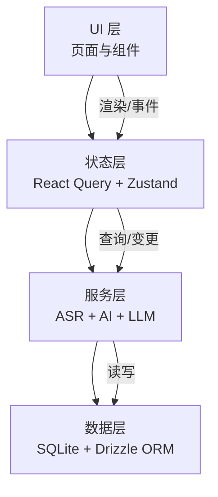
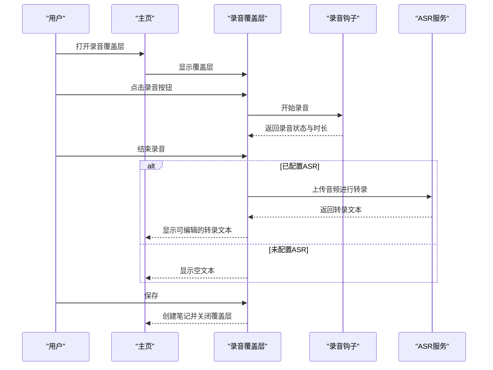
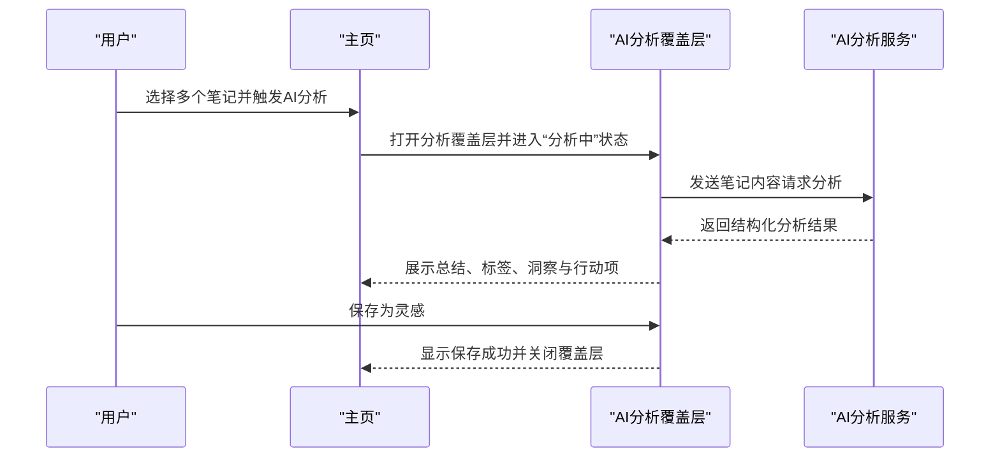
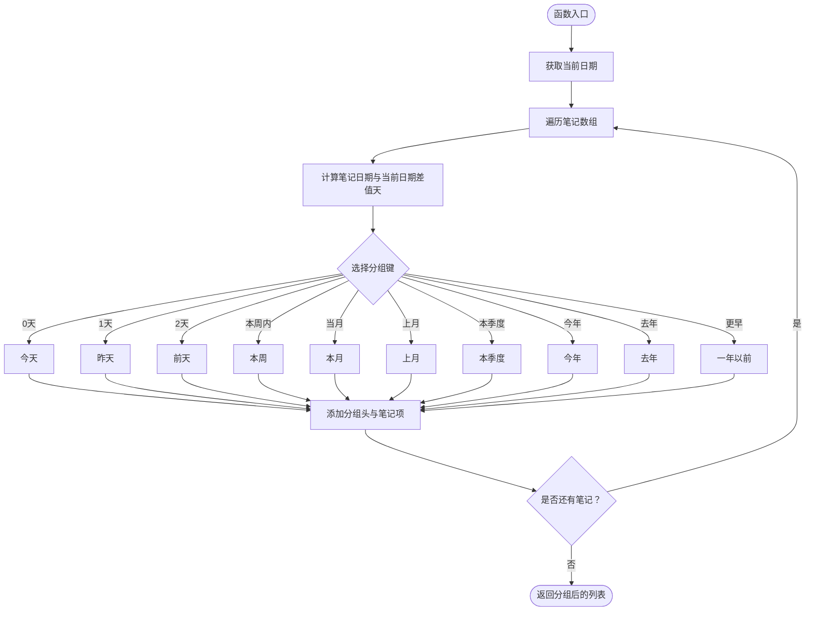
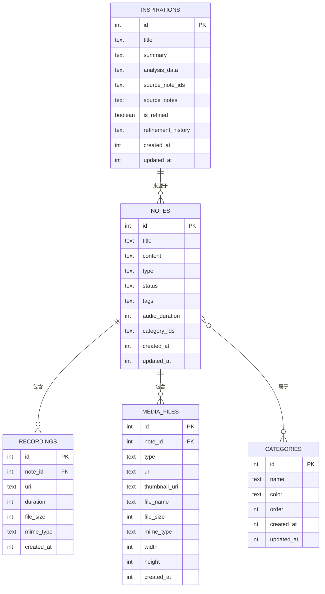

# 项目介绍

<cite>
**本文档引用的文件**
- [package.json](file://package.json)
- [app.json](file://app.json)
- [app/_layout.tsx](file://app/_layout.tsx)
- [app/index.tsx](file://app/index.tsx)
- [app/(tabs)/index.tsx](file://app/(tabs)/index.tsx)
- [components/note/NoteList.tsx](file://components/note/NoteList.tsx)
- [hooks/useNotes.ts](file://hooks/useNotes.ts)
- [services/asr/asrService.ts](file://services/asr/asrService.ts)
- [components/input/RecordingOverlay.tsx](file://components/input/RecordingOverlay.tsx)
- [hooks/useAudioRecorder.ts](file://hooks/useAudioRecorder.ts)
- [services/ai/aiService.ts](file://services/ai/aiService.ts)
- [components/note/AIAnalysisOverlay.tsx](file://components/note/AIAnalysisOverlay.tsx)
- [db/schema/index.ts](file://db/schema/index.ts)
</cite>

## 目录
1. [引言](#引言)
2. [项目结构](#项目结构)
3. [核心组件](#核心组件)
4. [架构总览](#架构总览)
5. [详细组件分析](#详细组件分析)
6. [依赖关系分析](#依赖关系分析)
7. [性能考虑](#性能考虑)
8. [故障排除指南](#故障排除指南)
9. [结论](#结论)

## 引言

VoiceNote 是一个基于 React Native 与 Expo 的跨平台移动应用，专注于语音笔记与多媒体内容管理。其核心价值主张在于为用户提供便捷的语音录制、智能转录、AI 分析以及多媒体笔记管理能力，帮助用户在会议记录、学习笔记、创意灵感收集等场景中高效整理与沉淀知识。

- 跨平台支持：通过 Expo 实现一次开发、多端部署（iOS、Android、Web），降低维护成本并提升开发效率。
- 多媒体笔记：支持文本、语音、照片/视频、附件等多种笔记类型，统一管理与检索。
- 智能化处理：集成自动语音识别（ASR）与大模型（LLM）分析，实现内容理解、标签抽取、洞察生成与行动项建议。
- 用户体验：采用现代化 UI 框架与手势交互，提供流畅的录音、播放、编辑与分享体验。

## 项目结构

项目采用按功能域划分的目录组织方式，结合 Expo 路由与 TypeScript 类型系统，确保代码可维护性与扩展性：

- 应用入口与布局：app/_layout.tsx 配置全局状态、国际化与主题；app/index.tsx 进行首页重定向。
- 页面与导航：app/(tabs) 下的页面负责主内容展示与底部导航；各页面通过 Overlay 形式承载录音、相机、附件、设置等输入与配置。
- 组件层：components 提供可复用 UI 组件，涵盖音频播放器、波形可视化、输入覆盖层、笔记列表、分类与搜索等。
- 数据与状态：hooks 提供数据钩子（React Query 管理缓存与同步）、store 提供轻量状态管理（Zustand）。
- 服务层：services 封装 ASR、AI 分析、LLM、上传与媒体存储等业务逻辑。
- 数据库：db/schema 定义本地 SQLite 表结构，drizzle 提供 ORM 查询与迁移工具链。
- 国际化：i18n 提供多语言资源与切换逻辑。
- 原生模块：modules 集成 Moonshine 本地推理与 Llama RN 本地模型支持。

**图表来源**
- [app/_layout.tsx:1-101](file://app/_layout.tsx#L1-L101)
- [app/(tabs)/index.tsx:1-497](file://app/(tabs)/index.tsx#L1-L497)
- [components/note/NoteList.tsx:1-240](file://components/note/NoteList.tsx#L1-L240)
- [components/input/RecordingOverlay.tsx:1-419](file://components/input/RecordingOverlay.tsx#L1-L419)
- [components/note/AIAnalysisOverlay.tsx:1-466](file://components/note/AIAnalysisOverlay.tsx#L1-L466)
- [hooks/useNotes.ts:1-217](file://hooks/useNotes.ts#L1-L217)
- [hooks/useAudioRecorder.ts:1-270](file://hooks/useAudioRecorder.ts#L1-L270)
- [services/asr/asrService.ts:1-74](file://services/asr/asrService.ts#L1-L74)
- [services/ai/aiService.ts:1-163](file://services/ai/aiService.ts#L1-L163)
- [db/schema/index.ts:1-75](file://db/schema/index.ts#L1-L75)

**章节来源**
- [package.json:1-83](file://package.json#L1-L83)
- [app.json:1-86](file://app.json#L1-L86)
- [app/_layout.tsx:1-101](file://app/_layout.tsx#L1-L101)
- [app/index.tsx:1-6](file://app/index.tsx#L1-L6)

## 核心组件

- 应用布局与导航
  - 全局状态与主题：Tamagui 提供主题与样式系统，QueryClient 管理 React Query 缓存策略。
  - 国际化：i18next 初始化与语言切换，支持多语言资源加载。
  - 深链接：useDeepLinkHandler 处理外部跳转到指定页面或覆盖层。
  - 页面路由：Expo Router 管理页面栈与屏幕选项，支持模态与卡片展示。

- 主页与笔记管理
  - 视图切换：记录视图与灵感视图，支持按活动/归档/分类查看。
  - 笔记列表：按日期分组显示，支持下拉刷新、长按选择、侧滑操作与批量处理。
  - 选择栏：批量归档、合并、AI 分析、分类与分享。
  - 覆盖层：录音、文本、相机、附件与设置的弹出式界面，避免深层路由复杂度。

- 数据与状态
  - React Query 钩子：useNotes 提供查询、创建、更新、删除、归档与合并等操作，配合乐观更新与缓存失效。
  - 状态管理：Zustand store 管理覆盖层、搜索、录音、设置等轻量状态，便于深链兼容。

- 语音与转录
  - 录音：useAudioRecorder 提供权限请求、开始/暂停/恢复/停止、播放控制与文件信息读取。
  - 转录：RecordingOverlay 集成流式与文件式两种转录模式，支持实时预览与优化文本切换。

- AI 分析
  - AI 分析：AIAnalysisOverlay 展示总结、标签、洞察与行动项，并支持保存为灵感。
  - LLM 集成：aiService 负责构建提示词、调用大模型、解析与规范化响应。

**章节来源**
- [app/_layout.tsx:1-101](file://app/_layout.tsx#L1-L101)
- [app/(tabs)/index.tsx:1-497](file://app/(tabs)/index.tsx#L1-L497)
- [components/note/NoteList.tsx:1-240](file://components/note/NoteList.tsx#L1-L240)
- [hooks/useNotes.ts:1-217](file://hooks/useNotes.ts#L1-L217)
- [hooks/useAudioRecorder.ts:1-270](file://hooks/useAudioRecorder.ts#L1-L270)
- [components/input/RecordingOverlay.tsx:1-419](file://components/input/RecordingOverlay.tsx#L1-L419)
- [services/ai/aiService.ts:1-163](file://services/ai/aiService.ts#L1-L163)
- [components/note/AIAnalysisOverlay.tsx:1-466](file://components/note/AIAnalysisOverlay.tsx#L1-L466)

## 架构总览

VoiceNote 采用分层架构，清晰分离 UI、状态、服务与数据层，确保职责单一与可测试性：

- UI 层：页面与组件负责用户交互与展示，覆盖层与底部导航提供上下文无关的操作入口。
- 状态层：React Query 管理远端与本地数据一致性，Zustand 管理轻量 UI 状态。
- 服务层：ASR 与 AI 服务封装第三方接口与本地模型，提供统一的调用与错误处理。
- 数据层：Drizzle ORM 访问 SQLite，定义笔记、录音、媒体、分类与灵感等表结构。

**图表来源**
- [app/_layout.tsx:1-101](file://app/_layout.tsx#L1-L101)
- [hooks/useNotes.ts:1-217](file://hooks/useNotes.ts#L1-L217)
- [services/asr/asrService.ts:1-74](file://services/asr/asrService.ts#L1-L74)
- [services/ai/aiService.ts:1-163](file://services/ai/aiService.ts#L1-L163)
- [db/schema/index.ts:1-75](file://db/schema/index.ts#L1-L75)

## 详细组件分析

### 语音录制与转录流程

该流程展示了从录音到转录再到保存的完整过程，包括权限请求、录音控制、转录模式切换与错误处理。

**图表来源**
- [components/input/RecordingOverlay.tsx:1-419](file://components/input/RecordingOverlay.tsx#L1-L419)
- [hooks/useAudioRecorder.ts:1-270](file://hooks/useAudioRecorder.ts#L1-L270)
- [services/asr/asrService.ts:1-74](file://services/asr/asrService.ts#L1-L74)
- [app/(tabs)/index.tsx:173-220](file://app/(tabs)/index.tsx#L173-L220)

**章节来源**
- [components/input/RecordingOverlay.tsx:1-419](file://components/input/RecordingOverlay.tsx#L1-L419)
- [hooks/useAudioRecorder.ts:1-270](file://hooks/useAudioRecorder.ts#L1-L270)
- [services/asr/asrService.ts:1-74](file://services/asr/asrService.ts#L1-L74)
- [app/(tabs)/index.tsx:173-220](file://app/(tabs)/index.tsx#L173-L220)

### AI 分析与保存流程

AI 分析覆盖层负责展示分析结果并支持保存为灵感条目，同时提供源笔记跳转与重试机制。

**图表来源**
- [components/note/AIAnalysisOverlay.tsx:1-466](file://components/note/AIAnalysisOverlay.tsx#L1-L466)
- [services/ai/aiService.ts:1-163](file://services/ai/aiService.ts#L1-L163)
- [app/(tabs)/index.tsx:440-451](file://app/(tabs)/index.tsx#L440-L451)

**章节来源**
- [components/note/AIAnalysisOverlay.tsx:1-466](file://components/note/AIAnalysisOverlay.tsx#L1-L466)
- [services/ai/aiService.ts:1-163](file://services/ai/aiService.ts#L1-L163)
- [app/(tabs)/index.tsx:440-451](file://app/(tabs)/index.tsx#L440-L451)

### 笔记列表与日期分组算法

笔记列表根据更新时间对笔记进行分组，使用日期间隔计算分组键，实现“今天/昨天/本周/本月/本季度/今年/去年/一年以前”等人性化分组。

**图表来源**
- [components/note/NoteList.tsx:43-97](file://components/note/NoteList.tsx#L43-L97)

**章节来源**
- [components/note/NoteList.tsx:1-240](file://components/note/NoteList.tsx#L1-L240)

### 数据模型与关系

应用的数据模型围绕“笔记”展开，支持多种类型与关联实体，确保内容的完整性与可扩展性。

**图表来源**
- [db/schema/index.ts:1-75](file://db/schema/index.ts#L1-L75)

**章节来源**
- [db/schema/index.ts:1-75](file://db/schema/index.ts#L1-L75)

## 依赖关系分析

- 应用框架与运行时
  - Expo：提供跨平台运行环境、原生模块桥接与打包工具链。
  - React Native：移动端 UI 渲染与原生能力访问。
  - Tamagui：主题与组件系统，提供一致的视觉与交互体验。
  - React Query：数据获取、缓存与同步，支持乐观更新与失效策略。
  - Zustand：轻量状态管理，适合覆盖层与设置等场景。

- 媒体与设备
  - expo-audio：录音与播放控制，支持高音质预设与权限管理。
  - expo-camera / expo-image-picker / expo-media-library：相机、相册与媒体访问。
  - expo-file-system：本地文件读写与大小查询。

- 人工智能与自然语言处理
  - Llama RN 与 Moonshine：本地 LLM 推理能力，支持离线分析与隐私保护。
  - OpenAI Provider：云端大模型接入，支持结构化输出与规范化处理。

- 数据与工具
  - Drizzle ORM + SQLite：本地持久化，支持迁移与查询优化。
  - Minisearch：全文检索，提升笔记搜索体验。
  - i18n：国际化资源与动态语言切换。

**章节来源**
- [package.json:20-62](file://package.json#L20-L62)
- [app.json:50-83](file://app.json#L50-L83)

## 性能考虑

- 列表渲染优化
  - 使用 FlashList 替代 FlatList，减少滚动卡顿，提升大数据集渲染性能。
  - 列表项按日期分组，避免一次性渲染过多节点，提高可感知性能。

- 网络与缓存
  - React Query 默认缓存策略与失效时间，减少重复请求，提升交互流畅度。
  - 乐观更新与批量操作（归档、合并、分类）降低网络往返延迟。

- 媒体与录音
  - 录音采用高音质预设，同时在停止后读取文件大小，便于后续上传与存储优化。
  - 转录支持流式与文件式两种模式，根据网络与配置动态选择，平衡实时性与准确性。

- 本地推理
  - Moonshine 与 Llama RN 支持本地模型，避免网络传输，提升隐私与速度，但需注意设备性能与内存占用。

## 故障排除指南

- 录音权限被拒绝
  - 现象：启动录音时报错。
  - 处理：检查应用权限设置，重新授权麦克风；确认 iOS/Android 权限描述已在 app.json 中正确配置。

- 转录服务未配置
  - 现象：录音完成后无转录文本。
  - 处理：在设置中配置 ASR API 地址与密钥；或切换到流式转录模式（若可用）。

- AI 分析失败
  - 现象：AI 分析覆盖层显示错误并提供重试。
  - 处理：检查网络连接与 LLM 配置；确认提示词与模型参数合理；必要时缩短输入长度或简化问题。

- 笔记列表空白
  - 现象：首次打开无数据。
  - 处理：等待数据加载完成；检查数据库初始化与迁移；确认查询键与缓存策略正常。

**章节来源**
- [hooks/useAudioRecorder.ts:74-77](file://hooks/useAudioRecorder.ts#L74-L77)
- [services/asr/asrService.ts:19-22](file://services/asr/asrService.ts#L19-L22)
- [services/ai/aiService.ts:30-32](file://services/ai/aiService.ts#L30-L32)
- [components/note/NoteList.tsx:139-157](file://components/note/NoteList.tsx#L139-L157)

## 结论

VoiceNote 通过 React Native 与 Expo 的组合，构建了一个功能完备、体验流畅的跨平台语音笔记应用。其核心优势在于：

- 一体化的多媒体笔记管理：录音、拍照、附件与文本统一入口，便于快速沉淀知识。
- 智能化处理链路：从本地/云端 ASR 到 LLM 分析，形成闭环的知识加工能力。
- 友好的交互设计：覆盖层与手势操作降低学习成本，提升日常使用效率。
- 可扩展的架构：清晰的分层与模块化设计，便于持续迭代与功能扩展。

对于初学者而言，VoiceNote 提供了明确的使用路径与价值定位：以语音为核心，辅以 AI 分析与多媒体能力，帮助用户在会议、学习与创作中高效记录与提炼信息。