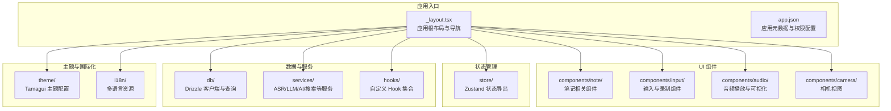
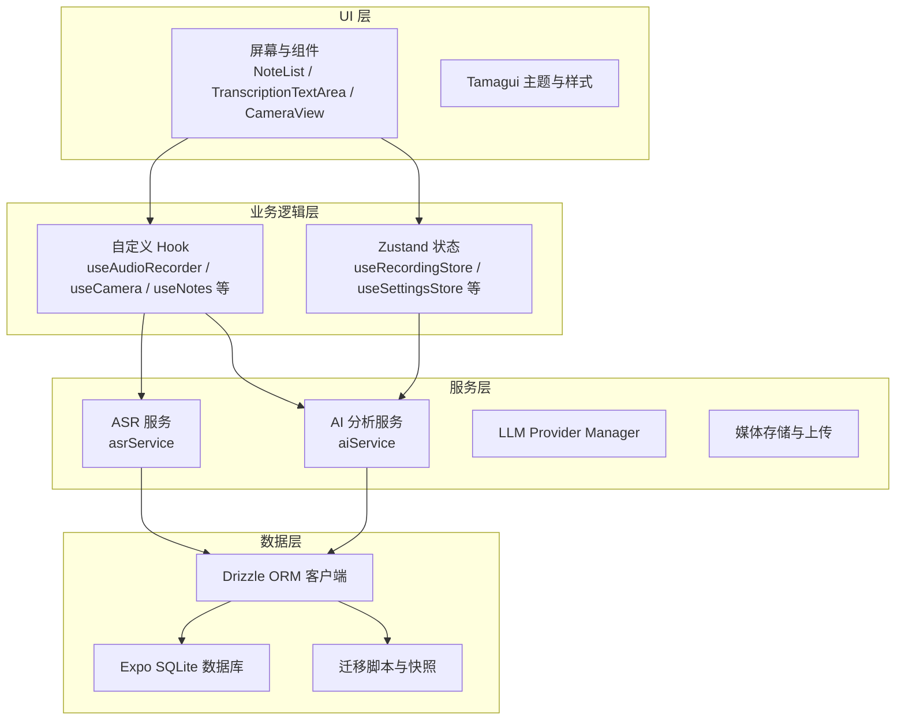
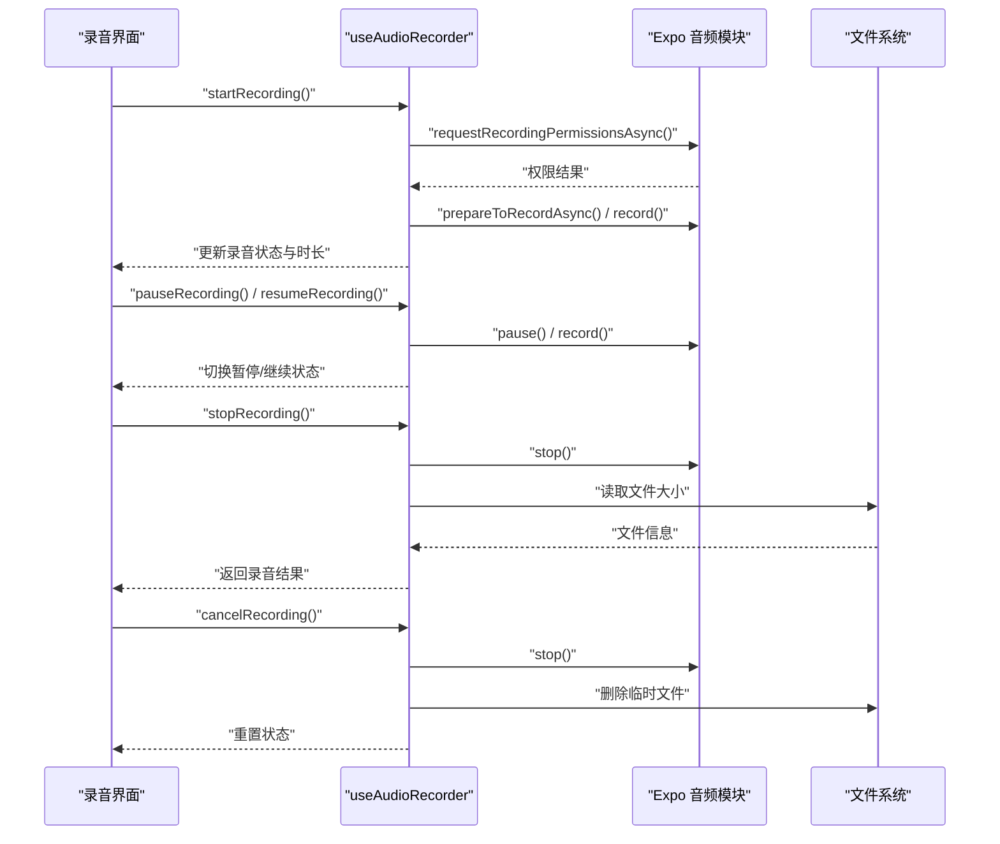
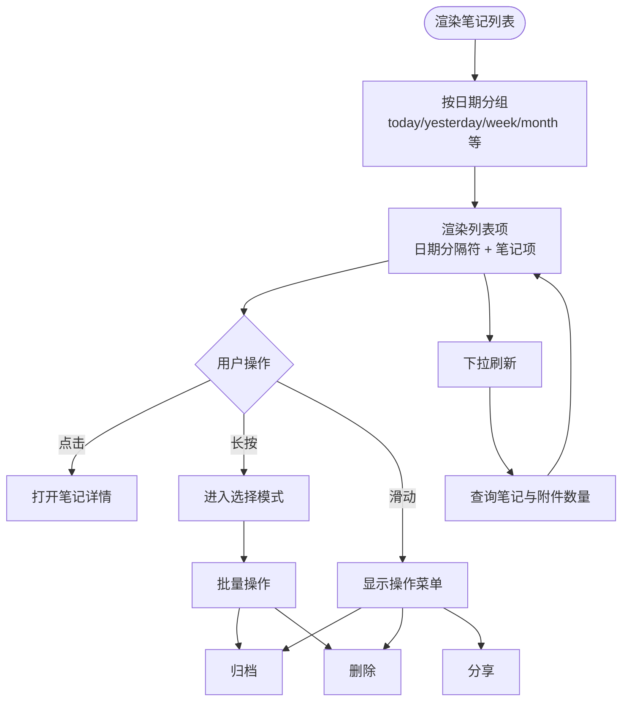
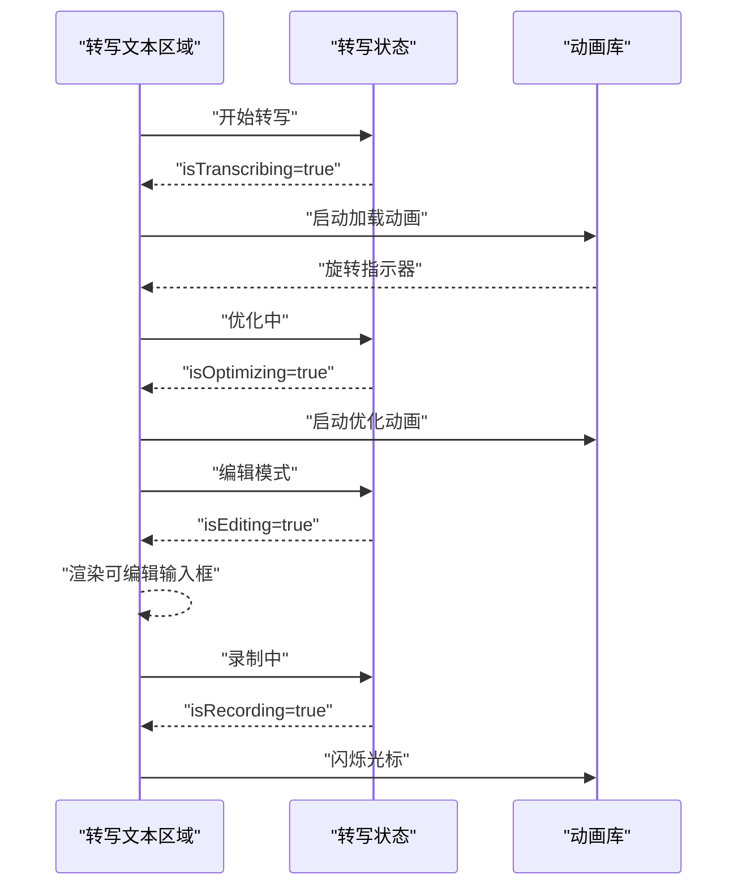
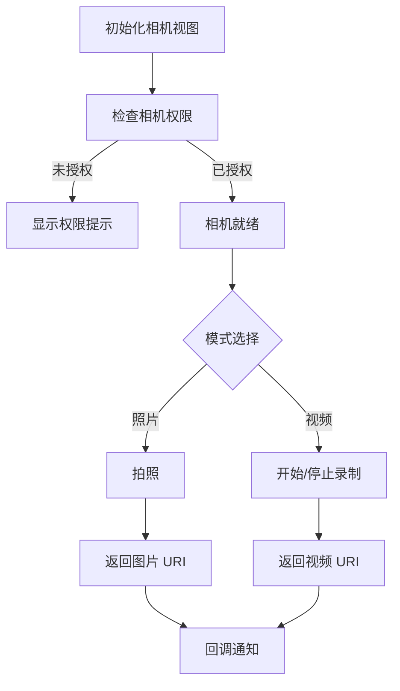
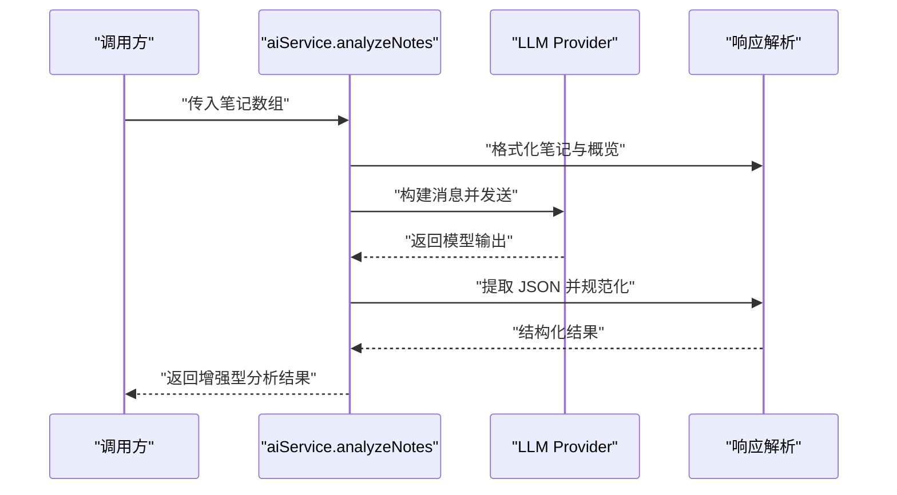
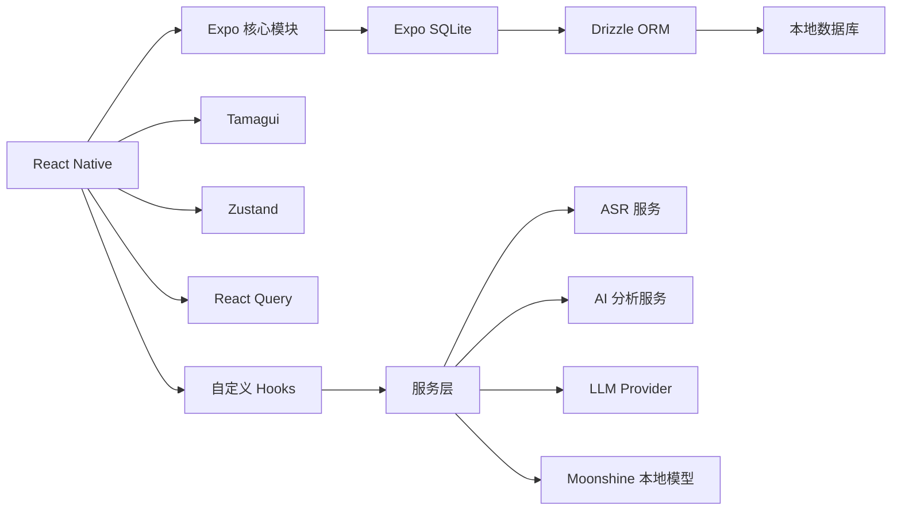

# 项目概述

<cite>
**本文档引用的文件**
- [package.json](file://package.json)
- [app.json](file://app.json)
- [drizzle.config.ts](file://drizzle.config.ts)
- [theme/tamagui.config.ts](file://theme/tamagui.config.ts)
- [app/_layout.tsx](file://app/_layout.tsx)
- [store/index.ts](file://store/index.ts)
- [db/client.ts](file://db/client.ts)
- [hooks/useAudioRecorder.ts](file://hooks/useAudioRecorder.ts)
- [services/asr/asrService.ts](file://services/asr/asrService.ts)
- [components/note/NoteList.tsx](file://components/note/NoteList.tsx)
- [components/input/TranscriptionTextArea.tsx](file://components/input/TranscriptionTextArea.tsx)
- [services/ai/aiService.ts](file://services/ai/aiService.ts)
- [modules/moonshine/src/NativeMoonshineModule.ts](file://modules/moonshine/src/NativeMoonshineModule.ts)
- [components/camera/CameraView.tsx](file://components/camera/CameraView.tsx)
</cite>

## 目录
1. [引言](#引言)
2. [项目结构](#项目结构)
3. [核心组件](#核心组件)
4. [架构总览](#架构总览)
5. [详细组件分析](#详细组件分析)
6. [依赖关系分析](#依赖关系分析)
7. [性能考虑](#性能考虑)
8. [故障排除指南](#故障排除指南)
9. [结论](#结论)

## 引言

VoiceNote 是一个基于 React Native 与 Expo 的跨平台移动应用，专注于语音笔记与多媒体内容管理。其核心目标是为用户提供便捷、高效的语音录制、实时转写、本地/云端 AI 分析、多媒体附件管理与分类检索能力。项目采用现代化技术栈，结合 Tamagui 设计系统、Zustand 状态管理、Drizzle ORM 数据持久化，以及多模态 AI 能力，构建出从录音到知识沉淀的一体化体验。

设计理念与价值主张：
- 以“语音优先”为核心：通过高质量录音与流式转写，降低输入门槛，提升记录效率。
- 多媒体融合：支持图片、视频、音频等多媒体附件统一管理与预览。
- 本地与云端并行：既可离线运行（本地模型 Moonshine），也可接入云端服务（OpenAI、SenseVoice 等）。
- 可扩展的 AI 分析：内置提示词工程与响应规范化，支持标签、洞察、行动项等结构化输出。
- 一致的跨平台体验：通过 Expo 统一构建，保证 iOS、Android 与 Web 的一致性。

与其他类似应用的区别：
- 深度集成本地语音识别（Moonshine）与云端 ASR 的混合模式，兼顾隐私与准确性。
- 借助 Tamagui 实现主题与动效的一致性，提供更流畅的交互体验。
- 使用 Drizzle ORM 进行数据库迁移与查询，确保数据层的可维护性与可演进性。
- 将笔记列表按时间分组展示，并结合手势操作与选择模式，优化移动端浏览与批量处理。

## 项目结构

项目采用按功能域划分的目录组织方式，核心模块包括应用入口、组件库、服务层、状态管理、数据库与迁移、国际化与主题配置等。



图表来源
- [app/_layout.tsx:1-101](file://app/_layout.tsx#L1-L101)
- [app.json:1-86](file://app.json#L1-L86)
- [store/index.ts:1-8](file://store/index.ts#L1-L8)
- [db/client.ts:1-15](file://db/client.ts#L1-L15)

章节来源
- [package.json:1-83](file://package.json#L1-L83)
- [app.json:1-86](file://app.json#L1-L86)

## 核心组件

- 应用根布局与导航：在根布局中集成了状态栏、手势处理、Tamagui 主题提供器、国际化提供器、React Query 客户端与深度链接处理，统一管理全局 UI 与数据流。
- 录音与播放：通过自定义 Hook useAudioRecorder 封装录音权限、状态监听、播放控制与文件信息获取，提供完整的录音生命周期管理。
- 笔记列表：实现按日期分组的时间轴式展示，支持下拉刷新、附件数量统计、滑动手势操作与批量选择。
- 输入与转写：提供可编辑的转写文本区域，支持转写进行中的加载指示、优化过程指示与录制光标闪烁效果。
- 相机视图：封装相机权限、拍照/录像、翻面控制与录制状态反馈。
- 数据持久化：基于 Drizzle ORM 与 Expo SQLite，自动执行迁移，提供类型安全的查询接口。
- AI 分析：封装云端 LLM 调用、响应提取与规范化，输出结构化的标签、洞察与行动项。
- 本地语音识别：通过 Moonshine TurboModule 提供本地流式转写能力，支持模型下载、事件回调与权限处理。

章节来源
- [app/_layout.tsx:1-101](file://app/_layout.tsx#L1-L101)
- [hooks/useAudioRecorder.ts:1-270](file://hooks/useAudioRecorder.ts#L1-L270)
- [components/note/NoteList.tsx:1-240](file://components/note/NoteList.tsx#L1-L240)
- [components/input/TranscriptionTextArea.tsx:1-156](file://components/input/TranscriptionTextArea.tsx#L1-L156)
- [components/camera/CameraView.tsx:1-140](file://components/camera/CameraView.tsx#L1-L140)
- [db/client.ts:1-15](file://db/client.ts#L1-L15)
- [services/ai/aiService.ts:1-163](file://services/ai/aiService.ts#L1-L163)
- [modules/moonshine/src/NativeMoonshineModule.ts:1-34](file://modules/moonshine/src/NativeMoonshineModule.ts#L1-L34)

## 架构总览

系统采用分层架构，自上而下分别为 UI 层、业务逻辑层、服务层与数据层。UI 层由 React Native + Tamagui 构建；业务逻辑通过自定义 Hook 与 Zustand 状态管理；服务层负责 ASR、LLM、AI 分析与上传等外部能力；数据层通过 Drizzle ORM 与 Expo SQLite 实现本地持久化与迁移。



图表来源
- [app/_layout.tsx:1-101](file://app/_layout.tsx#L1-L101)
- [hooks/useAudioRecorder.ts:1-270](file://hooks/useAudioRecorder.ts#L1-L270)
- [services/asr/asrService.ts:1-74](file://services/asr/asrService.ts#L1-L74)
- [services/ai/aiService.ts:1-163](file://services/ai/aiService.ts#L1-L163)
- [db/client.ts:1-15](file://db/client.ts#L1-L15)
- [drizzle.config.ts:1-12](file://drizzle.config.ts#L1-L12)

## 详细组件分析

### 录音与播放组件分析

该组件通过自定义 Hook 封装录音与播放流程，提供权限请求、状态同步、播放进度与文件信息获取等功能。其设计遵循“状态驱动”的原则，所有 UI 行为均由状态变化触发。



图表来源
- [hooks/useAudioRecorder.ts:1-270](file://hooks/useAudioRecorder.ts#L1-L270)

章节来源
- [hooks/useAudioRecorder.ts:1-270](file://hooks/useAudioRecorder.ts#L1-L270)

### 笔记列表组件分析

笔记列表实现了按日期分组的时间轴展示，支持下拉刷新与附件数量统计。列表项采用可滑动手势块，支持归档、删除、分享与选择等操作。



图表来源
- [components/note/NoteList.tsx:1-240](file://components/note/NoteList.tsx#L1-L240)

章节来源
- [components/note/NoteList.tsx:1-240](file://components/note/NoteList.tsx#L1-L240)

### 输入与转写组件分析

转写文本区域根据当前状态展示不同 UI：编辑态、转写中、优化中与录制光标闪烁。通过动画库实现加载指示与光标闪烁，提升交互反馈。



图表来源
- [components/input/TranscriptionTextArea.tsx:1-156](file://components/input/TranscriptionTextArea.tsx#L1-L156)

章节来源
- [components/input/TranscriptionTextArea.tsx:1-156](file://components/input/TranscriptionTextArea.tsx#L1-L156)

### 相机视图组件分析

相机视图封装了相机权限检查、拍照/录像控制、翻面与录制状态反馈。在无权限时提供明确的引导文案与图标，确保用户体验连贯。



图表来源
- [components/camera/CameraView.tsx:1-140](file://components/camera/CameraView.tsx#L1-L140)

章节来源
- [components/camera/CameraView.tsx:1-140](file://components/camera/CameraView.tsx#L1-L140)

### AI 分析服务分析

AI 分析服务封装了系统提示词、用户提示词构建、LLM 调用、响应提取与规范化流程，最终输出结构化的标签、洞察与行动项。



图表来源
- [services/ai/aiService.ts:1-163](file://services/ai/aiService.ts#L1-L163)

章节来源
- [services/ai/aiService.ts:1-163](file://services/ai/aiService.ts#L1-L163)

### 本地语音识别模块分析

Moonshine 模块提供本地流式转写能力，支持模型加载/卸载、事件回调与权限处理，适合对隐私敏感或网络受限场景。

```mermaid
classDiagram
class NativeMoonshineModule {
+isAvailable() Promise~boolean~
+loadModel(modelPath, arch) Promise~void~
+unloadModel() Promise~void~
+isModelLoaded() Promise~boolean~
+startStreaming(language) Promise~void~
+stopStreaming() Promise~{text}~
+getDownloadedModels() Promise~string[]~
+deleteModel(modelId) Promise~void~
+getModelsDirectory() Promise~string~
+onMicPermissionGranted() Promise~void~
+addListener(eventName) Promise~void~
+removeListeners(count) Promise~void~
}
```

图表来源
- [modules/moonshine/src/NativeMoonshineModule.ts:1-34](file://modules/moonshine/src/NativeMoonshineModule.ts#L1-L34)

章节来源
- [modules/moonshine/src/NativeMoonshineModule.ts:1-34](file://modules/moonshine/src/NativeMoonshineModule.ts#L1-L34)

## 依赖关系分析

项目技术栈概览与关键依赖：
- React Native 与 Expo：提供跨平台运行时与原生能力访问（相机、音频、文件系统、SQLite 等）。
- Tamagui：提供主题、动画与组件体系，统一 UI 设计语言。
- Zustand：轻量级状态管理，集中管理录音、设置、选择等状态。
- Drizzle ORM：类型安全的数据库 ORM，配合 Expo SQLite 实现本地持久化与迁移。
- @tanstack/react-query：缓存与并发控制，优化数据获取与刷新体验。
- 本地与云端 AI：Moonshine（本地）、OpenAI/Cloud LLM（云端），支持混合部署策略。



图表来源
- [package.json:20-62](file://package.json#L20-L62)
- [db/client.ts:1-15](file://db/client.ts#L1-L15)
- [drizzle.config.ts:1-12](file://drizzle.config.ts#L1-L12)

章节来源
- [package.json:1-83](file://package.json#L1-L83)
- [drizzle.config.ts:1-12](file://drizzle.config.ts#L1-L12)

## 性能考虑

- 列表渲染优化：使用高性能列表组件与分组渲染，减少不必要的重绘与布局计算。
- 状态与缓存：通过 React Query 的缓存与过期策略，避免重复请求；Zustand 精准订阅，降低全局重渲染。
- 媒体处理：录音与播放分离状态，避免 UI 阻塞；文件系统读取仅在需要时进行。
- 本地优先：在具备本地模型时优先使用 Moonshine，减少网络往返与延迟。
- 动画与主题：Tamagui 的动画与主题系统在移动端表现稳定，建议避免过度复杂的动画叠加。

## 故障排除指南

常见问题与排查要点：
- 录音权限被拒绝：确认应用权限配置与系统设置；在 Hook 中捕获错误并提示用户授权。
- 转写超时或失败：检查 ASR 服务配置与网络连接；合理设置超时时间并提供重试机制。
- 本地模型不可用：验证 Moonshine 模型是否已下载与加载；检查事件回调与权限授予流程。
- 数据库迁移异常：确认 Drizzle 配置与迁移脚本版本；必要时清理缓存后重新迁移。
- 国际化语言切换：确认 i18n 初始化与设置存储联动，避免语言切换不生效。

章节来源
- [hooks/useAudioRecorder.ts:74-77](file://hooks/useAudioRecorder.ts#L74-L77)
- [services/asr/asrService.ts:24-73](file://services/asr/asrService.ts#L24-L73)
- [modules/moonshine/src/NativeMoonshineModule.ts:16-31](file://modules/moonshine/src/NativeMoonshineModule.ts#L16-L31)
- [db/client.ts:11-12](file://db/client.ts#L11-L12)
- [app/_layout.tsx:33-35](file://app/_layout.tsx#L33-L35)

## 结论

VoiceNote 以“语音优先”的理念，结合本地与云端 AI 能力，构建了从录音、转写、分析到多媒体管理的完整闭环。通过 Tamagui 的主题与动画体系、Zustand 的状态管理、Drizzle ORM 的数据持久化，以及 Expo 的跨平台能力，项目在易用性、可维护性与扩展性之间取得了良好平衡。对于初学者，项目提供了清晰的组件与 Hook 分层；对于有经验的开发者，项目展示了现代移动端应用的架构实践与工程化方法。